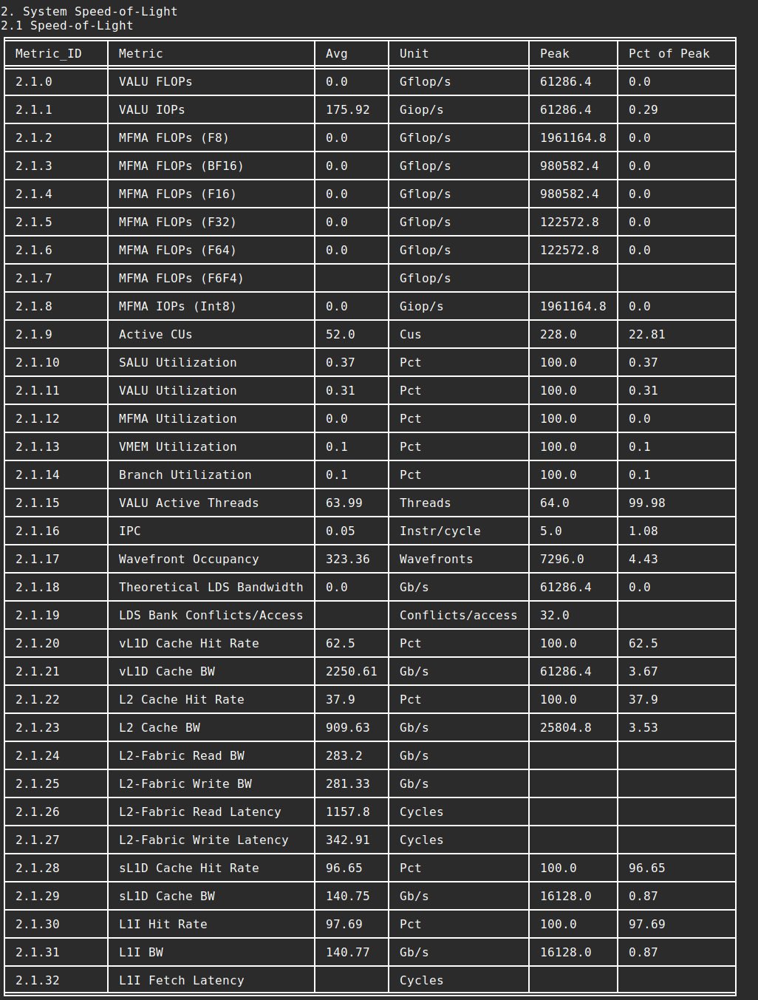
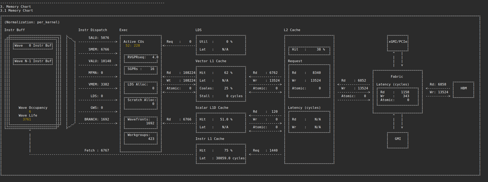
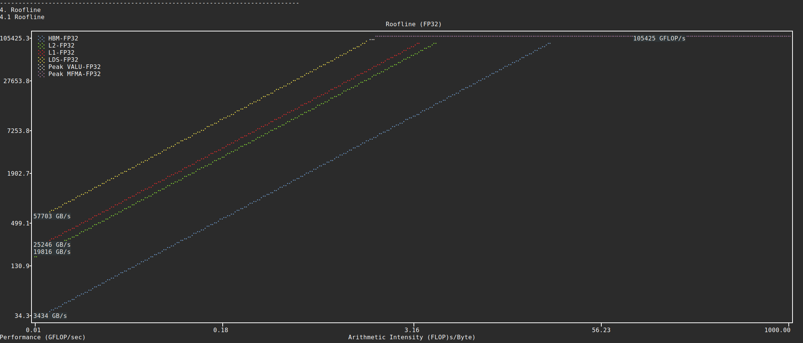
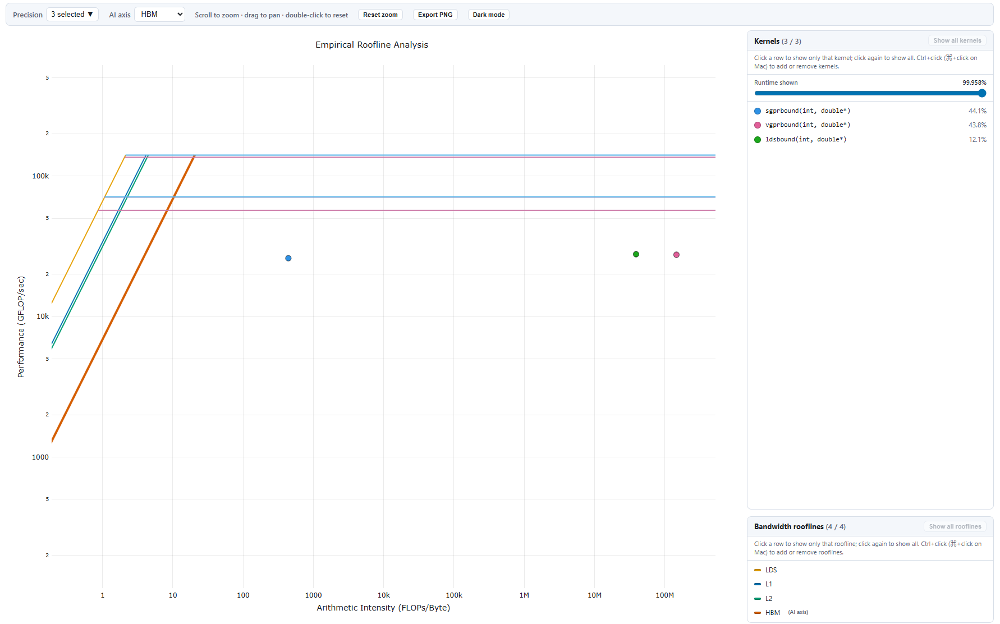
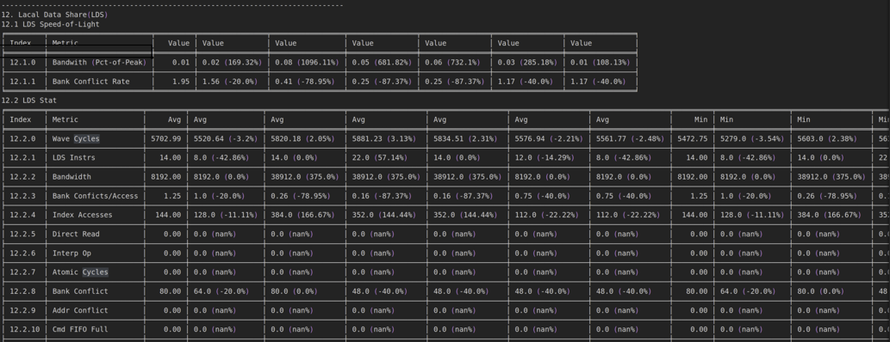
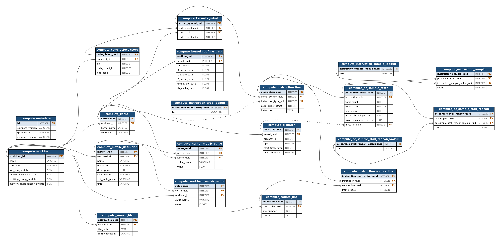
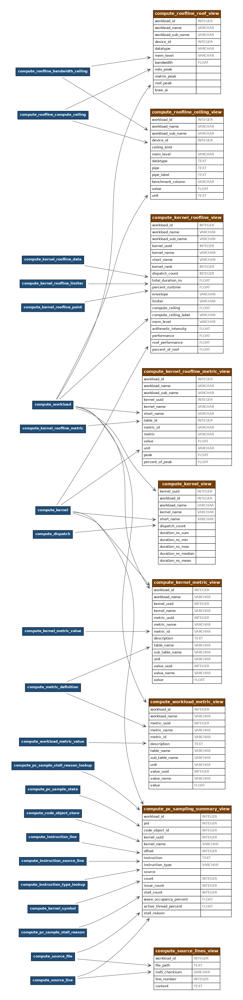

.. meta::
   :description: ROCm Compute Profiler analysis: CLI analysis
   :keywords: ROCm Compute Profiler, ROCm, profiler, tool, Instinct, accelerator, command line, analyze, filtering, metrics, baseline, comparison

************
CLI analysis
************

This section provides an overview of ROCm Compute Profiler's CLI analysis features.

* :ref:`Derived metrics <cli-list-available-metrics>`: All of ROCm Compute Profiler's built-in metrics.

* :ref:`Baseline comparison <analysis-baseline-comparison>`: Compare multiple runs in a side-by-side manner.

* :ref:`Metric customization <cli-analysis-options>`: Isolate a subset of built-in metrics or build your own profiling configuration.

* :ref:`Filtering <cli-analysis-options>`: Hone in on a particular kernel, GPU ID, or dispatch ID via post-process filtering.

* :ref:`Per-kernel roofline analysis <per-kernel-roofline>`: Detailed arithmetic intensity and performance analysis for individual kernels.

* :ref:`Roofline HTML generation <roofline-html-generation>`: Generate interactive HTML roofline charts from profiling data.

Run ``rocprof-compute analyze -h`` for more details.

.. _cli-walkthrough:

Walkthrough
===========

1. To begin, generate a high-level analysis report using ROCm Compute Profiler's ``-b`` (or ``--block``) flag.

.. note::

   By default, analyze only evaluates the profiled blocks. Analyze-mode
   ``-b`` overrides this and might produce missing-counter warnings for blocks
   whose counters were not collected.

There are three high-level GPU analysis views:

* System Speed-of-Light: Key GPU performance metrics to show overall GPU performance and utilization.
* Memory chart: Shows memory transactions and throughput on each cache hierarchical level.
* Empirical hierarchical roofline: Roofline model that compares achieved throughput with attainable peak hardware limits, more specifically peak compute throughput and memory bandwidth. When combined with kernel filtering, provides detailed per-kernel arithmetic intensity analysis and performance breakdowns.

**System Speed-of-Light:**

.. code-block:: shell-session

   $ rocprof-compute analyze -p workloads/vcopy/MI200/ -b 2

**Memory chart:**

.. code-block:: shell-session

   $ rocprof-compute analyze -p workloads/vcopy/MI200/ -b 3

.. _cli-memory-chart-viewing:

The memory chart is a wide diagram drawn at a fixed width. It does not shrink to
fit the terminal, so in a narrow window every chart line wraps and the boxes,
arrows, and bandwidth labels no longer line up. Widening the window until one
chart line fits on a single row fixes this. If you cannot resize, use one of the
following instead.

Pipe the output into ``less``. ``-S`` cuts long lines instead of wrapping them,
and ``-R`` shows the colored log lines above the chart as color rather than
escape codes. Use the left and right arrow keys to scroll across the chart:

.. code-block:: shell

   $ rocprof-compute analyze -p workloads/vcopy/MI200/ -b 3 | less -RS

You can also send the output to an editor, for example Visual Studio Code:

.. code-block:: shell

   $ rocprof-compute analyze -p workloads/vcopy/MI200/ -b 3 | code -

The chart is colored only when it is printed straight to a terminal, so it is
plain text in both of the preceding commands.

To print the block as tables instead of the diagram, see :ref:`cli-view-table`.

**Empirical hierarchical roofline:**

.. code-block:: shell-session

   $ rocprof-compute analyze -p workloads/vcopy/MI200/ -b 4

.. note::
   * Visualized memory chart and Roofline chart are only supported in single run analysis. In multiple runs comparison mode, both are switched back to basic table view.
   * Visualized memory chart is drawn at a fixed width and needs a wide terminal. See :ref:`cli-memory-chart-viewing` if it wraps.
   * Visualized Roofline chart is adapted to the initial terminal size only. If it is not clear, you may need to adjust the terminal size and regenerate it to check the display effect. Roofline analysis provides detailed, structured table output with measured empirical peak values for comparison.

.. _cli-list-available-metrics:

2. Use ``--list-available-metrics`` to generate a list of available metrics for inspection.

   .. code-block:: shell-session

      $ rocprof-compute analyze -p workloads/vcopy/MI200/ --list-available-metrics

                                       __                                       _
       _ __ ___   ___ _ __  _ __ ___  / _|       ___ ___  _ __ ___  _ __  _   _| |_ ___
      | '__/ _ \ / __| '_ \| '__/ _ \| |_ _____ / __/ _ \| '_ ` _ \| '_ \| | | | __/ _ \
      | | | (_) | (__| |_) | | | (_) |  _|_____| (_| (_) | | | | | | |_) | |_| | ||  __/
      |_|  \___/ \___| .__/|_|  \___/|_|        \___\___/|_| |_| |_| .__/ \__,_|\__\___|
                     |_|                                           |_|

      Analysis mode = cli
      [analysis] deriving rocprofiler-compute metrics...
      0 -> Top Stats
      1 -> System Info
      2 -> System Speed-of-Light
              2.1 -> Speed-of-Light
                      2.1.0 -> VALU FLOPs
                      2.1.1 -> MFMA FLOPs (BF16)
                      2.1.2 -> MFMA FLOPs (F16)
                      2.1.3 -> MFMA FLOPs (F32)
                      2.1.4 -> MFMA FLOPs (F64)
                      2.1.5 -> MFMA IOPs (Int8)
                      2.1.6 -> SALU Utilization
                      2.1.7 -> VALU Utilization
                      2.1.8 -> MFMA Utilization
                      2.1.9 -> VMEM Utilization
                      2.1.10 -> Branch Utilization
                      2.1.11 -> VALU Active Threads
                      2.1.12 -> IPC
                      2.1.13 -> Wavefront Occupancy
                      2.1.14 -> Theoretical LDS Bandwidth
                      2.1.15 -> LDS Bank Conflicts/Access
                      2.1.16 -> vL1D Cache Hit Rate
                      2.1.17 -> vL1D Cache BW
                      2.1.18 -> L2 Cache Hit Rate
                      2.1.19 -> L2 Cache BW
                      2.1.20 -> L2-Fabric Read BW
                      2.1.21 -> L2-Fabric Write BW
                      2.1.22 -> L2-Fabric Read Latency
                      2.1.23 -> L2-Fabric Write Latency
                      2.1.24 -> sL1D Cache Hit Rate
                      2.1.25 -> sL1D Cache BW
                      2.1.26 -> L1I Hit Rate
                      2.1.27 -> L1I BW
                      2.1.28 -> L1I Fetch Latency
      ...

   On MI300 and MI350 series GPUs, block **1 (System Info)** also reports compute
   and memory partition modes. See :doc:`/conceptual/cdna/compute-memory-partition`
   for how those fields affect metric normalization.

3. Choose your own customized subset of metrics with the ``-b`` (or ``--block``)
   option. Or, build your own configuration following
   `config_template <https://github.com/ROCm/rocm-systems/blob/develop/projects/rocprofiler-compute/src/rocprof_compute_soc/analysis_configs/panel_config_template.yaml>`_.
   The following snippet shows how to generate a report containing only metric 2
   (:doc:`System Speed-of-Light </conceptual/cdna/system-speed-of-light>`).

   .. code-block:: shell-session

      $ rocprof-compute analyze -p workloads/vcopy/MI200/ -b 2

      --------
      Analyze
      --------

      --------------------------------------------------------------------------------
      1. Top Stat
      ╒════╤══════════════════════════════════════════╤═════════╤═══════════╤════════════╤══════════════╤════════╕
      │    │ KernelName                               │   Count │   Sum(ns) │   Mean(ns) │   Median(ns) │    Pct │
      ╞════╪══════════════════════════════════════════╪═════════╪═══════════╪════════════╪══════════════╪════════╡
      │  0 │ vecCopy(double*, double*, double*, int,  │       1 │  20000.00 │   20000.00 │     20000.00 │ 100.00 │
      │    │ int) [clone .kd]                         │         │           │            │              │        │
      ╘════╧══════════════════════════════════════════╧═════════╧═══════════╧════════════╧══════════════╧════════╛

      --------------------------------------------------------------------------------
      2. System Speed-of-Light
      2.1 System Speed-of-Light
      ╒═════════════╤═══════════════════════════╤═════════╤════════════════════════╤══════════╤═══════════════════╕
      │ Metric_ID   │ Metric                    │ Avg     │ Unit                   │ Peak     │ Percent of Peak   │
      ╞═════════════╪═══════════════════════════╪═════════╪════════════════════════╪══════════╪═══════════════════╡
      │ 2.1.0       │ VALU FLOPs                │ 0.0     │ GFLOP/s                │ 22630.4  │ 0.0               │
      ├─────────────┼───────────────────────────┼─────────┼────────────────────────┼──────────┼───────────────────┤
      │ 2.1.1       │ MFMA FLOPs (BF16)         │ 0.0     │ GFLOP/s                │ 181043.2 │ 0.0               │
      ├─────────────┼───────────────────────────┼─────────┼────────────────────────┼──────────┼───────────────────┤
      │ 2.1.2       │ MFMA FLOPs (F16)          │ 0.0     │ GFLOP/s                │ 181043.2 │ 0.0               │
      ├─────────────┼───────────────────────────┼─────────┼────────────────────────┼──────────┼───────────────────┤
      │ 2.1.3       │ MFMA FLOPs (F32)          │ 0.0     │ GFLOP/s                │ 45260.8  │ 0.0               │
      ├─────────────┼───────────────────────────┼─────────┼────────────────────────┼──────────┼───────────────────┤
      │ 2.1.4       │ MFMA FLOPs (F64)          │ 0.0     │ GFLOP/s                │ 45260.8  │ 0.0               │
      ├─────────────┼───────────────────────────┼─────────┼────────────────────────┼──────────┼───────────────────┤
      │ 2.1.5       │ MFMA IOPs (Int8)          │ 0.0     │ GIOP/s                 │ 181043.2 │ 0.0               │
      ├─────────────┼───────────────────────────┼─────────┼────────────────────────┼──────────┼───────────────────┤
      │ 2.1.6       │ SALU Utilization          │ 2.74    │ Percent                │ 100.0    │ N/A               │
      ├─────────────┼───────────────────────────┼─────────┼────────────────────────┼──────────┼───────────────────┤
      │ 2.1.7       │ VALU Utilization          │ 3.91    │ Percent                │ 100.0    │ N/A               │
      ├─────────────┼───────────────────────────┼─────────┼────────────────────────┼──────────┼───────────────────┤
      │ 2.1.8       │ MFMA Utilization          │ 0.0     │ Percent                │ 100.0    │ N/A               │
      ├─────────────┼───────────────────────────┼─────────┼────────────────────────┼──────────┼───────────────────┤
      │ 2.1.9       │ VMEM Utilization          │ 0.78    │ Percent                │ 100.0    │ N/A               │
      ├─────────────┼───────────────────────────┼─────────┼────────────────────────┼──────────┼───────────────────┤
      │ 2.1.10      │ Branch Utilization        │ 0.78    │ Percent                │ 100.0    │ N/A               │
      ├─────────────┼───────────────────────────┼─────────┼────────────────────────┼──────────┼───────────────────┤
      │ 2.1.11      │ VALU Active Threads       │ 64.0    │ Work-items             │ 64.0     │ 100.0             │
      ├─────────────┼───────────────────────────┼─────────┼────────────────────────┼──────────┼───────────────────┤
      │ 2.1.12      │ IPC                       │ 0.14    │ Instructions per Cycle │ 5.0      │ 2.89              │
      ├─────────────┼───────────────────────────┼─────────┼────────────────────────┼──────────┼───────────────────┤
      │ 2.1.13      │ Wavefront Occupancy       │ 1904.8  │ Wavefronts             │ 3328.0   │ 57.24             │
      ├─────────────┼───────────────────────────┼─────────┼────────────────────────┼──────────┼───────────────────┤
      │ 2.1.14      │ Theoretical LDS Bandwidth │ 0.0     │ GB/s                   │ 22630.4  │ 0.0               │
      ├─────────────┼───────────────────────────┼─────────┼────────────────────────┼──────────┼───────────────────┤
      │ 2.1.15      │ LDS Bank Conflicts/Access │ N/A     │ Conflicts per Access   │ 32.0     │ N/A               │
      ├─────────────┼───────────────────────────┼─────────┼────────────────────────┼──────────┼───────────────────┤
      │ 2.1.16      │ vL1D Cache Hit Rate       │ 50.0    │ Percent                │ 100.0    │ N/A               │
      ├─────────────┼───────────────────────────┼─────────┼────────────────────────┼──────────┼───────────────────┤
      │ 2.1.17      │ vL1D Cache BW             │ 1941.81 │ GB/s                   │ 11315.2  │ 17.16             │
      ├─────────────┼───────────────────────────┼─────────┼────────────────────────┼──────────┼───────────────────┤
      │ 2.1.18      │ L2 Cache Hit Rate         │ 34.75   │ Percent                │ 100.0    │ N/A               │
      ├─────────────┼───────────────────────────┼─────────┼────────────────────────┼──────────┼───────────────────┤
      │ 2.1.19      │ L2 Cache BW               │ 1488.67 │ GB/s                   │ 3481.6   │ 42.76             │
      ├─────────────┼───────────────────────────┼─────────┼────────────────────────┼──────────┼───────────────────┤
      │ 2.1.20      │ L2-Fabric Read BW         │ 485.48  │ GB/s                   │ 1638.4   │ 29.63             │
      ├─────────────┼───────────────────────────┼─────────┼────────────────────────┼──────────┼───────────────────┤
      │ 2.1.21      │ L2-Fabric Write BW        │ 386.75  │ GB/s                   │ 1638.4   │ 23.61             │
      ├─────────────┼───────────────────────────┼─────────┼────────────────────────┼──────────┼───────────────────┤
      │ 2.1.22      │ L2-Fabric Read Latency    │ 909.82  │ Cycles                 │ N/A      │ N/A               │
      ├─────────────┼───────────────────────────┼─────────┼────────────────────────┼──────────┼───────────────────┤
      │ 2.1.23      │ L2-Fabric Write Latency   │ 606.22  │ Cycles                 │ N/A      │ N/A               │
      ├─────────────┼───────────────────────────┼─────────┼────────────────────────┼──────────┼───────────────────┤
      │ 2.1.24      │ sL1D Cache Hit Rate       │ 99.91   │ Percent                │ 100.0    │ N/A               │
      ├─────────────┼───────────────────────────┼─────────┼────────────────────────┼──────────┼───────────────────┤
      │ 2.1.25      │ sL1D Cache BW             │ 242.73  │ GB/s                   │ 6092.8   │ 3.98              │
      ├─────────────┼───────────────────────────┼─────────┼────────────────────────┼──────────┼───────────────────┤
      │ 2.1.26      │ L1I Hit Rate              │ 99.91   │ Percent                │ 100.0    │ N/A               │
      ├─────────────┼───────────────────────────┼─────────┼────────────────────────┼──────────┼───────────────────┤
      │ 2.1.27      │ L1I BW                    │ 242.73  │ GB/s                   │ 6092.8   │ 3.98              │
      ├─────────────┼───────────────────────────┼─────────┼────────────────────────┼──────────┼───────────────────┤
      │ 2.1.28      │ L1I Fetch Latency         │ 32.73   │ Cycles                 │ N/A      │ N/A               │
      ├─────────────┼───────────────────────────┼─────────┼────────────────────────┼──────────┼───────────────────┤
      │ 2.1.29      │ CU Utilization            │ 65.01   │ Percent                │ 100.0    │ N/A               │
      ╘═════════════╧═══════════════════════════╧═════════╧════════════════════════╧══════════╧═══════════════════╛

   Alternatively, use the option ``-b`` (or ``--block``) with block alias(es).
   The following snippet shows how to generate a report containing only metric 2 with the alias equivalent of ``sol``

   .. code-block:: shell-session

      $ rocprof-compute analyze -p workloads/vcopy/MI200/ -b sol

      --------
      Analyze
      --------

      --------------------------------------------------------------------------------
      1. Top Stat
      ╒════╤══════════════════════════════════════════╤═════════╤═══════════╤════════════╤══════════════╤════════╕
      │    │ KernelName                               │   Count │   Sum(ns) │   Mean(ns) │   Median(ns) │    Pct │
      ╞════╪══════════════════════════════════════════╪═════════╪═══════════╪════════════╪══════════════╪════════╡
      │  0 │ vecCopy(double*, double*, double*, int,  │       1 │  20000.00 │   20000.00 │     20000.00 │ 100.00 │
      │    │ int) [clone .kd]                         │         │           │            │              │        │
      ╘════╧══════════════════════════════════════════╧═════════╧═══════════╧════════════╧══════════════╧════════╛

      --------------------------------------------------------------------------------
      2. System Speed-of-Light
      2.1 System Speed-of-Light
      ╒═════════════╤═══════════════════════════╤═════════╤════════════════════════╤══════════╤═══════════════════╕
      │ Metric_ID   │ Metric                    │ Avg     │ Unit                   │ Peak     │ Percent of Peak   │
      ╞═════════════╪═══════════════════════════╪═════════╪════════════════════════╪══════════╪═══════════════════╡
      │ 2.1.0       │ VALU FLOPs                │ 0.0     │ GFLOP/s                │ 22630.4  │ 0.0               │
      ├─────────────┼───────────────────────────┼─────────┼────────────────────────┼──────────┼───────────────────┤
      │ 2.1.1       │ MFMA FLOPs (BF16)         │ 0.0     │ GFLOP/s                │ 181043.2 │ 0.0               │
      ├─────────────┼───────────────────────────┼─────────┼────────────────────────┼──────────┼───────────────────┤
      │ 2.1.2       │ MFMA FLOPs (F16)          │ 0.0     │ GFLOP/s                │ 181043.2 │ 0.0               │
      ├─────────────┼───────────────────────────┼─────────┼────────────────────────┼──────────┼───────────────────┤
      │ 2.1.3       │ MFMA FLOPs (F32)          │ 0.0     │ GFLOP/s                │ 45260.8  │ 0.0               │
      ├─────────────┼───────────────────────────┼─────────┼────────────────────────┼──────────┼───────────────────┤
      │ 2.1.4       │ MFMA FLOPs (F64)          │ 0.0     │ GFLOP/s                │ 45260.8  │ 0.0               │
      ├─────────────┼───────────────────────────┼─────────┼────────────────────────┼──────────┼───────────────────┤
      │ 2.1.5       │ MFMA IOPs (Int8)          │ 0.0     │ GIOP/s                 │ 181043.2 │ 0.0               │
      ├─────────────┼───────────────────────────┼─────────┼────────────────────────┼──────────┼───────────────────┤
      │ 2.1.6       │ SALU Utilization          │ 2.74    │ Percent                │ 100.0    │ N/A               │
      ├─────────────┼───────────────────────────┼─────────┼────────────────────────┼──────────┼───────────────────┤
      │ 2.1.7       │ VALU Utilization          │ 3.91    │ Percent                │ 100.0    │ N/A               │
      ├─────────────┼───────────────────────────┼─────────┼────────────────────────┼──────────┼───────────────────┤
      │ 2.1.8       │ MFMA Utilization          │ 0.0     │ Percent                │ 100.0    │ N/A               │
      ├─────────────┼───────────────────────────┼─────────┼────────────────────────┼──────────┼───────────────────┤
      │ 2.1.9       │ VMEM Utilization          │ 0.78    │ Percent                │ 100.0    │ N/A               │
      ├─────────────┼───────────────────────────┼─────────┼────────────────────────┼──────────┼───────────────────┤
      │ 2.1.10      │ Branch Utilization        │ 0.78    │ Percent                │ 100.0    │ N/A               │
      ├─────────────┼───────────────────────────┼─────────┼────────────────────────┼──────────┼───────────────────┤
      │ 2.1.11      │ VALU Active Threads       │ 64.0    │ Work-items             │ 64.0     │ 100.0             │
      ├─────────────┼───────────────────────────┼─────────┼────────────────────────┼──────────┼───────────────────┤
      │ 2.1.12      │ IPC                       │ 0.14    │ Instructions per Cycle │ 5.0      │ 2.89              │
      ├─────────────┼───────────────────────────┼─────────┼────────────────────────┼──────────┼───────────────────┤
      │ 2.1.13      │ Wavefront Occupancy       │ 1904.8  │ Wavefronts             │ 3328.0   │ 57.24             │
      ├─────────────┼───────────────────────────┼─────────┼────────────────────────┼──────────┼───────────────────┤
      │ 2.1.14      │ Theoretical LDS Bandwidth │ 0.0     │ GB/s                   │ 22630.4  │ 0.0               │
      ├─────────────┼───────────────────────────┼─────────┼────────────────────────┼──────────┼───────────────────┤
      │ 2.1.15      │ LDS Bank Conflicts/Access │ N/A     │ Conflicts per Access   │ 32.0     │ N/A               │
      ├─────────────┼───────────────────────────┼─────────┼────────────────────────┼──────────┼───────────────────┤
      │ 2.1.16      │ vL1D Cache Hit Rate       │ 50.0    │ Percent                │ 100.0    │ N/A               │
      ├─────────────┼───────────────────────────┼─────────┼────────────────────────┼──────────┼───────────────────┤
      │ 2.1.17      │ vL1D Cache BW             │ 1941.81 │ GB/s                   │ 11315.2  │ 17.16             │
      ├─────────────┼───────────────────────────┼─────────┼────────────────────────┼──────────┼───────────────────┤
      │ 2.1.18      │ L2 Cache Hit Rate         │ 34.75   │ Percent                │ 100.0    │ N/A               │
      ├─────────────┼───────────────────────────┼─────────┼────────────────────────┼──────────┼───────────────────┤
      │ 2.1.19      │ L2 Cache BW               │ 1488.67 │ GB/s                   │ 3481.6   │ 42.76             │
      ├─────────────┼───────────────────────────┼─────────┼────────────────────────┼──────────┼───────────────────┤
      │ 2.1.20      │ L2-Fabric Read BW         │ 485.48  │ GB/s                   │ 1638.4   │ 29.63             │
      ├─────────────┼───────────────────────────┼─────────┼────────────────────────┼──────────┼───────────────────┤
      │ 2.1.21      │ L2-Fabric Write BW        │ 386.75  │ GB/s                   │ 1638.4   │ 23.61             │
      ├─────────────┼───────────────────────────┼─────────┼────────────────────────┼──────────┼───────────────────┤
      │ 2.1.22      │ L2-Fabric Read Latency    │ 909.82  │ Cycles                 │ N/A      │ N/A               │
      ├─────────────┼───────────────────────────┼─────────┼────────────────────────┼──────────┼───────────────────┤
      │ 2.1.23      │ L2-Fabric Write Latency   │ 606.22  │ Cycles                 │ N/A      │ N/A               │
      ├─────────────┼───────────────────────────┼─────────┼────────────────────────┼──────────┼───────────────────┤
      │ 2.1.24      │ sL1D Cache Hit Rate       │ 99.91   │ Percent                │ 100.0    │ N/A               │
      ├─────────────┼───────────────────────────┼─────────┼────────────────────────┼──────────┼───────────────────┤
      │ 2.1.25      │ sL1D Cache BW             │ 242.73  │ GB/s                   │ 6092.8   │ 3.98              │
      ├─────────────┼───────────────────────────┼─────────┼────────────────────────┼──────────┼───────────────────┤
      │ 2.1.26      │ L1I Hit Rate              │ 99.91   │ Percent                │ 100.0    │ N/A               │
      ├─────────────┼───────────────────────────┼─────────┼────────────────────────┼──────────┼───────────────────┤
      │ 2.1.27      │ L1I BW                    │ 242.73  │ GB/s                   │ 6092.8   │ 3.98              │
      ├─────────────┼───────────────────────────┼─────────┼────────────────────────┼──────────┼───────────────────┤
      │ 2.1.28      │ L1I Fetch Latency         │ 32.73   │ Cycles                 │ N/A      │ N/A               │
      ├─────────────┼───────────────────────────┼─────────┼────────────────────────┼──────────┼───────────────────┤
      │ 2.1.29      │ CU Utilization            │ 65.01   │ Percent                │ 100.0    │ N/A               │
      ╘═════════════╧═══════════════════════════╧═════════╧════════════════════════╧══════════╧═══════════════════╛
   .. note::

      Some cells may be blank indicating a missing or unavailable hardware
      counter or NULL value.

4. Optimize the application, iterate, and re-profile to inspect performance
   changes.

5. Redo a comprehensive analysis with ROCm Compute Profiler CLI at any optimization
   milestone.

.. _cli-analysis-options:

More analysis options
=====================

**Single run**

.. code-block:: shell

   $ rocprof-compute analyze -p workloads/vcopy/MI200/

**List top kernels and dispatches**

.. code-block:: shell

   $ rocprof-compute analyze -p workloads/vcopy/MI200/  --list-stats

**List metrics**

.. code-block:: shell

   $ rocprof-compute analyze -p workloads/vcopy/MI200/  --list-metrics gfx90a

**List IP blocks**

.. code-block:: shell

   $ rocprof-compute analyze -p workloads/vcopy/MI200/  --list-blocks gfx90a

**Show Description column which is excluded by default in cli output**

.. code-block:: shell

   $ rocprof-compute analyze -p workloads/vcopy/MI200/  --list-metrics gfx90a --include-cols Description

.. _cli-view-table:

**TTY output view (plain tables)**

Use ``--view table`` to force plain tabular output for all sections and ignore ``cli_style`` from the analysis YAML (for example, memory charts and Roofline charts are shown as tables). Additional ``--view`` values may be added in future releases.

.. code-block:: shell

   $ rocprof-compute analyze -p workloads/vcopy/MI200/ -b 3 --view table

**Show System Speed-of-Light and CS_Busy blocks only**

.. code-block:: shell

   $ rocprof-compute analyze -p workloads/vcopy/MI200/  -b 2  5.1.0

.. note::

   You can filter a single metric or the whole hardware component by its ID. In
   this case, ``1`` is the ID for System Speed-of-Light and ``5.1.0`` the ID for
   GPU Busy Cycles metric.

**Filter kernels**

First, list the top kernels in your application using `--list-stats`.

.. code-block::

   $ rocprof-compute analyze -p workloads/vcopy/MI200/ --list-stats

   Analysis mode = cli
   [analysis] deriving rocprofiler-compute metrics...

   --------------------------------------------------------------------------------
   Detected Kernels (sorted descending by duration)
   ╒════╤══════════════════════════════════════════════╕
   │    │ Kernel_Name                                  │
   ╞════╪══════════════════════════════════════════════╡
   │  0 │ vecCopy(double*, double*, double*, int, int) │
   ╘════╧══════════════════════════════════════════════╛

   --------------------------------------------------------------------------------
   Dispatch list
   ╒════╤═══════════════╤══════════════════════════════════════════════╤══════════╕
   │    │   Dispatch_ID │ Kernel_Name                                  │   GPU_ID │
   ╞════╪═══════════════╪══════════════════════════════════════════════╪══════════╡
   │  0 │             1 │ vecCopy(double*, double*, double*, int, int) │        0 │
   ╘════╧═══════════════╧══════════════════════════════════════════════╧══════════╛

Second, select the index of the kernel you would like to filter; for example,
``vecCopy(double*, double*, double*, int, int) [clone .kd]`` at index ``0``.
Then, use this index to apply the filter via ``-k`` or ``--kernels``.

.. code-block:: shell-session

   $ rocprof-compute analyze -p workloads/vcopy/MI200/ -k 0

   Analysis mode = cli
   [analysis] deriving rocprofiler-compute metrics...

   --------------------------------------------------------------------------------
   0. Top Stats
   0.1 Top Kernels
   ╒════╤══════════════════════════════════════════╤═════════╤═══════════╤════════════╤══════════════╤════════╤═════╕
   │    │ Kernel_Name                              │   Count │   Sum(ns) │   Mean(ns) │   Median(ns) │    Pct │ S   │
   ╞════╪══════════════════════════════════════════╪═════════╪═══════════╪════════════╪══════════════╪════════╪═════╡
   │  0 │ vecCopy(double*, double*, double*, int,  │    1.00 │  18560.00 │   18560.00 │     18560.00 │ 100.00 │ *   │
   │    │ int)                                     │         │           │            │              │        │     │
   ╘════╧══════════════════════════════════════════╧═════════╧═══════════╧════════════╧══════════════╧════════╧═════╛
   ...

You should see your filtered kernels indicated by an asterisk in the **Top
Stats** table.

.. _per-kernel-roofline:

**Per-kernel roofline analysis**

When analyzing specific kernels, the roofline analysis provides detailed metrics for each filtered kernel:

.. code-block:: shell-session

   $ rocprof-compute analyze -p workloads/vcopy/MI200/ -k 0 -b 4

This generates enhanced roofline output showing per-kernel performance rates and arithmetic intensity calculations:

.. code-block:: text

   ================================================================================
   4. Roofline
   ================================================================================
   (4.1) Per-Kernel Roofline Metrics and (4.2) AI Plot Points
   --------------------------------------------------------------------------------
   Kernel 0: vecCopy(double*, double*, double*, int, int) (100.0%)
      |
      ├─ 4.1 Roofline Rate Metrics:
      |   ╒═════════════╤════════════════════╤═══════════════════╤═════════╤════════════════════╕
      |   │ Metric_ID   │ Metric             │ Value             │ Unit    │   Peak (Empirical) │
      |   ╞═════════════╪════════════════════╪═══════════════════╪═════════╪════════════════════╡
      |   │ 4.1.0       │ VALU FLOPs         │                   │ Gflop/s │           61286.40 │
      |   ├─────────────┼────────────────────┼───────────────────┼─────────┼────────────────────┤
      |   │ 4.1.1       │ MFMA FLOPs (F64)   │                   │ Gflop/s │          108544.33 │
      |   ├─────────────┼────────────────────┼───────────────────┼─────────┼────────────────────┤
      |   │ 4.1.2       │ MFMA FLOPs (F32)   │                   │ Gflop/s │          104531.42 │
      |   ├─────────────┼────────────────────┼───────────────────┼─────────┼────────────────────┤
      |   │ 4.1.3       │ MFMA FLOPs (F16)   │                   │ Gflop/s │          709169.38 │
      |   ├─────────────┼────────────────────┼───────────────────┼─────────┼────────────────────┤
      |   │ 4.1.4       │ MFMA FLOPs (BF16)  │ 0.0               │ Gflop/s │          388161.09 │
      |   ├─────────────┼────────────────────┼───────────────────┼─────────┼────────────────────┤
      |   │ 4.1.5       │ MFMA FLOPs (F8)    │ 0.0               │ Gflop/s │         1446089.60 │
      |   ├─────────────┼────────────────────┼───────────────────┼─────────┼────────────────────┤
      |   │ 4.1.6       │ MFMA IOPs (Int8)   │                   │ Giop/s  │          737317.94 │
      |   ├─────────────┼────────────────────┼───────────────────┼─────────┼────────────────────┤
      |   │ 4.1.7       │ HBM Bandwidth      │                   │ Gb/s    │            3231.95 │
      |   ├─────────────┼────────────────────┼───────────────────┼─────────┼────────────────────┤
      |   │ 4.1.8       │ L2 Cache Bandwidth │                   │ Gb/s    │           19096.81 │
      |   ├─────────────┼────────────────────┼───────────────────┼─────────┼────────────────────┤
      |   │ 4.1.9       │ L1 Cache Bandwidth │ 3880.358726762844 │ Gb/s    │           25006.24 │
      |   ├─────────────┼────────────────────┼───────────────────┼─────────┼────────────────────┤
      |   │ 4.1.10      │ LDS Bandwidth      │                   │ Gb/s    │           54920.88 │
      |   ╘═════════════╧════════════════════╧═══════════════════╧═════════╧════════════════════╛
      ├─ 4.2 Roofline AI Plot Points:
      |   ╒═════════════╤══════════════════════╤═════════╤════════════╕
      |   │ Metric_ID   │ Metric               │ Value   │ Unit       │
      |   ╞═════════════╪══════════════════════╪═════════╪════════════╡
      |   │ 4.2.0       │ AI HBM               │         │ Flops/byte │
      |   ├─────────────┼──────────────────────┼─────────┼────────────┤
      |   │ 4.2.1       │ AI L2                │         │ Flops/byte │
      |   ├─────────────┼──────────────────────┼─────────┼────────────┤
      |   │ 4.2.2       │ AI L1                │         │ Flops/byte │
      |   ├─────────────┼──────────────────────┼─────────┼────────────┤
      |   │ 4.2.3       │ AI LDS               │         │ Flops/byte │
      |   ├─────────────┼──────────────────────┼─────────┼────────────┤
      |   │ 4.2.4       │ Performance (GFLOPs) │         │ Gflop/s    │
      |   ╘═════════════╧══════════════════════╧═════════╧════════════╛

The per-kernel analysis evaluates the architecture's roofline metric definitions
once, then reads the results from an in-memory analysis database for the tables,
terminal plot, and HTML. The same calculation supplies the persisted database
and CSV exports. Missing metric values appear as ``N/A`` in the tables.

Analyze multiple kernels for comparison:

.. code-block:: shell-session

   $ rocprof-compute analyze -p workloads/vcopy/MI200/ -k 0 1 2 -b 4

.. _roofline-html-generation:

**Roofline HTML generation**

Roofline HTML plots are generated during analyze mode. Profile mode creates
``roofline.csv`` containing microbenchmark data, and analyze mode uses this
data to produce interactive HTML roofline charts. All analysis artifacts go to
``--output-directory``, which defaults to ``./analysis/``. The profiling workload
directory is kept unchanged.

For CLI analysis with terminal or text output, HTML generation requires a single
workload path, a supported architecture, and valid benchmark data for device 0.
``--list-stats``
does not generate a roofline plot. Missing or corrupt benchmark data skips
roofline charting while the remaining analysis continues.

Database and CSV analysis generate HTML for each workload with usable roofline
data. Those plots are built from queried database rows before export. A single
workload produces ``empirRoof_gpu-0.html``; multiple workloads produce
``empirRoof_<workload-name>_<workload-sub-name>_gpu-0.html``. A kernel filter adds
its IDs or names to the filename. The filename does not change with
``--output-name``.

.. note::
   Matrix multiplication performance data will vary depending on which architecture is profiled:

   * gfx9 (CDNA1/2/3/4) supports Matrix Fused MultiplyAdd (MFMA).
   * gfx10+ (RDNA3+) supports Wave Matrix Multiply Accumulate (WMMA).

   CDNA4+ also supports Microscaling formats, which can be identified by the "MX" prefix in datatypes. More details and other resources about MX per CDNA architecture can be found at `AMD CDNA Architecture <https://www.amd.com/en/technologies/cdna.html>`_.

   Additionally, the cache level data available for analysis is dependent on the memory hierarchy levels of the architecture. See the :ref:`CDNA Performance Model <cdna-performance-model>` or :ref:`RDNA Performance Model <rdna-performance-model>` pages to view more information about the hardware blocks and cache levels supported in each architecture.

Two-step workflow:

.. code-block:: shell-session

   # Step 1: Profile to generate roofline.csv
   $ rocprof-compute profile --name vcopy --roof-only -- tests/vcopy -n 1048576 -b 256

   # Step 2: Analyze to generate HTML roofline plots
   $ rocprof-compute analyze -p workloads/vcopy/MI300A_A1/ -b 4 --output-directory ./analysis/vcopy

Open ``./analysis/vcopy/empirRoof_gpu-0.html``. Use a fresh output directory for
each run, or pass ``--overwrite`` to clear the directory before regenerating
the artifacts; see :ref:`analysis-output-format`.

Roofline visualization options (available only in analyze mode):

* ``--sort``: Accepted for compatibility (default: kernels). Roofline points
  aggregate dispatches by kernel.
* ``--mem-level``: Filter by memory level -- HBM, L2, vL1D, L0, LDS (default: ALL)
* ``--roofline-data-type``: Choose the terminal plot precision (default: FP32).
  The terminal uses the first selected datatype. The HTML includes all supported
  datatypes with usable benchmark data and selects them interactively, independently
  of this option.

Example with multiple ``--mem-level`` and ``--roofline-data-type`` options:

.. code-block:: shell-session

   $ rocprof-compute analyze -p workloads/vcopy/MI200/ --mem-level HBM L2 --roofline-data-type FP32 FP16 --output-directory ./analysis/vcopy-hbm-l2

Kernel points use GFLOP/s, so integer datatypes supply compute ceilings without
kernel points. All filtered kernels are retained in the database and tables;
only kernels with positive performance are included in the plots. Kernel rank,
dispatch count, total duration, and runtime percentage use the GPU- and
dispatch-filtered workload, before the kernel filter is applied. Selecting a
kernel therefore retains the rank and runtime share shown in the top-stats table.
When table 4.2 is absent or excluded by a block filter, benchmark ceilings remain
available and the HTML contains roofs without kernel points.

Interactive Roofline HTML:

* Use the *AI axis* selector to choose one memory level per kernel, or *All peaks* to plot every level at once. Isolating one kernel shows it across all available memory levels.
* Use the *Precision* selector to choose one or more arithmetic precision's peak roofline to display on the plot.
* Use the *Kernels* and *Bandwidth rooflines* panels to isolate, multi-select, or reset plotted items. The *Runtime shown* slider filters to the heaviest kernels that reach the selected GPU resident-time cutoff.
* Hover over kernel dots and rooflines to see arithmetic intensity, throughput, roofline percentage, limiter, runtime, bandwidth, and compute-peak details.
* Drag to pan, scroll to zoom, double-click or use *Reset zoom* to re-frame the chart, use *Export PNG* to save the current view, and use *Theme toggle* to switch between light and dark modes.

Below is an example of the interactive HTML plot:

.. _analysis-baseline-comparison:

**Baseline comparison**

Baseline comparison allows for checking A/B effect. Currently baseline comparison is limited to the same :ref:`SoC <def-soc>`. Cross-comparison between SoCs is in development.

For both the Current Workload and the Baseline Workload, you can independently setup the following filters to allow fine grained comparisons:

* Workload Name with ``--path``
* GPU ID filtering (multi-selection) with ``--gpu-id``
* Kernel Name filtering (multi-selection) with ``--kernel``
* Dispatch ID filtering (regex filtering) with ``--dispatch``
* ROCm Compute Profiler panels/blocks (multi-selection) with ``--block``

.. code-block:: shell

   rocprof-compute analyze -p [path1] [path2] … [pathN]

.. code-block:: shell

   rocprof-compute analyze -p [path1] [options for path1] ... -p [pathN] [options for pathN]

Examples:

.. code-block:: shell

   rocprof-compute analyze -p workloads/workload_1/gpu_arch/ -k 0 -b 2 -p workloads/workload_2/gpu_arch/ -k 1 -b 2

.. code-block:: shell

   rocprof-compute analyze -p workloads/workload_1/gpu_arch/ workloads/workload_2/gpu_arch/ ... workloads/workload_7/gpu_arch/ -b 12

.. _analysis-output-format:

Analysis output format
======================

Use ``--output-format <format>`` to choose the analysis report format. The
accepted values are ``stdout`` (default), ``txt``, ``csv``, and ``db``.
``--output-directory <directory>`` places all generated artifacts in the chosen
directory and defaults to ``./analysis/`` relative to the current working
directory.

.. list-table:: Analysis report formats
   :header-rows: 1
   :widths: 15 35 50

   * - Format
     - Report location
     - Contents
   * - ``stdout``
     - Terminal
     - Prints the analysis report. Eligible single-workload runs also save
       :ref:`roofline HTML <roofline-html-generation>`.
   * - ``txt``
     - ``<output-directory>/<name>.txt``
     - Saves the terminal report as text and disables terminal report output.
   * - ``csv``
     - ``<output-directory>/<name>/``
     - Saves one CSV per :ref:`analysis view <analysis-database>` and disables
       terminal report output. PC-sampled workloads also export per-kernel
       disassembly and source; see :ref:`pc-sampling-per-kernel-csv`.
   * - ``db``
     - ``<output-directory>/<name>.db``
     - Saves a SQLite :ref:`analysis database <analysis-database>` and disables
       terminal report output.

Counter analysis in CSV and database reports requires profiles collected in
``rocpd`` format; the converted counter files are sufficient. PC-sampling-only
workloads collected through ``rocprofiler-sdk`` can also export their samples
to CSV and databases. All report formats can produce roofline HTML when the
workload is eligible.
Operator listing and filtering write
``<output-directory>/ml_api_trace/consolidated.csv``. Analysis reads profiling
workloads without writing derived files into them. A stdout run that produces
no artifacts does not create the output directory.

The default report name is ``rocprof_compute_<uuid>``. Override it with
``--output-name <name>``; the name may contain alphanumeric characters,
underscores, and hyphens. It names the report file or CSV folder inside the
output directory, while the directory itself is set by ``--output-directory``.

.. warning::

   A run that writes artifacts refuses an existing non-empty analysis directory.
   Use a fresh directory per run. ``--overwrite`` clears **all contents** of the
   chosen directory before analysis, including files from earlier runs and files
   unrelated to the report name. Choose a directory outside every profiling
   workload; an output directory equal to, inside, or containing a workload
   directory is rejected.

For example, these two commands first create a report and then replace all
artifacts in its output directory:

.. code-block:: shell-session

   $ rocprof-compute analyze -p workloads/vcopy/MI200/ --output-format db --output-name report --output-directory ./analysis/vcopy
   $ rocprof-compute analyze -p workloads/vcopy/MI200/ --output-format db --output-name report --output-directory ./analysis/vcopy --overwrite

The database is ``./analysis/vcopy/report.db``. Any roofline HTML is saved beside
it, rather than inside the profiling workload or a CSV report folder.

.. _analysis-database:

Analysis database schema
========================

The analysis schema version is **3.0.0**, recorded in
``compute_metadata.schema_version``. This major version removes the unused
``compute_workload_roofline_data`` table. Roofline results are stored per kernel,
with no workload-level aggregate replacement. Other roofline schema changes
are additive.

Analysis database tables

The roofline tables hold the data used by terminal tables, plots, and standalone
HTML:

.. list-table:: Roofline tables
   :header-rows: 1
   :widths: 45 55

   * - Table
     - Contents
   * - ``compute_roofline_bandwidth_ceiling``
     - Per-workload, per-device bandwidth measurements, keyed by memory level
       and retaining the benchmark column name. Values are GB/s.
   * - ``compute_roofline_compute_ceiling``
     - Per-workload, per-device compute measurements, with datatype, execution
       pipe, benchmark column, and unit: GFLOP/s or GOP/s.
   * - ``compute_kernel_roofline_data``
     - Kernel performance and per-level arithmetic intensity, plus
       ``kernel_rank``, ``dispatch_count``, ``total_duration_ns``, and
       ``percent_runtime``.
   * - ``compute_kernel_roofline_point``
     - Arithmetic intensity, performance, roof performance, and percent of roof
       per kernel, envelope, and memory level.
   * - ``compute_kernel_roofline_limiter``
     - Binding roof, compute ceiling, and compute ceiling label per kernel and
       envelope.
   * - ``compute_kernel_roofline_metric``
     - Evaluated rows from tables 4.1 and 4.2, retaining metric IDs, units,
       nullable values and peaks, and percent of peak.

The ceiling tables retain every positive finite ``Bw``, ``Flops``, or ``Ops``
benchmark column from device 0. Compute columns without a supported datatype
mapping, such as ``MFMAF6F4Flops``, retain a NULL datatype and still contribute
to the HTML frame. The database contains enough empirical ceiling data to
rebuild the frame and roofs without reading ``roofline.csv`` again.

Point and limiter envelopes exist for supported floating-point datatypes and
for ``MEMORY``, which applies no compute cap. Integer datatypes are ceilings
only because kernel points are measured in GFLOP/s. Point rows use the memory
levels defined by the architecture's table 4.2 and supported by its ALL memory
hierarchy; MALL is excluded. Every filtered kernel remains stored, including
kernels whose performance is zero or negative.

The existing columns in ``compute_kernel_roofline_data`` retain their meanings:
``total_flops`` stores **GFLOP/s**, despite its name, and the cache columns store
arithmetic intensity. Invalid evaluations become zero in these cleaned fields;
NULL means the architecture's table 4.2 lacks the corresponding row. Raw values
in ``compute_kernel_roofline_metric`` preserve NULL, which displays as ``N/A`` in
terminal tables. ``compute_workload.roofline_bench_extdata`` retains its existing
benchmark whitelist.

``kernel_rank`` is the zero-based top-stats index selected by ``-k``.
``dispatch_count`` counts the kernel's dispatches after GPU and dispatch
filtering. ``total_duration_ns`` sums their end-minus-start durations in
nanoseconds, and ``percent_runtime`` is the kernel's share of the duration of
all GPU- and dispatch-filtered kernels. The kernel filter does not renumber
these ranks or change the denominator.

Analysis database views

.. list-table:: Roofline views and CSV exports
   :header-rows: 1
   :widths: 40 25 35

   * - Database view
     - CSV file
     - Contents
   * - ``compute_roofline_ceiling_view``
     - ``roofline_ceiling.csv``
     - Combined bandwidth and compute ceilings with workload/device identity,
       benchmark column, value, and unit.
   * - ``compute_roofline_roof_view``
     - ``roofline_roof.csv``
     - Bandwidth, VALU and matrix peaks, envelope peak, and knee arithmetic
       intensity per datatype and memory level.
   * - ``compute_kernel_roofline_view``
     - ``kernel_roofline.csv``
     - Kernel identities, statistics, envelope, limiter, arithmetic intensity,
       performance, roof performance, and percent of roof.
   * - ``compute_kernel_roofline_metric_view``
     - ``kernel_roofline_metric.csv``
     - Raw per-kernel table 4.1/4.2 values, units, peaks, and percent of peak.

For the roof view, ``roof_peak`` is the larger of ``valu_peak`` and
``matrix_peak``, and ``knee_ai`` is ``roof_peak / bandwidth``. Database and CSV
analysis construct HTML from queried rows before the export closes the analysis
session. CLI analysis uses the same computation and queries through an
in-memory database.

Analysis database example

Repeat ``-p`` to combine multiple workloads in one database:

.. code-block:: shell-session

   $ rocprof-compute analyze --output-name comparison --output-format db --output-directory ./analysis/comparison -p workloads/nbody/MI300X_A1 -p workloads/nbody1/MI300X_A1

This creates ``./analysis/comparison/comparison.db`` and, when usable benchmark
data is present, one HTML file per workload beside it. Missing counters can
leave individual metric values NULL without preventing database export.

Inspect the schema version and a kernel's FP32 roofline rows with SQLite:

.. code-block:: shell-session

   $ sqlite3 ./analysis/comparison/comparison.db "SELECT schema_version FROM compute_metadata;"
   3.0.0
   $ sqlite3 -header -column ./analysis/comparison/comparison.db "
   SELECT workload_name, kernel_name, kernel_rank, mem_level,
          arithmetic_intensity, performance, limiter, percent_of_roof
   FROM compute_kernel_roofline_view
   WHERE envelope = 'FP32'
   ORDER BY workload_id, kernel_rank, mem_level
   LIMIT 10;"

For CSV output, use a fresh directory:

.. code-block:: shell-session

   $ rocprof-compute analyze -p workloads/nbody/MI300X_A1 --output-format csv --output-name report --output-directory ./analysis/nbody-csv

The four roofline CSV files are under ``./analysis/nbody-csv/report/``. The HTML
is ``./analysis/nbody-csv/empirRoof_gpu-0.html`` when roofline data is usable.

PyTorch operator analysis
=========================

.. warning::

   PyTorch operator analysis is currently available only in CLI mode. GUI and TUI
   will provide different interfaces for operator selection and visualization.

   These options require ``--experimental``. After profiling with
   ``--experimental --torch-trace`` (see :ref:`torch-operator-profiling`),
   use ``rocprof-compute analyze ... --experimental`` with
   ``--list-torch-operators`` or ``--torch-operator`` as needed.

List all operators
---------------------

Display all PyTorch operators captured during profiling:

.. code-block:: shell-session

   $ rocprof-compute analyze --experimental --list-torch-operators --path ./workload

   ================================================================================
   PyTorch Operator Call Tree: ./workload
   Grouped by source location, sorted by total GPU kernel duration.
   ================================================================================

   main.py:60 (dispatches: 90, total: 42.80 ms, dispatch_mean: 0.48 ms, dispatch_min: 0.01 ms, dispatch_max: 2.10 ms)
   └─ nn.Module.Net.forward (calls: 10, dispatches: 90, total: 42.80 ms, dispatch_mean: 0.48 ms, dispatch_min: 0.01 ms, dispatch_max: 2.10 ms)
      ├─ torch.nn.functional.conv2d (calls: 20)
      |  └─ conv2d_fwd (dispatches: 40, total: 27.08 ms)
      ├─ torch.nn.functional.linear (calls: 20)
      |  └─ gemm (dispatches: 20, total: 15.41 ms)
      └─ torch.nn.functional.relu (calls: 40)
         └─ relu_kernel (dispatches: 30, total: 0.31 ms)

   Operator summary (Min/Max/Mean are per-dispatch over the subtree; sorted by Total):
   ╒══════════════════════════════════════════════════╤═════════╤══════════════╤══════════╤═══════════╤═════════════╤═════════╤═════════╤═════════╕
   │ Operator                                         │   Calls │   Dispatches │    Total │   % Total │   Mean/Call │    Mean │     Min │     Max │
   ╞══════════════════════════════════════════════════╪═════════╪══════════════╪══════════╪═══════════╪═════════════╪═════════╪═════════╪═════════╡
   │ nn.Module.Net.forward                            │      10 │           90 │ 42.80 ms │    100.00 │     4.28 ms │ 0.48 ms │ 0.01 ms │ 2.10 ms │
   ├──────────────────────────────────────────────────┼─────────┼──────────────┼──────────┼───────────┼─────────────┼─────────┼─────────┼─────────┤
   │ nn.Module.Net.forward/torch.nn.functional.conv2d │      20 │           40 │ 27.08 ms │     63.27 │     1.35 ms │ 0.68 ms │ 0.21 ms │ 2.10 ms │
   ├──────────────────────────────────────────────────┼─────────┼──────────────┼──────────┼───────────┼─────────────┼─────────┼─────────┼─────────┤
   │ nn.Module.Net.forward/torch.nn.functional.linear │      20 │           20 │ 15.41 ms │     36.00 │     0.77 ms │ 0.77 ms │ 0.13 ms │ 1.82 ms │
   ├──────────────────────────────────────────────────┼─────────┼──────────────┼──────────┼───────────┼─────────────┼─────────┼─────────┼─────────┤
   │ nn.Module.Net.forward/torch.nn.functional.relu   │      40 │           30 │  0.31 ms │      0.72 │     7.70 us │ 0.01 ms │ 0.01 ms │ 0.02 ms │
   ╘══════════════════════════════════════════════════╧═════════╧══════════════╧══════════╧═══════════╧═════════════╧═════════╧═════════╧═════════╛

Output is grouped by source location (``file:line``) and shows full operator
hierarchy (``/``-separated) and kernel stats. A consolidated CSV
(``<output-directory>/ml_api_trace/consolidated.csv``) is written with all
operator/kernel data. Each operator analysis run regenerates it from the raw
profiling traces. Use a fresh output directory for filtering after listing,
or pass ``--overwrite`` to replace the previous analysis artifacts; see
:ref:`analysis-output-format` and :ref:`torch-operator-profiling` for details.

The flat **Operator summary** table below the call tree has one row per
operator that ran at least one GPU kernel. Time cells auto-switch between
milliseconds and microseconds per cell; missing values render as ``N/A``.

* **Operator** — full operator path (for example
  ``aten::matmul/aten::mm``).
* **Calls** — how many times the operator was invoked. ``N/A`` when the
  trace did not include ``Context_Id`` information to count invocations.
* **Dispatches** — how many GPU kernels ran while the operator was on the
  call stack (kernels launched by operators it called also count).
* **Total** — total GPU time spent while the operator was on the call
  stack.
* **% Total** — share of the workload's total GPU time spent while this
  operator was on the call stack. Because the same kernel time is counted
  for an operator and for any operator that called it, the column can add
  up to more than 100%. ``N/A`` when no GPU time was recorded.
* **Mean/Call** — average GPU time per call to this operator.
* **Mean / Min / Max** — per-kernel-dispatch timings across all kernels
  launched while this operator was on the call stack.

When no operator has any recorded dispatches, the table is replaced by the
line ``Operator summary: (no operators with recorded dispatches)``.

.. _operator-filtering:

Filtering by Operator
---------------------

``--torch-operator`` uses shell-style glob patterns (``fnmatch``) to select
operators. Operator hierarchies are ``/``-separated (e.g.
``nn.Module.Net.forward/torch.nn.functional.relu``); ``*``, ``?``, and
``[seq]`` cross hierarchy levels, and matching is case-sensitive:

* **Wildcard** — ``*relu`` (ends with relu), ``*conv*`` (contains conv)
* **Exact** — ``torch.nn.functional.relu``
* **Multi-level** — ``*/torch.nn.functional.relu``, ``*/*functional*/*``
* **Match all** — no arguments, ``all``, ``*``, or ``**``

.. code-block:: shell-session

   # Wildcard match
   $ rocprof-compute analyze --experimental --torch-operator "*relu" --path ./workload

   # Exact match
   $ rocprof-compute analyze --experimental --torch-operator torch.nn.functional.relu --path ./workload

   # Match all operators (no arguments)
   $ rocprof-compute analyze --experimental --torch-operator --path ./workload

**Filter multiple operators** (space or comma separated):

.. code-block:: shell-session

   $ rocprof-compute analyze --experimental \
       --torch-operator "*relu,*conv*,*linear" --path ./workload

Triton operator analysis
========================

.. warning::

   Triton operator analysis is currently available only in CLI mode and
   requires ``--experimental``. After profiling with
   ``--experimental --triton-trace`` (see :ref:`triton-trace`), use
   ``rocprof-compute analyze ... --experimental`` with
   ``--list-triton-operators`` or ``--triton-operator`` as needed.

Triton kernels can be analyzed similar to PyTorch operators. You can use the
``--list-triton-operators`` and ``--triton-operator`` options. Each run regenerates
``<output-directory>/ml_api_trace/consolidated.csv`` and selects rows where the
``Backend`` column is ``triton``. As a result, Triton kernels are reported
independently even if PyTorch operators appear in the same run.

List all captured Triton kernels
---------------------------------

Display all Triton kernels captured during profiling:

.. code-block:: shell-session

   $ rocprof-compute analyze --experimental --list-triton-operators --path ./workload

   ================================================================================
   Triton Operator Call Tree: ./workload
   Grouped by source location, sorted by total GPU kernel duration.
   ================================================================================

   torch_compile_triton.py:26 (dispatches: 39, total: 4.22 ms, dispatch_mean: 0.11 ms, dispatch_min: 0.05 ms, dispatch_max: 0.81 ms)
   └─ torch.compile.fused (calls: 1)
      └─ triton.CompiledKernel.triton_poi_fused_add_mul_relu_0 (calls: 3)
         └─ triton_poi_fused_add_mul_relu_0 (id 0) (dispatches: 39, total: 4.22 ms)

   Operator summary (Min/Max/Mean are per-dispatch over the subtree; sorted by Total):
   ╒══════════════════════════════════════════════════════════════════════════╤═════════╤══════════════╤═════════╤═══════════╤═════════════╤═════════╤═════════╤═════════╕
   │ Operator                                                                 │   Calls │   Dispatches │   Total │   % Total │   Mean/Call │    Mean │     Min │     Max │
   ╞══════════════════════════════════════════════════════════════════════════╪═════════╪══════════════╪═════════╪═══════════╪═════════════╪═════════╪═════════╪═════════╡
   │ torch.compile.fused                                                      │       1 │           39 │ 4.22 ms │    100.00 │     4.22 ms │ 0.11 ms │ 0.05 ms │ 0.81 ms │
   ├──────────────────────────────────────────────────────────────────────────┼─────────┼──────────────┼─────────┼───────────┼─────────────┼─────────┼─────────┼─────────┤
   │ torch.compile.fused/triton.CompiledKernel.triton_poi_fused_add_mul_relu_ │       3 │           39 │ 4.22 ms │    100.00 │     1.41 ms │ 0.11 ms │ 0.05 ms │ 0.81 ms │
   │ 0                                                                        │         │              │         │           │             │         │         │         │
   ╘══════════════════════════════════════════════════════════════════════════╧═════════╧══════════════╧═════════╧═══════════╧═════════════╧═════════╧═════════╧═════════╛

Filter the Triton kernels
-------------------------

``--triton-operator`` uses the same shell-style glob matching as
``--torch-operator``; see :ref:`operator-filtering` for the full pattern syntax.

.. code-block:: shell-session

   # Wildcard match
   $ rocprof-compute analyze --experimental --triton-operator "*matmul*" --path ./workload

   # Filter multiple kernels (space or comma separated)
   $ rocprof-compute analyze --experimental \
       --triton-operator "*matmul*,*softmax*" --path ./workload

.. note::

   ``--torch-operator`` and ``--triton-operator`` are mutually exclusive; use
   one operator filter per analysis run.
