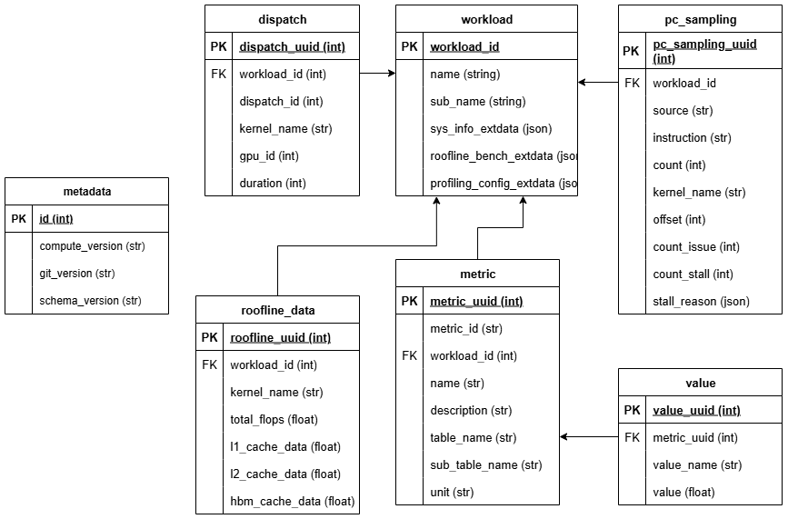
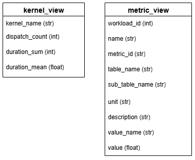

.. meta::
   :description: ROCm Compute Profiler analysis: Data dump analysis
   :keywords: ROCm Compute Profiler, ROCm, profiler, tool, Instinct, accelerator, analyze, filtering, metrics, baseline, comparison, post analysis, database, sqlite, data, dump, data dump

******************
Data dump analysis
******************

This section provides an overview of how the data generated in analysis mode can be dumped to a SQLite3 database for custom report generation.

.. _overview:

Overview
=================

.. note::

   Data dump analysis only works when the given workload(s) folder are created using ``--format-rocprof-output rocpd`` option in profile mode.

In addition to applying various analysis mode options mentioned in :doc:`cli` to perform kernel, dispatch and metric filtering; Add ``--db <db_name>`` option to the command.
This will do the following:

* Create ``<db_name>.db`` SQLite3 database file in the current working directory

  * Will fail if the file already exists to avoid overwriting

* Will populate system information, roofline data, PC sampling data and calculate metrics data into the database file

  * Warning will be shown if any information cannot be calculated due to missing data 

  * For example, attempting to analyze workload profiled with ``--no-roof`` option will throw a warning for unable to calculate roofline data.

.. _schema:

Data dump schema
================

Analysis data dump schema
-------------------------

Analysis data dump views
------------------------

.. _example:

Data dump command example
=========================

.. note::

   Some metrics cannot be calculated when corresponding counters are missing as shown in the warnings below

.. note::

   It is possible to merge the analysis data dump for multiple workload folders (resulting from multiple profiles) by repeating ``-p`` option for each workload

.. code-block:: shell-session

   $ rocprof-compute analyze --verbose --db test -p workloads/vmem/MI300X_A1 -p workloads/vmem1/MI300X_A1
   DEBUG Execution mode = analyze

                                    __                                       _
   _ __ ___   ___ _ __  _ __ ___  / _|       ___ ___  _ __ ___  _ __  _   _| |_ ___
   | '__/ _ \ / __| '_ \| '__/ _ \| |_ _____ / __/ _ \| '_ ` _ \| '_ \| | | | __/ _ \
   | | | (_) | (__| |_) | | | (_) |  _|_____| (_| (_) | | | | | | |_) | |_| | ||  __/
   |_|  \___/ \___| .__/|_|  \___/|_|        \___\___/|_| |_| |_| .__/ \__,_|\__\___|
                  |_|                                           |_|

      INFO Analysis mode = db
   DEBUG [omnisoc init]
   DEBUG [omnisoc init]
   DEBUG [analysis] prepping to do some analysis
      INFO [analysis] deriving rocprofiler-compute metrics...
   WARNING Roofline ceilings not found for /app/projects/rocprofiler-compute/workloads/vmem/MI300X_A1.
   WARNING Roofline ceilings not found for /app/projects/rocprofiler-compute/workloads/vmem1/MI300X_A1.
   WARNING PC sampling data not found for /app/projects/rocprofiler-compute/workloads/vmem/MI300X_A1.
   WARNING PC sampling data not found for /app/projects/rocprofiler-compute/workloads/vmem1/MI300X_A1.
   DEBUG Collected dispatch data
   DEBUG Applied analysis mode filters
   DEBUG Calculated dispatch data
   DEBUG Collected metrics data
   WARNING Failed to evaluate expression for 3.1.25 - Value: to_round(to_avg(
   (pmc_df.get("TCP_TCP_LATENCY_sum") / pmc_df.get("TCP_TA_TCP_STATE_READ_sum")).where((pmc_df.get("TCP_TA_TCP_STATE_READ_sum") != 0), None)), 0) - unsupported operand type(s) for /: 'NoneType' and 'float'
   WARNING Failed to evaluate expression for 3.1.39 - Value: to_round((to_avg(
   (pmc_df.get("pmc_perf_ACCUM") / pmc_df.get("SQC_ICACHE_REQ")).where((pmc_df.get("SQC_ICACHE_REQ") != 0), None)) * 100), 0) - unsupported operand type(s) for /: 'NoneType' and 'float'
   WARNING Failed to evaluate expression for 3.1.25 - Value: to_round(to_avg(
   (pmc_df.get("TCP_TCP_LATENCY_sum") / pmc_df.get("TCP_TA_TCP_STATE_READ_sum")).where((pmc_df.get("TCP_TA_TCP_STATE_READ_sum") != 0), None)), 0) - unsupported operand type(s) for /: 'NoneType' and 'float'
   WARNING Failed to evaluate expression for 3.1.39 - Value: to_round((to_avg(
   (pmc_df.get("pmc_perf_ACCUM") / pmc_df.get("SQC_ICACHE_REQ")).where((pmc_df.get("SQC_ICACHE_REQ") != 0), None)) * 100), 0) - unsupported operand type(s) for /: 'NoneType' and 'float'
   DEBUG Calculated metric values
   DEBUG Calculated roofline data points
   DEBUG [analysis] generating analysis
   DEBUG SQLite database initialized with name: test.db
   DEBUG Initialized database: test.db
   DEBUG Completed writing database
