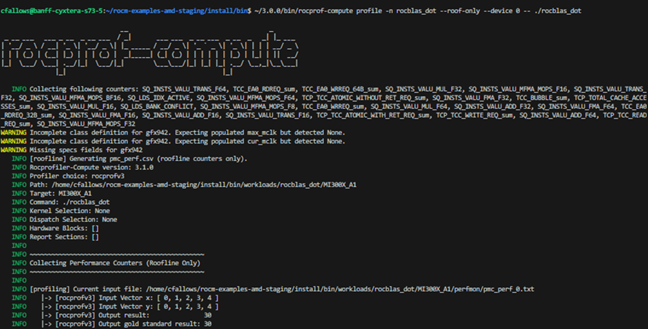
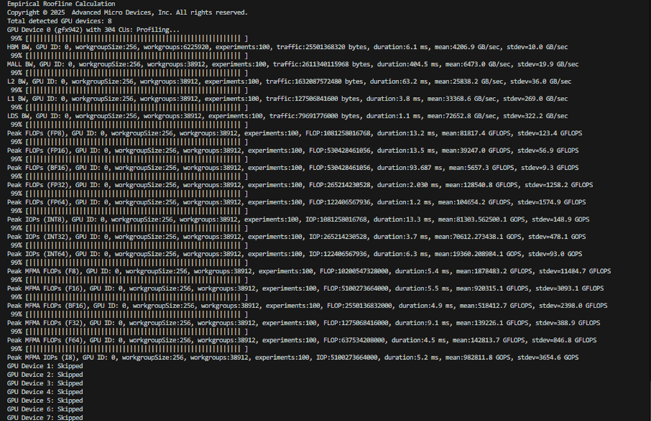
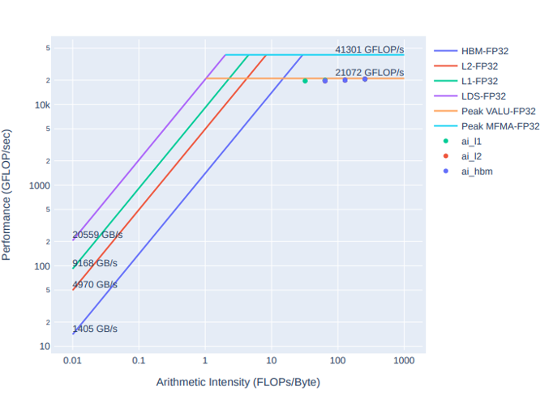
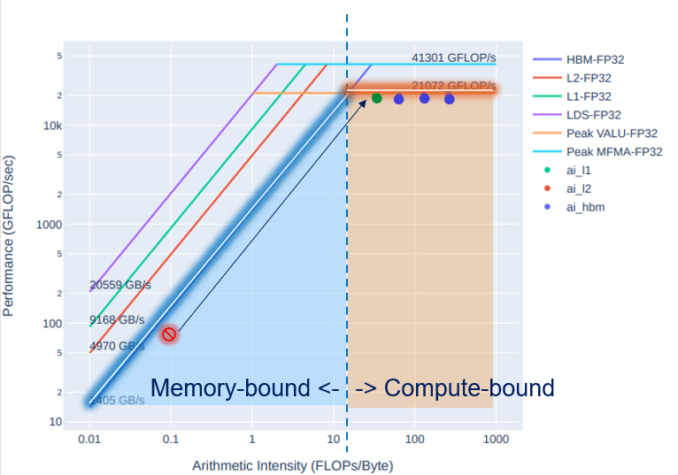
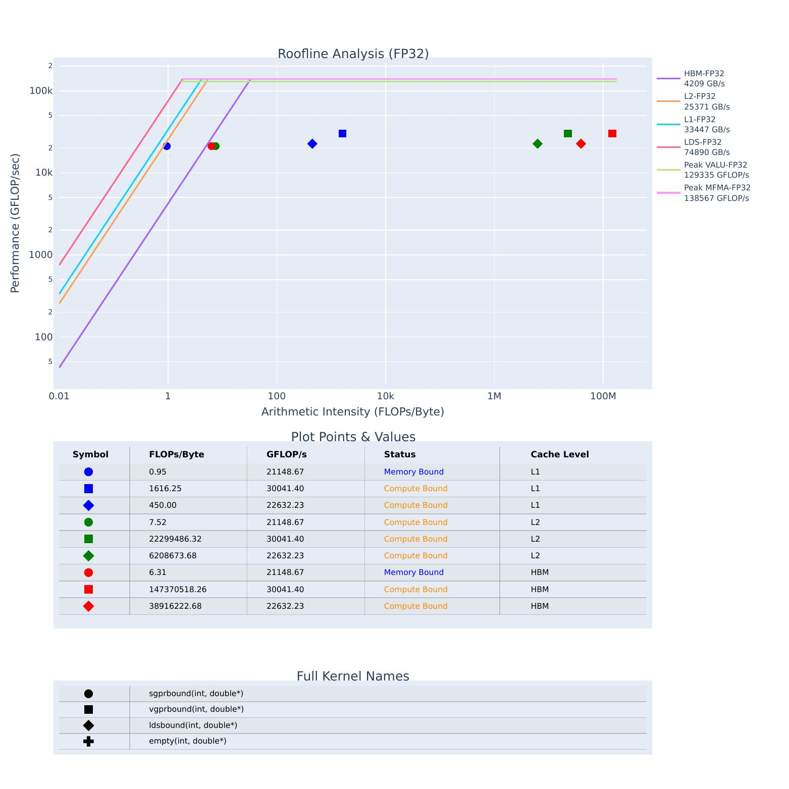
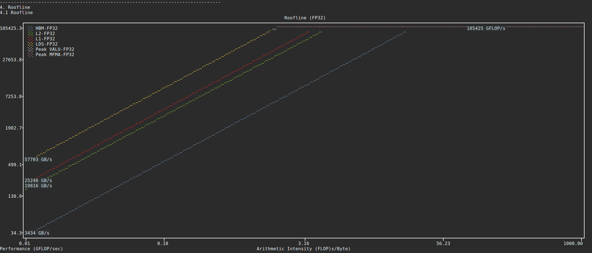
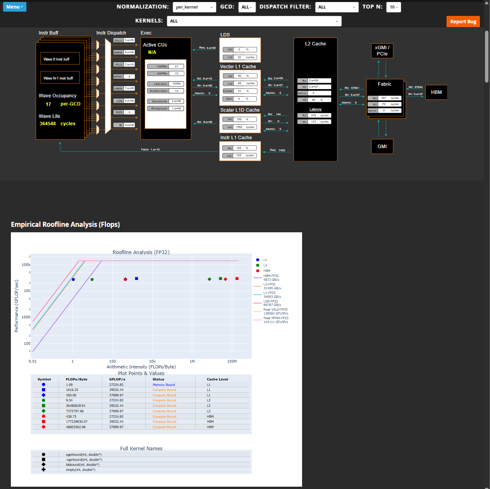

.. meta::
   :description: ROCm Compute Profiler: Roofline Analysis
   :keywords: ROCm Compute Profiler, profiling, analysis, analyze mode, roofline, benchmark, MFMA, plot

********************************************
Using Roofline Analysis in ROCm Compute Profiler
********************************************

.. contents::

.. _roofline-Conceptual:
Conceptual
=====================

The roofline model is a way to compare kernel or application performance against the hardware capabilities, or the peak performance, of a system.
At a high level, the purpose is for displaying how efficient a program is executing. Typically, roofline is visualized as a graph plotting points of kernel performance against “roof lines”- the maximum theoretical ceilings for performance and bandwidth of a system. This visual tool can be used by developers to find points of optimization, bottlenecks, and limitations in their application and the given hardware it is running on.

Roofline analysis in the profiling stage consists of two different data captures:

* The performance counter collection which profiles the user’s workload itself. For roof-only case, we limit the counters to only those necessary for roofline analysis purposes. This data is used to plot the kernel points on the roofline graph.

* The roofline micro-benchmarking which profiles the hardware capabilities of the system. This part executes the roofline binary, comprised of benchmarks that compute the attainable peak of the hardware per data type. This phase is dependent on both the hardware architecture and the customer’s hardware settings, such as clock speed for example. This data is used to plot the ‘peaks’, or lines on the graph.

The goal with the roofline model is for developers to see through their kernel runs where they can minimize the amount of data being accessed through memory,
whist maximizing the operations performed on said memory. Roofline plots display this information based on where in a plot a kernel point sits agains the two axis:

* [Y axis] Bandwidth/memory throughput: the amount of data that can be transferred between memory and CPU, hardware-dependent.

* [X axis] Arithmetic Intensity: the ratio of computational work (operations) to data movement (in bytes).

Interpreting a basic roofline plot involves a few key items:

Referencing the graph above, the glowing lines represent the theoretical peaks, or the most optimal performance of the hardware and software in the most ideal conditions.
The diagonal lines represents the theoretical maximum memory throughput:

* :doc:`LDS </conceptual/local-data-share.html>`: local data share, or shared memory, is fast on-CU scratchpad that can be managed by SW to effectively share data and coordinate between wavefronts in a workgroup.

* :doc:`L1 cache </conceptual/vector-l1-cache.html>`: the vL1d, or vector L1 data cache, is local to each CU on an accelerator and handles vector memory operations issued by a wavefront.

* :doc:`L2 cache </conceptual/l2-cache.html>`: shared by all CUs on the accelerator, handles requests from all L1 caches and the command processor.

* HBM: an accelerator’s local high-bandwidth memory.

The horizontal lines is the theoretical maximum compute performance:

* :ref:`Peak VALU <desc-valu>`: the vector arithmetic logic unit (VALU) executes vector instructions over an entire wavefront, each work-item (or, vector-lane) potentially operating on distinct data.

* :ref:`Peak MFMA <desc-mfma>`: matrix fused multiply add instructions where entries of the input and output matrices are distributed over the lanes of the wavefront’s vector registers.

Let’s start with the red kernel point- it is a memory-intensive workload, and because it sits just under peak memory bandwidth line, we are restricted in performance by how fast we can move data. Seeing a kernel point here would first suggest to us that we are bottlenecked by a specific memory stage and might want to reevaluate memory access implementation. Another obervation would be that we should optimize our code to do more operations on loaded data before needing more- this is the arithmetic intensity measurement- how much work we can do on the same data. Some examples of this would be to change precision (for example single precision over double precision for space and speed), use the vector units more efficiently, multithreading, use optimized kernels or other rocm software. Applications that are throughput bound by GEMM computation can achieve additional speedups by utilizing Matrix Cores. Generalized Matrix Multiplication (GEMM) computations are hardware-accelerated through Matrix Core Processing Units to achieve speedup, compared to SIMD vector units.
See :amd-lab-note:`AMD matrix cores <amd-lab-notes-matrix-cores-readme>` for more information.

.. _roofline-Benchmarking:
Benchmarking
=====================

.. note::
    Roofline benchmarking was previously executed with binaries generated from the `rocm-amdgpu-bench <https://github.com/ROCm/rocm-amdgpu-bench>`_ repository. This repository is now deprecated and replaced by the runtime benchmarking explained below.

Roofline benchmarks are compiled at runtime using `local HIP and HIPRTC Python wrappers <https://github.com/ROCm/rocm-systems/tree/develop/projects/rocprofiler-compute/src/hip>`.

To modify the benchmarks, users can edit the source code in `benchmark.py <https://github.com/ROCm/rocm-systems/blob/develop/projects/rocprofiler-compute/src/utils/benchmark.py>` and compile the project before running. Alternatively users can run ``benchmark.py`` to collect standalone Roofline empirical peaks without running the entire ROCm Compute Profiler's profile mode:

  .. code-block:: shell-session
     $ python benchmark.py

The ``roofline.csv`` is outputted into the working directory.

.. _roofline-Profiling-options:
Profiling Options
=====================
In profiling mode, we collect the roofline-related performance counters for a user's workload and roofline benchmarks for the system's empirical attainable peak throughput. Roofline analysis occurs on any profile mode run, provided ``--no-roof`` option is not included. You don't need to include any additional roofline-specific options for roofline analysis. If you want to focus only on roofline-specific performance data and reduce the time it takes to profile, you can use the ``--roof-only`` option. This option limits the profiling to just the roofline performance counters.

Profile Mode Roofline Options:
---------------------

``--sort <desired_sort>``
   Allows you to specify whether you would like to overlay top kernel or top
   dispatch data in your roofline plot.

``-k``, ``--kernel <kernel-substr>``
   Allows for kernel filtering. Usage is equivalent with the current ``rocprof``
   utility. See :ref:`profiling-kernel-filtering`.

``-m``, ``--mem-level <cache_level>``
   Allows you to specify specific levels of cache to include in your roofline
   plot.

``--device <gpu_id>``
   Allows you to specify a device ID to collect performance data from when
   running a roofline benchmark on your system.

``-R <datatype>``, ``--roofline-data-type <datatype>``
   Allows you to specify data types that you want plotted in the roofline PDF output(s). Selecting more than one data type will overlay the results onto the same plot. At this time we separate Op vs FLOP data types into separate graphs, as we only support FLOP intensities. (Default: FP32)

   .. note::
      For more information on data types supported based on the GPU architecture, see :doc:`../../conceptual/performance-model`

``--no-roof``
   Profile your workload as usual but skip all roofline-related work (including roofline benchmarking); i.e. do not do any roofline profiling.

``--roof-only``
   Only do roofline profiling; collect only the counters relevant to roofline.

Examples:
---------------------

**The following demonstrates profiling roofline data only:**

.. code-block:: shell-session
   $ rocprof-compute profile --name vcopy --roof-only -- ./vcopy -n 1048576 -b 256
   ...
   [roofline] Checking for roofline.csv in /home/auser/repos/rocprofiler-compute/sample/workloads/vcopy/MI200
   [roofline] No roofline data found. Generating...
   Checking for roofline.csv in /home/auser/repos/rocprofiler-compute/sample/workloads/vcopy/MI200
   Empirical Roofline Calculation
   Copyright © 2022  Advanced Micro Devices, Inc. All rights reserved.
   Total detected GPU devices: 4
   GPU Device 0: Profiling...
    99% [||||||||||||||||||||||||||||||||||||||||||||||||||||||||||| ]
    ...
   Empirical Roofline PDFs saved!

An inspection of our workload output folder shows ``.pdf`` plots were generated
successfully.

.. code-block:: shell-session
   $ ls workloads/vcopy/MI200/
   total 48
   -rw-r--r-- 1 auser agroup 13331 Mar  1 16:05 empirRoof_gpu-0_FP32.pdf
   drwxr-xr-x 1 auser agroup     0 Mar  1 16:03 perfmon
   -rw-r--r-- 1 auser agroup  1101 Mar  1 16:03 pmc_perf.csv
   -rw-r--r-- 1 auser agroup  1715 Mar  1 16:05 roofline.csv
   -rw-r--r-- 1 auser agroup   650 Mar  1 16:03 sysinfo.csv
   -rw-r--r-- 1 auser agroup   399 Mar  1 16:03 timestamps.csv
.. note::
    ROCm Compute Profiler currently captures roofline profiling for all data types, and you can reduce the clutter in the PDF outputs by filtering the data type(s). Selecting multiple data types will overlay the results into the same PDF. To generate results in separate PDFs for each data type from the same workload run, you can re-run the profiling command with each data type as long as the ``roofline.csv`` file still exists in the workload folder.

**The following image is a sample ``empirRoof_gpu-0_FP32.pdf`` roofline PDF output:**

Each kernel in your ``.pdf`` roofline plot is automatically distinguished with a unique marker identifiable from the plot's key. The roofline PDF includes an integrated multi-subplot layout with:

   1. **Roofline Plot** - Shows performance ceilings and kernel arithmetic intensity points
   2. **Plot Points & Values Table** - Displays AI values, performance metrics, memory/compute bound status, and cache levels for each kernel
   3. **Full Kernel Names Table** - Lists complete kernel names with their corresponding plot markers

.. _roofline-Analysis-options:
Analysis Options
=====================

Analyze Mode Roofline Options:
---------------------

**CLI/GUI:**
``-b <block_id>, --block <block_id>``
   Allows you to select metric id(s) from --list-metrics for filtering analysis outputs. Roofline metric ID is 4. Other information relevant to roofline can be found in metric ID 2, Speed-of-Light.

**CLI:**
``-R <datatype>``, ``--roofline-data-type <datatype>``
   Allows you to specify data types that you want in the roofline plots(s). Selecting more than one data type will overlay the results onto the same plot. At this time we separate Op vs FLOP data types into separate graphs, as we only support FLOP intensities. (Default: FP32)

   .. note::
      For more information on data types supported based on the GPU architecture, see :doc:`../../conceptual/performance-model`

Examples:
---------------------

**Sample code for displaying Roofline plot and metrics through block filtering in CLI mode:**

In CLI mode, Roofline information can be isolated by using the ``-b`` option to select the roofline-related block 4 that displays a roofline plot in terminal (generated using plotly) and compute and memory bandwidth metrics.

.. code-block:: shell-session
   $ rocprof-compute analyze -p workloads/vcopy/MI200/ -b 4

.. note::
   * Visualized memory chart and Roofline chart are only supported in single run analysis. In multiple runs comparison mode, both are switched back to basic table view.
   * Visualized memory chart requires the width of the terminal output to be greater than or equal to 234 to display the whole chart properly.
   * Visualized Roofline chart is adapted to the initial terminal size only. If it is not clear, you may need to adjust the terminal size and regenerate it to check the display effect.

Empirical hierarchical roofline can be viewed on the main CLI Analysis page :ref:`here <cli-empirical-hierarchical-roofline>`, along with the other available general usage options in CLI mode.

.. _roofline-Analysis-kernel-filtering:
**Sample code for applying kernel filtering to Roofline analysis in CLI mode:**

In addition to block filtering (``-b 4``), Roofline metrics can also be filtered by kernel filtering using the ``-k`` option. When analyzing specific kernels, the roofline analysis provides detailed metrics for each filtered kernel.

  .. code-block:: shell-session

     $ rocprof-compute analyze -p workloads/vcopy/MI200/ -k 0 -b 4
  This generates enhanced roofline output showing per-kernel performance rates and arithmetic intensity calculations:

  .. code-block:: text

   ================================================================================
   4. Roofline
   ================================================================================
   (4.1) Per-Kernel Roofline Metrics and (4.2) AI Plot Points
   --------------------------------------------------------------------------------
   Kernel 0: vecCopy(double*, double*, double*, int, int) (100.0%)
      |
      ├─ 4.1 Roofline Rate Metrics:
      |   ╒═════════════╤════════════════════╤═══════════════════╤═════════╤════════════════════╕
      |   │ Metric_ID   │ Metric             │ Value             │ Unit    │   Peak (Empirical) │
      |   ╞═════════════╪════════════════════╪═══════════════════╪═════════╪════════════════════╡
      |   │ 4.1.0       │ VALU FLOPs         │                   │ Gflop/s │           61286.40 │
      |   ├─────────────┼────────────────────┼───────────────────┼─────────┼────────────────────┤
      |   │ 4.1.1       │ MFMA FLOPs (F64)   │                   │ Gflop/s │          108544.33 │
      |   ├─────────────┼────────────────────┼───────────────────┼─────────┼────────────────────┤
      |   │ 4.1.2       │ MFMA FLOPs (F32)   │                   │ Gflop/s │          104531.42 │
      |   ├─────────────┼────────────────────┼───────────────────┼─────────┼────────────────────┤
      |   │ 4.1.3       │ MFMA FLOPs (F16)   │                   │ Gflop/s │          709169.38 │
      |   ├─────────────┼────────────────────┼───────────────────┼─────────┼────────────────────┤
      |   │ 4.1.4       │ MFMA FLOPs (BF16)  │ 0.0               │ Gflop/s │          388161.09 │
      |   ├─────────────┼────────────────────┼───────────────────┼─────────┼────────────────────┤
      |   │ 4.1.5       │ MFMA FLOPs (F8)    │ 0.0               │ Gflop/s │         1446089.60 │
      |   ├─────────────┼────────────────────┼───────────────────┼─────────┼────────────────────┤
      |   │ 4.1.6       │ MFMA IOPs (Int8)   │                   │ Giop/s  │          737317.94 │
      |   ├─────────────┼────────────────────┼───────────────────┼─────────┼────────────────────┤
      |   │ 4.1.7       │ HBM Bandwidth      │                   │ Gb/s    │            3231.95 │
      |   ├─────────────┼────────────────────┼───────────────────┼─────────┼────────────────────┤
      |   │ 4.1.8       │ L2 Cache Bandwidth │                   │ Gb/s    │           19096.81 │
      |   ├─────────────┼────────────────────┼───────────────────┼─────────┼────────────────────┤
      |   │ 4.1.9       │ L1 Cache Bandwidth │ 3880.358726762844 │ Gb/s    │           25006.24 │
      |   ├─────────────┼────────────────────┼───────────────────┼─────────┼────────────────────┤
      |   │ 4.1.10      │ LDS Bandwidth      │                   │ Gb/s    │           54920.88 │
      |   ╘═════════════╧════════════════════╧═══════════════════╧═════════╧════════════════════╛
      ├─ 4.2 Roofline AI Plot Points:
      |   ╒═════════════╤══════════════════════╤═════════╤════════════╕
      |   │ Metric_ID   │ Metric               │ Value   │ Unit       │
      |   ╞═════════════╪══════════════════════╪═════════╪════════════╡
      |   │ 4.2.0       │ AI HBM               │         │ Flops/byte │
      |   ├─────────────┼──────────────────────┼─────────┼────────────┤
      |   │ 4.2.1       │ AI L2                │         │ Flops/byte │
      |   ├─────────────┼──────────────────────┼─────────┼────────────┤
      |   │ 4.2.2       │ AI L1                │         │ Flops/byte │
      |   ├─────────────┼──────────────────────┼─────────┼────────────┤
      |   │ 4.2.3       │ Performance (GFLOPs) │         │ Gflop/s    │
      |   ╘═════════════╧══════════════════════╧═════════╧════════════╛
  The per-kernel analysis uses YAML-based metric evaluation for accurate calculations.

  Analyze multiple kernels for comparison:

  .. code-block:: shell-session

     $ rocprof-compute analyze -p workloads/vcopy/MI200/ -k 0 1 2 -b 4

General kernel filtering instructions and code can be viewed on the main CLI Analysis page :ref:`here <cli-filter-kernel>`, along with the other available general usage options in CLI mode.

**Sample GUI visual displaying roofline plots:**

GUI mode uses plotly to generate and display the Roofline plots (same method as our roofline plot PDF outputs).

Viewing Roofline analysis in GUI mode does not require any additional options from the user other than starting the interface with ``--gui`` option. All blocks are displayed in the GUI, and all filtering and sorting options (for example, kernel filtering) are available in the interface itself for the user to toggle.

General GUI mode details can be found on the :doc:`Standalone GUI analysis <how-to/analyze/standalone-gui>` page.

**TUI mode and Roofline analysis:**

.. note::
   TUI mode does not support Roofline analysis feature at this time.
