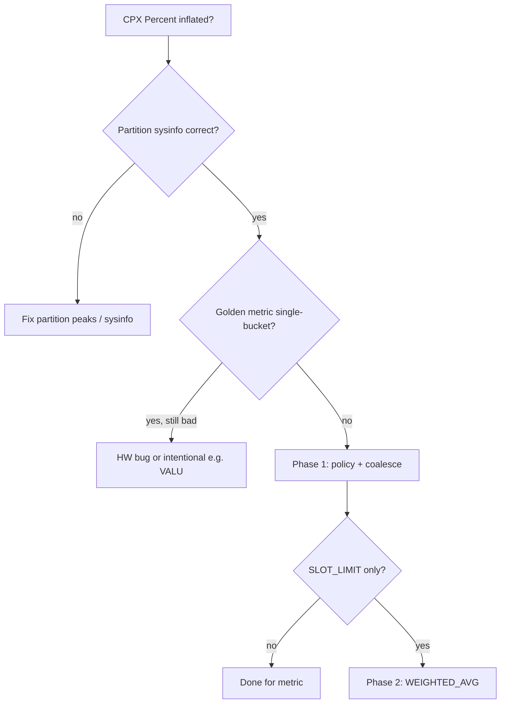

# Single-run metric collection — Phase 1 & Phase 2 plan

**Status:** In progress (branch `users/feizheng10/aiprofcomp-865-single-run-collection`)
**JIRA:** AIPROFCOMP-865 (single-run collection; parent AIPROFCOMP-864)
**Related:** AIPROFCOMP-78 (CPX Percent inflation), grouping coalesce fix [#10912](https://github.com/ROCm/rocm-systems/pull/10912)
**Explicitly out of scope:** `BOUND_RATIO` and other analyze-time caps (defer until Phase 1 evidence is collected)

---

## Goal

Establish **same profiling replay** for each ratio metric’s numerator and denominator PMCs (Jira bullet 1), then—only where HW slots make that impossible—add **weighted submetric recombination** (Jira bullets 2–3, `WEIGHTED_AVG`).

Grouping policy + metric-aware coalescing remains the **first accurate choice**; Phase 1 proves and hardens it. Phase 2 addresses **residual** multi-pass cases that are slot-limited, not policy bugs.

---

## Phase 1 — Same-run contract (profiler / grouping)

### 1.1 Objectives

| # | Objective | Done when |
|---|-----------|-----------|
| P1-1 | Golden metric set for gfx942 CPX | Checklist below signed off per metric |
| P1-2 | Offline proof: formula PMCs share one perfmon bucket | Inspector shows 1 bucket for each golden metric (full default counter set) |
| P1-3 | Hardware proof: Percent stable after #10912 | Re-profile CPX workloads; avg ≤ 100% (max per rules below) |
| P1-4 | Close policy / coalesce gaps | No golden metric in inspector “multi-bucket” without documented HW excuse |
| P1-5 | Operational guardrails (optional stretch) | Profile warns when a `same_bucket_priority` metric is still multi-pass |

### 1.2 Normative rule (design intent)

- If metric \(M = A/B\) (including via YAML variables that expand to PMCs), **all HW counters needed to evaluate \(A\) and \(B\) on a dispatch row** must be collected in the **same perfmon replay** for that metric’s coalesce group.
- **Exceptions:** documented intentional \>100% (e.g. gfx942 VALU dual-issue), metrics that cannot fit one bucket due to IP-block or slot rules (feeds Phase 2), or investigate-as-bug if violation persists under single-pass.

### 1.3 CPX validation workloads (hardware)

Use the same workloads as the AIPROFCOMP-78 investigation (re-profile on a stack that includes #10912):

| Workload | Role | Notes |
|----------|------|--------|
| `occupancy_cpx` | HBM avg inflation (~103% pre-fix) | Memory-heavy; good for `3.1.x` / `17.2.x` traffic % |
| `mat_exp` | WGM / HBM **max** explosions (739% / 188% pre-fix) | Stresses `MAX(n/d)` dispatch outliers |
| `rocflop` | Secondary SOL / VALU sanity | Compare against known dual-issue behavior |

**Profile setup (example):**

```bash
# CPX on one logical GPU (MI300X-class), NPS per your platform doc
sudo amd-smi set -C CPX -g all
export HIP_VISIBLE_DEVICES=0

rocprof-compute profile -n <name> -- ./<binary>
rocprof-compute analyze -p workloads/<name>/gfx942/ -n per_kernel
```

**Data paths (authoritative copy from prior investigation):**

- `~/Downloads/aiprofcomp78-cpx-data/{occupancy_cpx,mat_exp,rocflop}/` — use for **before** baseline; **after** = new profiles post-#10912.

### 1.4 Golden metric checklist (gfx942)

Run inspector **before** hardware re-profile to catch grouping gaps cheaply.

```bash
cd projects/rocprofiler-compute
./tools/counter_grouping_inspector.py --arch gfx942 --output /tmp/gfx942-plan.txt
# Optional: narrow YAML scan to memory + SPI + L2 blocks
./tools/counter_grouping_inspector.py --arch gfx942 --block 3 6 17 --output /tmp/gfx942-subset.txt
```

In the plan output, read **“Metrics with PMC counters assigned to more than one perfmon bucket”**. Each golden row should **not** appear there (or must be listed in §1.6 with HW rationale).

| Priority | Metric ID | Metric name (gfx942) | Formula class | In `profiling_counter_grouping_policy.yaml`? | CPX symptom (pre-fix) | Pass criteria (post Phase 1) |
|----------|-----------|----------------------|---------------|-----------------------------------------------|------------------------|------------------------------|
| P0 | `3.1.63` | HBM Read Traffic (mem chart) | `SUM(DRAM)/SUM(REQ)` | Yes | occupancy avg **>100%** | avg ≤ 100%; inspector **1 bucket** |
| P0 | `3.1.64` | HBM Write and Atomic Traffic | `SUM(DRAM)/SUM(REQ)` | Yes | same class | avg ≤ 100%; inspector **1 bucket** |
| P0 | `17.2.1` | HBM Read Traffic (L2 panel) | avg + **max** `MAX(n/d)` | Yes | mat_exp HBM max **188%** | avg ≤ 100%; max ≤ 100% *or* explain dispatch-level noise after single-pass |
| P0 | `17.2.5` | HBM Write and Atomic Traffic | avg + max | Yes | same class | same as `17.2.1` |
| P0 | `6.1.2` | Workgroup Manager Utilization | `SUM(SPI_BUSY)/SUM(GUI_ACTIVE)` | Yes (gfx942 policy) | mat_exp WGM max **739%** | max ≤ 100% after same-run; verify full-panel inspector (block-only scan may still show 2 buckets) |
| P1 | `3.1.x` | Remote / non-HBM traffic % (NOISE_CLAMP) | derived from same REQ family | Partial (denom shared) | secondary | avg ≤ 100%; confirm **DRAM+clamp** counters co-located with REQ |
| P1 | `2.1.x` | VALU Utilization | CU-scaled % | No | ~108% “inflation” | **Exception:** may exceed 100% (dual-issue); document, do not cap in Phase 1 |
| P2 | `17.1.x` / GRBM | CP / GPU busy style (if in CPX panel) | ratio | arch-dependent | lower priority on CPX | single-bucket per inspector |

**How to fill “Metric ID” from analyze:** use the first column from `rocprof-compute analyze -b …` (e.g. `17.2.1`). Map to inspector rows: `File` stem → block (`1700` → `17`), `Panel` → sub-panel, `Idx` → metric index → id `17.2.1`.

### 1.5 Evidence worksheet (per metric, per workload)

Copy for each re-profile run:

```text
Metric ID:
Workload:
rocprof-compute commit / PR:
Inspector: single-bucket? (Y/N) buckets:
Analyze avg / min / max:
SPX same-workload reference (optional):
Verdict: PASS | POLICY_GAP | SLOT_LIMIT (→ Phase 2) | HW_BUG | INTENTIONAL
Notes:
```

### 1.6 Triage buckets (after measurement)

| Verdict | Action |
|---------|--------|
| **POLICY_GAP** | Add `same_bucket_priority_metric_ids` and/or coalesce fix; re-run inspector |
| **SLOT_LIMIT** | Document counters + slot count; queue for Phase 2 decomposition |
| **HW_BUG** | File driver/firmware/counter-defect; **do not** cap in YAML until validated |
| **INTENTIONAL** | Document in metric description (VALU); exclude from “inflation” KPIs |

### 1.7 Phase 1 deliverables

1. Completed worksheet for all **P0** rows × three CPX workloads.
2. PR(s) only for: grouping policy entries, coalesce edge cases, inspector/docs—**no `BOUND_RATIO`**.
3. Short summary for Xuan / AIPROFCOMP-865: % of golden metrics single-bucket; list of **SLOT_LIMIT** candidates.
4. Optional: profile-mode warning when a priority metric id is multi-bucket (stretch).

### 1.8 Phase 1 timeline (suggested)

| Week | Focus |
|------|--------|
| W1 | Inspector baseline gfx942 full + blocks 3/6/17; fix any POLICY_GAP on branch |
| W2 | CPX re-profile three workloads; fill worksheets |
| W3 | Policy/coalesce follow-ups; publish summary + Phase 2 candidate list |

---

## Phase 2 — Weighted submetrics (`WEIGHTED_AVG`)

**Start only after** Phase 1 sign-off on P0 metrics **or** explicit **SLOT_LIMIT** classification with inspector evidence.

### 2.1 Objectives

| # | Objective | Done when |
|---|-----------|-----------|
| P2-1 | Design review (Xuan) | Signed YAML schema + aggregation semantics |
| P2-2 | Implement `WEIGHTED_AVG(M0, M1, …)` in analyze | Python unwrap with explicit weight counters \(C_0, C_1\) |
| P2-3 | Pilot metrics | At least one production metric converted from multi-pass to weighted merge |
| P2-4 | Tests + inspector | Unit tests for merge math; inspector proves each submetric is single-bucket |

### 2.2 Scope

**In scope**

- Metrics of the form \(M = (A+B)/C\) (or documented generalization) where Phase 1 proves **cannot** fit \(\{A,B,C\}\) in one perfmon file but **can** measure \((A,C_0)\) and \((B,C_1)\) in two single-pass sub-runs with \(C_0 + C_1 = C\) (or equivalent partition).
- YAML sugar: `WEIGHTED_AVG` with metadata binding submetrics to weight PMC series (per Jira note).

**Out of scope**

- Replacing partition normalization (AIPROFCOMP-798).
- Blanket `BOUND_RATIO` / `SUM(MIN)/SUM` rollout.
- Metrics that are already single-bucket after Phase 1.

### 2.3 Design tasks (pre-code)

1. **Candidate list** — export from Phase 1 worksheets where `Verdict=SLOT_LIMIT`.
2. **Identity checklist** — for each candidate, prove merge formula matches true \(M\) on paper + synthetic PMC tables.
3. **YAML schema** — e.g. submetric definitions, weight counter names, aggregation mode (avg vs max).
4. **Interaction with existing** `NOISE_CLAMP` remote-traffic metrics — avoid duplicate decomposition.
5. **Review** — “review design from Xuan” on Jira.

### 2.4 Implementation sketch

| Layer | Change |
|-------|--------|
| Analysis YAML | Submetrics `M0`, `M1` + `WEIGHTED_AVG(...)` wrapper on parent |
| `aggregation.py` | Evaluate weights from same dispatch rows; \(M = \sum M_i C_i / \sum C_i\) |
| Profiler | No change if submetrics are separate metric ids sharing policy priority |
| Inspector | Report single-bucket per submetric id |
| Tests | Numeric fixtures + one gfx942 metric golden row |

### 2.5 Phase 2 exit criteria

- All Phase 1 **SLOT_LIMIT** P0 metrics either converted to weighted submetrics **or** accepted as multi-pass with written rationale.
- No new silent caps introduced; regression tests on CPX workloads show improvement vs Phase 1 baseline (document deltas in PR).

### 2.6 Phase 2 timeline (suggested)

| Week | Focus |
|------|--------|
| W1 | Design doc + Xuan review; pick 1 pilot metric |
| W2–W3 | `WEIGHTED_AVG` implementation + pilot YAML |
| W4 | CPX re-validation + expand to remaining SLOT_LIMIT list if pilot succeeds |

---

## Decision flow (unchanged from evaluation)



---

## References

- `src/rocprof_compute_soc/soc_base.py` — `_metric_aware_coalesce_pass`
- `src/rocprof_compute_soc/analysis_configs/profiling_counter_grouping_policy.yaml`
- `tools/counter_grouping_inspector.py`
- `docs/conceptual/cdna/compute-memory-partition.rst` — CPX analyze interpretation
- Design guidance PR: [#10655](https://github.com/ROCm/rocm-systems/pull/10655) (correction methods; caps deferred here)
