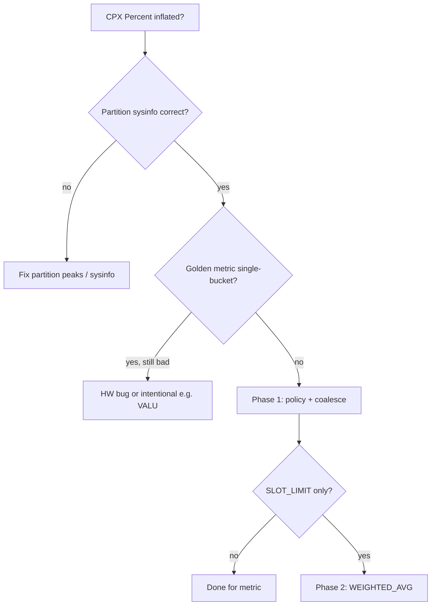

# AIPROFCOMP-865 — Stakeholder Q&A (collectables / Phase 1 & 2)

**Purpose:** Answers to design and scope questions on single-run collection, collectables, `SLOT_LIMIT`, and `WEIGHTED_AVG`.

**Branch:** `users/feizheng10/aiprofcomp-865-single-run-collection`

**Related docs**

- [Collectables-scoped delivery plan](aiprofcomp-865-collectables-scope.md)
- [Phase 1 & Phase 2 plan](aiprofcomp-865-single-run-collection-phases.md)
- [gfx942 single-pass impact report](aiprofcomp-865-gfx942-single-pass-impact-report.md)
- [WEIGHTED_AVG design](aiprofcomp-865-phase2-weighted-avg-design.md)

**On GitHub (branch):**

- https://github.com/ROCm/rocm-systems/blob/users/feizheng10/aiprofcomp-865-single-run-collection/projects/rocprofiler-compute/docs/plans/aiprofcomp-865-collectables-scope.md

---

## 1. Is `SLOT_LIMIT` “cannot fit into a single pass no matter what”?

**Not quite — we use it more precisely than “multi-pass.”**

In the Phase 1 worksheet, **`SLOT_LIMIT`** means: for that **metric’s full PMC set**, you **cannot pack all formula counters into one hardware perfmon bucket** (gfx942 `perfmon_config` slot limits per IP block), even if you repack globally. That is the **16** metrics in the gfx942 impact report (class B).

That is **different from**:

- **Multi-bucket under today’s 13-pass plan** but **packable in one bucket** with better coalesce/repack → **POLICY_GAP** / class **A** (**75** metrics), fixed in Phase 1, not Phase 2.
- **“Single pass” for the whole profile** — we still have **~13 replays**; the contract is **same replay for all PMCs of a given metric (or sub-collectable)**, not one replay for the entire chip.

**Summary:** **`SLOT_LIMIT` = one-bucket slot limit for the whole metric**, not “no number of passes can ever collect these counters.”

---

## 2. Long-term collectables in `sdk_config.yaml` vs local `sdk_config` for this design?

**North star (LLD):** Collectables (Layer 1.5) should eventually be first-class like counters and flow through SDK/config so profiling and analyze stay aligned.

**865 scope explicitly defers** full SDK integration and a standalone `collectables.yaml` migration (see [collectables-scope §1.4](aiprofcomp-865-collectables-scope.md)).

**For this delivery we use the legacy analysis path:**

- Collectables = **metric table rows** (normal `avg:` formulas) + optional `_collectable_id`
- Parents = **`WEIGHTED_AVG(...)` / `COLLECT_SUM(...)`** + `_weighted_avg` metadata on the parent row

**On `sdk_config.yaml` today:** it is the **SDK counter availability** surface used during profiling (e.g. `list-avail` in `perfmon_coalesce`). It is **not** yet a collectable registry. The tree already uses **local** `src/rocprof_compute_soc/profile_configs/sdk_config.yaml` for counter defs; **bolting collectable definitions there without an SDK/schema agreement** is a product decision, not something 865 commits to.

**Suggested incremental path:**

1. **865:** prove semantics on analysis YAML + tests (branch).
2. **Next:** agree with maintainers/SDK on **where** collectables live (`sdk_config` extension vs `collectables.yaml` vs metric library adapter).
3. **Then:** adapter emits the same `df.attrs` / graph the branch implements, so analyze does not depend on which file was authoritative.

**865 does not** stage collectables in `sdk_config` until that contract exists.

---

## 3. Exceptions beyond VALU / `SLOT_LIMIT` / HW defect?

The Phase 1 worksheet **triage** is the full picture:

| Verdict | Meaning |
|--------|---------|
| **PASS** | Single-bucket + acceptable analyze behavior |
| **POLICY_GAP** | Fix grouping/coalesce (#10912, policy YAML) — **not** a collectable |
| **SLOT_LIMIT** | Decompose (Phase 2) |
| **INTENTIONAL** | Real >100% (e.g. VALU dual-issue) — document, do not “fix” with caps |
| **HW_BUG** | Driver/firmware/counter defect — do not mask in YAML |

**Additional cases to be aware of:**

- **Wrong CPX partition / sysinfo** (e.g. 38-CU die vs SPX peaks) — fix interpretation before blaming metrics (see decision flow below).
- **Derived-only / peak-only metrics** (no profile PMCs) — out of pass/bucket semantics (the **34** of **408** on gfx942 default).
- **`NOISE_CLAMP` / remote traffic** — avoid double decomposition with HBM family metrics (Phase 2 design).
- **`BOUND_RATIO` / silent analyze caps** — **explicitly out of scope** for this effort.
- **`COLLECT_SUM` vs `WEIGHTED_AVG`:** when \(M = h + i\) is exact, use **sum of sub-collectables**, not weighted merge.

Normative intent (unchanged): fix **SLOT_LIMIT** via decomposition, not silent analyze-time caps — see [collectables-scope §1.2](aiprofcomp-865-collectables-scope.md).

---

## 4. Formulas harder than \((A-B)/C\) — e.g. \((A+B+C)/(D+E+F)\)?

The written Phase 2 v1 focus is the Jira-shaped case: **sum of numerators over a partitioned denominator**, merged as

\[
M = \frac{\sum_k M_k W_k}{\sum_k W_k}
\]

with **proved** weights (often \(W_k\) = a piece of the denominator).

**What the design does not automatically solve:**

- **Arbitrary rationals** need a **paper + numeric identity proof** per metric; the code provides **merge mechanics**, not auto-decomposition.
- **\((A+B+C)/(D+E+F)\)** is only safe if submetrics + weights are defined so the weighted merge **equals** the true ratio per dispatch (or an accepted approximation). That may require **more than two** sub-collectables.
- **`COLLECT_SUM`** covers **additive** parents when children are already single-pass.
- **`min` / `max` on parents** with `WEIGHTED_AVG` are **open** in the design doc — v1 is **avg-focused**.

**SLOT_LIMIT** metrics need **metric-by-metric** algebra + pilot validation (`pmc_perf.csv` hand calc).

---

## 5. Decision flow — full idea (not only “who gets collectables”)

From [Phase 1 plan](aiprofcomp-865-single-run-collection-phases.md):



**Interpretation:**

1. **Symptom:** CPX **percent inflation** (AIPROFCOMP-78) — visible on HBM % and WGM max.
2. **Environment:** Partition/sysinfo correct?
3. **Grouping:** Are **golden** metrics **single-bucket** in the inspector?
   - **No** → Phase 1 (policy, coalesce, future refill for packable multi-bucket).
   - **Yes** but still wrong → **HW_BUG** or **INTENTIONAL** (VALU).
4. **Still slot-limited after Phase 1** → Phase 2 (collectables + `WEIGHTED_AVG` / `COLLECT_SUM`).

**Collectables help when:**

- Same-replay is required for correctness, but
- The **whole metric** cannot fit one bucket (`SLOT_LIMIT`), yet
- **Sub-collectables** can be single-bucket in the **existing** pass plan (gfx942: all **16** class B — per-bucket slices fit slots; see [impact report §2](aiprofcomp-865-gfx942-single-pass-impact-report.md)).

**Refill (future)** targets the **75** packable multi-bucket metrics; the **16** need decomposition, not extra passes by default.

---

## 6. Why start from “CPX percent inflation”? Only targeting overflow?

**No.** Inflation is the **historical entry point**, not the whole goal.

- **AIPROFCOMP-78** surfaced the bug on **CPX** with **HBM traffic % > 100%** and extreme **max** on WGM.
- **865’s goal** is broader: **same perfmon replay for all PMCs that define a ratio (or sub-collectable)** so analyze does not mix passes. That applies to **any** misleading ratio, not only >100% display.
- Pass criteria often use **≤ 100%** on **P0** HBM/WGM because those are percent-of-traffic metrics where inflation was the smoking gun; **VALU** may exceed 100% by design.

---

## 7. “Golden metrics” — fixed list of 4 traffic + 1 utilization?

**P0 (Phase 1 closure gate)** — five metric IDs on gfx942:

| ID | Role |
|----|------|
| `3.1.63`, `3.1.64` | HBM read / write+atomic (mem chart) |
| `17.2.1`, `17.2.5` | Same traffic family (L2 panel, avg + max) |
| `6.1.2` | Workgroup Manager Utilization |

**Significance:** CPX **regression anchors** from the inflation investigation, entries in **`profiling_counter_grouping_policy.yaml`**, and the **inspector + hardware worksheets**. They are **not** the only metrics that matter (gfx942 inspector scan: **408** metrics; **91** multi-bucket globally today).

The plan also lists **P1** (e.g. remote traffic / NOISE_CLAMP, VALU as intentional) and **P2** (GRBM-style). **P0** is the gating list for Phase 1 evidence.

Offline, all **P0** ids are **single-bucket** in the 13-pass plan; hardware sign-off and post-#10912 re-profile remain open.

---

## 8. Where designers put `WEIGHTED_AVG` weights (implemented contract)

Weights are **not** inside the `WEIGHTED_AVG(...)` string. On the **parent** metric row in analysis YAML:

```yaml
        hbm_combined_traffic:
          avg: WEIGHTED_AVG(hbm_read_sub, hbm_write_sub)
          unit: Percent
          _weighted_avg:
            hbm_read_sub:
              weight_counter: TCC_EA0_RDREQ_sum
            hbm_write_sub:
              weight_counter: TCC_EA0_WRREQ_sum
```

Submetrics are separate rows with normal `avg:` formulas. Example: `tests/fixtures/weighted_avg/pilot_metric_table.yaml`. Production gfx942 pilot YAML is pending Phase 1 `SLOT_LIMIT` sign-off.

**“Prove weights”** = show that \(\sum_k M_k W_k / \sum_k W_k\) matches the intended parent definition (algebra + optional `pmc_perf.csv` check). See [impact report §2](aiprofcomp-865-gfx942-single-pass-impact-report.md) (class B / prove weights).

---

## Revision history

| Date | Change |
|------|--------|
| 2026-09-17 | Initial stakeholder Q&A from design review comments |
