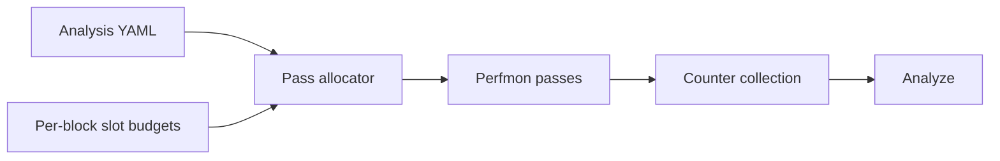

# Single-pass packable and unpackable

**JIRA:** AIPROFCOMP-865 (parent AIPROFCOMP-864)

**Scope:** Correct multi-pass ratio errors on the analysis YAML that ships today.

The packing algorithm is in [Metric grouping (SPP / SPU)](<lld-metrics grouping algorithm.md>). This document states why the change exists, what it must do, and which decisions it locks. It does not walk the bucket loop.

**Related design:**

- [Analysis config YAML redesign](../design/analysis-config-redesign/hld-analysis-config-redesign.md#layer-details) — Layer 1.5 collectables. This plan uses that idea on today’s panel YAML.
- [Three-layer analysis config LLD](../design/analysis-config-redesign/lld-index.md) and [metric library LLD](../design/analysis-config-redesign/lld-phase1-metric-library.md) — the migration this plan does not do.

Older planning drafts are on branch `users/feizheng10/aiprofcomp-865-docs-backup`.

---

## System Context

`rocprof-compute profile` replays a kernel once per perfmon pass. Each hardware block in a pass has its own slot budget (`perfmon_config` on `CounterFile` in `src/rocprof_compute_soc/soc_base.py`). A pass can hold GRBM and SQ together, because each counter is charged only to its own block. The pass cannot hold more SQ counters than the SQ budget, even when GRBM still has room.

Analysis YAML defines a metric as an expression over PMC counters. The shipping allocator, `_allocate_perfmon_counter_files`, packs the whole counter list into as few passes as it can. It does not require one metric’s counters to share a pass. Analyze then evaluates the expression on values merged across those replays.



Surrounding pieces, unchanged by this design:

- The counter collector (rocprofiler-sdk) programs whatever each pass file names. This design does not change that collector.
- Panel YAML remains the metric source. A later metric-library migration is a different program.

### What this design does not cover

| Item | Why it is outside |
|------|-------------------|
| One pass for the whole chip | The contract is one pass per metric PMC set, not one pass for every counter on the device. |
| Metric-library migration (MetricLibrary, Stage 4, an SDK collectables registry) | Layer 1.5 is the long-term home. 865 proves the same idea on today’s YAML. |
| Metrics with no profile PMCs | Nothing to pack. On gfx942 that is 34 of 408 YAML rows. |
| Intentional values above 100% (VALU dual-issue) and hardware counter defects | Those are not packing bugs. This design does not add a silent analyze-time cap. |
| Single-XCD L2 channel correction, SQG counter omission | Separate from pass placement and expression bind. |
| General hardware-instance metric framework | The grouping note treats today's TCC channel rules as a short-term solution; generalizing them is out of scope. |

### Shipping layout (gfx942 default profile)

Offline inspector of the shipping allocator:

| Quantity | Value |
|----------|------:|
| Unique hardware PMCs | 274 |
| Perfmon passes | **12–13** |
| YAML metrics | 408 |
| Metrics with profile PMCs | **374** |
| Already in one pass | **283** |
| Multi-pass, but the PMC set fits one pass (POLICY_GAP) | **75** |
| PMC set does not fit one pass | **16** |
| No profile PMCs | 34 |

POLICY_GAP here means a shipping-layout diagnosis: the metric is multi-pass today and becomes single-pass packable once the allocator’s goal changes. It is not a third metric class.

### Terms

| Term | Meaning | Example |
|------|---------|---------|
| **Single-pass packable (SPP)** | A metric whose counters can share one perfmon pass. Each hardware block in that pass has its own slot budget, so counters from different blocks (GRBM and SQ, for example) can sit together. **Collection:** that pass holds the metric's full PMC set. The same counter may also be copied into other passes. **Analyze:** same-pass bind — each expression uses counters from that one pass (`{counter}@pass:{key}`), so a ratio is not evaluated on values merged across different replays. | `CPC Utilization` (one replay; same-pass bind) |
| **Single-pass unpackable (SPU)** | Cannot fit one pass even after that placement. Phase 2 splits the parent into collectables. `WEIGHTED_AVG` only for split-weight ratios; `COLLECT_SUM` and `COLLECT_RATIO` for sums and ratios of those pieces. | `VALU FLOPs` (F16/F32/F64 rates) |
| **Collectable** | A single-pass fragment (formula + PMC set) collected together, then composed into a display metric ([Layer 1.5](../design/analysis-config-redesign/hld-analysis-config-redesign.md#layer-details) on today’s panel YAML). Used for SPU parents. | `hbm_read_sub` (HBM Bandwidth read fragment) |
| **POLICY_GAP** | Shipping-layout diagnosis only. Multi-pass today, SPP under the new packer, fixed in Phase 1. | `CPC Utilization` (shipping layout splits it; SPP places it in one pass) |
| **WEIGHTED_AVG** | Analyze composite for a ratio whose weight was split: \((M_0 C_0 + M_1 C_1)/(C_0 + C_1)\). | `WEIGHTED_AVG(read_ratio_sub, write_ratio_sub)` with `TCC_EA0_RDREQ_sum` and `TCC_EA0_WRREQ_sum` |
| **COLLECT_SUM / COLLECT_RATIO** | Analyze composites for a sum of sub-collectables, and for a ratio of summed pieces. | HBM Bandwidth `COLLECT_SUM(hbm_read_sub, hbm_write_sub)`; AI HBM `COLLECT_RATIO`(FLOP pieces, bytes) |

Same-pass bind is the analyze half of SPP, not its own class. A mixed GRBM + other-block PMC set is still SPP when each block’s budget has room. None of the 16 SPU metrics on gfx942 include GRBM.

### Constraints

- Slot budgets are per hardware block, from `perfmon_config`. Copying a counter into a second pass is allowed when two PMC sets cannot share one bucket.
- gfx942 is the reference count (408 / 374 / 358 / 16 / 34). Other arches use the same rules; their pass counts are a measurement, not a second design.
- Until the cleanup in Phase 2b, three environment variables restore the old path: `ROCPROF_COMPUTE_PERFMON_LEGACY_HEURISTIC=1`, `ROCPROF_COMPUTE_PERFMON_SINGLE_PASS_PACKABLE=0`, `ROCPROF_COMPUTE_ANALYZE_LEGACY_PASS_MERGE=1`.

Reported failures that this layout explains include [AIPROFCOMP-265](https://ontrack-internal.amd.com/browse/AIPROFCOMP-265) (CPC), [AIPROFCOMP-90](https://ontrack-internal.amd.com/browse/AIPROFCOMP-90) (L1 bandwidth above 100%), [AIPROFCOMP-268](https://ontrack-internal.amd.com/browse/AIPROFCOMP-268) (cache), [AIPROFCOMP-267](https://ontrack-internal.amd.com/browse/AIPROFCOMP-267) (TA/TD), [AIPROFCOMP-266](https://ontrack-internal.amd.com/browse/AIPROFCOMP-266) (Workgroup Manager utilization), and [ROCM-31864](https://ontrack-internal.amd.com/browse/ROCM-31864) (gfx950 L2-Fabric HBM / remote read traffic).

---

## Problem statement

For \(M = A/B\), `SUM(A)/SUM(B)` on counters merged from different perfmon passes is not the ratio of one kernel execution. The numerator and the denominator can come from different replays. Percent metrics then show averages and maxes that no single execution produced. `CPC Utilization` is the example: with the counters split, the reported average can sit far above 100%.

On gfx942, **75** of the **374** metrics that have profile PMCs are in that state only because the shipping allocator optimizes pass count for the whole counter list. Their PMC sets fit one pass. Another **16** do not fit one pass even after placement that respects each block’s slot budget. Both groups are wrong if analyze evaluates the full expression on merged passes. They are not the same fix.

Packing without same-pass bind is still wrong once a counter is copied into more than one pass: analyze would merge those copies. Bind without packing leaves the 75 POLICY_GAP metrics split. Both halves are Single-pass packable (SPP), and they ship together.

---

## Requirements

### Functional

Priority is the order of delivery. Phase 1 is the packable set. Phase 2 is only the unpackable parents.

| ID | Priority | Requirement |
|----|----------|-------------|
| FR-1 | Phase 1 | For every Single-pass packable (SPP) metric, one perfmon pass holds that metric’s full PMC set. |
| FR-2 | Phase 1 | Analyze binds each SPP expression to that pass (`{counter}@pass:{key}`). A ratio is not evaluated on values merged across replays. |
| FR-3 | Phase 1 | When two PMC sets cannot share a bucket, the same counter may be copied into another pass. |
| FR-4 | Phase 1 | A PMC set that mixes blocks (GRBM and SQ, for example) stays SPP when every block it touches still has room. |
| FR-5 | Phase 1 | The 75 POLICY_GAP metrics are fixed by FR-1 and FR-2. They are not collectables. |
| FR-6 | Phase 2 | Each Single-pass unpackable (SPU) parent is decomposed into collectables and recomposed at analyze time. |
| FR-7 | Phase 2 | `WEIGHTED_AVG` is only for a ratio whose weight was split across passes. Sums use `COLLECT_SUM`. A ratio of summed pieces uses `COLLECT_RATIO`. |
| FR-8 | Phase 2 | `min` / `max` on a composite parent stay unset, so grouping does not pull the parent’s full PMC set back into a pass. |
| FR-9 | Phase 2b | After Phase 1 and Phase 2 are accepted, a separate change removes the three escape hatches and the old allocator. |

### Non-functional

| ID | Requirement |
|----|-------------|
| NFR-1 | gfx942 default profile stays near **14** passes (measured 14), against 12–13 today. The cost is extra replays of some counters, not a new counter set (still 274 PMCs). |
| NFR-2 | SPU residual fill adds **0** passes on gfx942. Counters those 16 parents need are already in the Phase 1 layout. |
| NFR-3 | SPP packing and same-pass bind are the default. The three environment variables in System Context are the rollback path during soak. |
| NFR-4 | No silent analyze-time cap. A value above 100% is either intentional, a hardware defect, or a remaining SPU parent. |

### Guidelines

- The bucket walk, TCC series affinity, and the placement flowchart live in the grouping note. This document records the decision those steps implement.
- `WEIGHTED_AVG` does not repair a POLICY_GAP metric. Packing does.
- Phase 2b stays a separate change so the escape hatches exist while Phase 1 and Phase 2 soak.

---

## Design

```
408 YAML metrics (gfx942 default)
├── 374 with profile PMCs
│   ├── 358 Single-pass packable (SPP)    ← Phase 1 (~14 passes + same-pass bind)
│   └── 16 Single-pass unpackable (SPU)   ← Phase 2 collectables
└── 34 with no profile PMCs                ← out of packing scope
```

### Phase 1 — packing and same-pass bind

**Collection.** Replace the shipping heuristic as the default in `_allocate_perfmon_counter_files`. Place each SPP PMC set into one bucket (one perfmon pass). The normative steps are in the grouping note: prefer a bucket that already holds some of the set, and extend it only when every hardware block the new counters touch still has room.

Code: `src/rocprof_compute_soc/counter_grouping_single_pass.py`, `counter_grouping_buckets.py`, `soc_base.py`.

**Analyze.** When a counter is copied across passes, keep per-pass columns as `{counter}@pass:{key}` at load time, and bind each SPP expression to one co-located pass. Wire both CLI (`eval_metric`) and DB (`calc_expressions` / `bind_expression_dataframe`).

Code: `src/utils/metrics/pass_provenance.py`, plus the shadow columns in file I/O and analysis utilities.

TCC series affinity (channel instances of one event base, affinity pairs in the same pass) is a layout harden on this phase. It does not add passes on gfx942 (14 stays 14) and it is not a Phase 2 concern. Panel 1805 stays one packing group: `TCC_EA0_RDREQ`, `TCC_EA0_WRREQ`, and `TCC_EA0_ATOMIC` are one replay, in the pass that already holds them with `TCC_EA0_ATOMIC_LEVEL`. The extra `RDREQ` and `WRREQ` copies in that pass stay. Rows 1806 and 1807 bind to the pass that holds each LEVEL with its request series. Row 1808 binds to the pass that holds `ATOMIC_LEVEL` and `ATOMIC`. Details are in the grouping note.

### Phase 2 — collectables for Single-pass unpackable (SPU)

An SPU parent cannot fit one pass. Decompose it. Submetrics are ordinary SPP rows. The parent is an analyze-time composite (`apply_composite_metrics()`).

Pick the operator from the parent algebra:

- `COLLECT_SUM` adds already-single-pass submetrics. HBM bandwidth is read bandwidth plus write bandwidth: `COLLECT_SUM(hbm_read_sub, hbm_write_sub)`.
- `WEIGHTED_AVG` rebuilds one ratio whose weights were split: \(M = (M_0 C_0 + M_1 C_1)/(C_0 + C_1) = (A+B)/(C_0+C_1)\). That is a different quantity from \(A/C_0 + B/C_1\). It is the wrong operator for adding two bandwidths.
- `COLLECT_RATIO` is summed numerator pieces over summed denominator pieces.

```yaml
value: COLLECT_SUM(hbm_read_sub, hbm_write_sub)
```

```yaml
avg: WEIGHTED_AVG(read_ratio_sub, write_ratio_sub)
_weighted_avg:
  read_ratio_sub:
    weight_counter: TCC_EA0_RDREQ_sum
  write_ratio_sub:
    weight_counter: TCC_EA0_WRREQ_sum
```

Two possible solutions are (1) the current explicit structured YAML and (2) dynamic runtime Python handling; this delivery keeps option 1, and option 2 will be evaluated later.

gfx942 has **16** SPU parents and **10** unique PMC sets (panel mirrors share a set). All 16 become composites. Sub-collectables are single-pass. The offline residual count for parents that still cannot fit one pass is 0.

| Unique set | Composite |
|------------|-----------|
| VALU FLOPs | `COLLECT_SUM` F16/F32/F64 rates |
| vL1D hit | `COLLECT_SUM` non-RW hit + atom correction |
| HBM Bandwidth | `COLLECT_SUM` read/write bandwidth |
| AI HBM/L2/L1/LDS | `COLLECT_RATIO` (FLOP pieces, bytes) |
| Perf GFLOPs | `COLLECT_SUM` VALU+MFMA rates |
| IPC Issued | `COLLECT_SUM` two IPC slices |
| Read Instructions | `COLLECT_SUM` load + (−store−atomic) |

Code: `src/utils/metrics/collectable.py`, `weighted_avg.py`, and the aggregation / expression / evaluation-pipeline composite path. gfx942 SPU YAML carries the conversions.

Offline check: `PYTHONPATH=src:tools python3 tools/eval_single_pass_packable.py --arch gfx942` reports `slot_limit_metrics: 0` (the script’s name for that residual count), `packable_multi: 0`, and 14 passes.

### Phase 2b — legacy cleanup (separate change)

After Phase 1 and Phase 2 are accepted, remove the migration-only paths in a **separate change**:

- Profile: drop `ROCPROF_COMPUTE_PERFMON_LEGACY_HEURISTIC` and `ROCPROF_COMPUTE_PERFMON_SINGLE_PASS_PACKABLE=0`, and the old heuristic allocator, once SPP is the only default.
- Analyze: drop `ROCPROF_COMPUTE_ANALYZE_LEGACY_PASS_MERGE` and merged-pass analyze once same-pass bind is mandatory.
- Dead priority-coalesce helpers that exist only for the pre-SPP layout.
- The priority-tier sort in `_iter_metric_groups`. It still consults `_same_bucket_priority_metric_ids()`. SPP ignores that sort key and orders PMC sets largest-first.
- Docs and tests that exercise only the escape hatches.

Rollback via those environment variables stays available until this change lands.

### Decisions and alternatives

| Decision | Why | Alternative |
|----------|-----|-------------|
| SPP packing is the default allocator | The shipping pack minimizes passes for all 274 counters, so 75 metrics whose sets fit one pass stay split | Priority-list coalesce. It steers a few metric ids and does not cover the rest |
| Copy a counter into another pass when two PMC sets cannot share a bucket | Unique assignment cannot place all 358 single-pass packable sets, and gfx942 stays near 14 passes | One dedicated pass per metric |
| Same-pass bind ships with packing | A copied counter has several values. Merging them evaluates the ratio on different replays. `CPC Utilization` averages can sit far above 100% | Packing alone, or bind alone |
| Phase 2 only for the 16 SPU parents | Those sets do not fit one pass after placement. None of them include GRBM | `WEIGHTED_AVG` for the 75 POLICY_GAP metrics |
| `WEIGHTED_AVG` only for a split-weight ratio | \((M_0 C_0 + M_1 C_1)/(C_0 + C_1)\) rebuilds one ratio | One composite operator for every parent |
| Largest-first greedy placement | It meets the gfx942 gates (`packable_multi == 0`, ~14 passes). A solver on the allocate path is harder to explain when a metric is split | CP-SAT as the production allocator (removed from allocate) |
| Panel 1805 stays one packing group | The read, write, and atomic request columns are one execution. Extra `RDREQ` and `WRREQ` copies stay in the pass that already holds them with `ATOMIC_LEVEL`. Latency ratios bind to the pass that contains both counters. gfx942 stays at 14 passes | Splitting 1805 into three packing groups and dropping those copies |
| Escape hatches until a separate cleanup | Soak has to tell a packing change from a bind change | Deleting the old allocator in the same change as the collectables |

---

## Validation, security and debuggability

### Tests

Single-pass packable (SPP) coverage on gfx942 is `packable_multi == 0`. Single-pass unpackable (SPU) residual fill adds 0 passes.

| Layer | What it shows | Tied to |
|-------|----------------|---------|
| Unit | Packing (`test_counter_grouping_single_pass`, buckets, `soc_base`), same-pass bind (`test_pass_provenance`, DB bind), composites (`test_collectable`, `test_weighted_avg*`, `test_collect_ratio`) | FR-1, FR-2, FR-6, FR-7 |
| Offline | `tools/eval_single_pass_packable.py --arch gfx942`: `packable_multi == 0`, passes ≈ **14**, SPU count **16**, residual fill **+0**. After Phase 2 the residual count is 0 (`slot_limit_metrics: 0`) | FR-1, FR-5, NFR-1, NFR-2 |
| End to end | Three workloads — `vcopy`, `nbody` (`mini-nbody`), `mega_kernel` — on gfx908, gfx90a, gfx942, gfx950, gfx115x, gfx1250 where a host exists. **CPX mode only on MI300 (gfx942).** Check percent sanity (average and max ≤ 100% where that is expected) and a before/after delta against the legacy allocator and legacy pass-merge | FR-2, NFR-4, the tickets in System Context |
| Phase 2 only | The 16 SPU parents: each sub-collectable is one pass, and the parent matches its algebra on a captured profile | FR-6, FR-7, FR-8 |

The health test report is the before/after comparison artifact for those workload runs. It is not part of the packing algorithm.

Re-check the tickets listed under System Context after Phase 1, and again after Phase 2 where the metric is an SPU parent.

### Debugging a bad ratio

The failure mode is a wrong ratio, not a crash. Isolate it with the escape hatches:

| Switch | Restores | Use when |
|--------|----------|----------|
| `ROCPROF_COMPUTE_PERFMON_LEGACY_HEURISTIC=1` or `ROCPROF_COMPUTE_PERFMON_SINGLE_PASS_PACKABLE=0` | Shipping allocator | The new pass layout is the suspect |
| `ROCPROF_COMPUTE_ANALYZE_LEGACY_PASS_MERGE=1` | Merged-pass analyze | Same-pass bind is the suspect |

Loaded frames keep `{counter}@pass:{key}`, so the pass an expression used is visible in the data. `eval_single_pass_packable.py` prints the offline gates without a GPU. There is no new trace or alert channel; the existing profile output plus these switches are the debug surface.

### Security

No new privilege, network, or credential surface. Profile still launches the existing counter collector. The environment variables change layout and bind for the local process only.

---

## Open questions

- Pass budgets other than gfx942 are not locked. gfx1250 may need an explicit rule that some blocks never share a bucket (VALU versus VMEM). That constraint is not in this design.
- Filtered `--block` / `--set` profiles allocate only the counters that were requested. There is no separate acceptance count for those subsets.
- Composite `min` / `max` stay unset (FR-8). A later definition of composite min/max is deferred.
- Iteration multiplexing inside one replay is outside same-pass bind.
