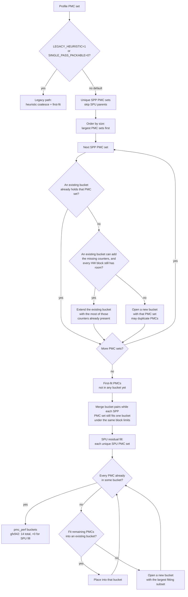
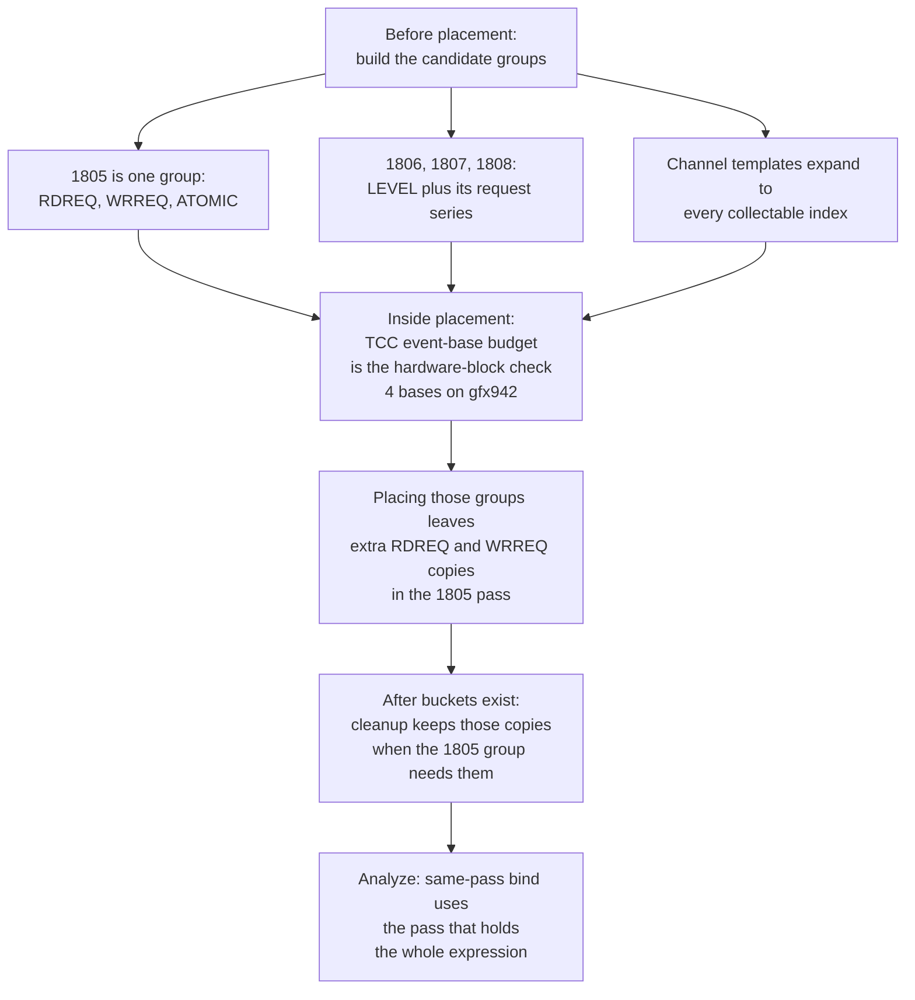

# Metric grouping (SPP / SPU)

**Parent:** [High-level design](hld-plan.md)

This note is the collection algorithm for Phase 1 in the high-level design (requirement FR-1). Same-pass bind and Single-pass unpackable (SPU) composite operators stay there.

A **PMC set** is the counters of one metric that must share one perfmon pass. A **bucket** is one perfmon pass. A block's slot budget is that block's capacity in `perfmon_config` (`CounterFile` in `soc_base.py`). GRBM and SQ are charged separately.

---

## 1. Algorithm

**Replace** the shipping heuristic + priority coalesce as the default allocator in
`_allocate_perfmon_counter_files`.

Why this allocator: the shipping pack minimizes passes for the whole counter list, so metrics whose PMC sets fit one pass stay split. Largest-first gives a large set a bucket before smaller sets fragment the open passes.

1. Collect each **Single-pass packable (SPP)** metric's PMC set and keep the unique sets (skip **Single-pass unpackable (SPU)** parents).
2. Largest-first: place each PMC set with the existing-bucket and per-block slot checks in §2 (copy a PMC into another pass when two sets cannot share a bucket).
3. Run **SPU residual fill** so leftover SPU counters appear somewhere. Open a new bucket only for a counter that fits in none of the open buckets (+0 extra passes on gfx942).
4. Harden **TCC series affinity + coverage** (and ACCUM slot charging where required). See §3.

**Locked decisions** (from the high-level design):

- Default path is SPP packing. During migration, `ROCPROF_COMPUTE_PERFMON_LEGACY_HEURISTIC=1` or `ROCPROF_COMPUTE_PERFMON_SINGLE_PASS_PACKABLE=0` restores the shipping allocator.
- Do **not** use `WEIGHTED_AVG` for former POLICY_GAP metrics (shipping multi-pass layouts that are SPP). Packing covers them.
- Priority policy YAML is not required for the packable guarantee.
- gfx942 offline packing gates: `packable_multi == 0`, passes ≈ **14**, SPU count == **16**, SPU extra passes == **0**. `packable_multi` counts SPP metrics whose PMC set is not fully inside one bucket. Panel 1805 stays one packing group in one pass (§3), so that gate includes it.

**Primary packing code:** `counter_grouping_single_pass.py`, `counter_grouping_buckets.py`, `soc_base.py`.

---

## 2. Flowchart

A **bucket** is one perfmon pass. Flow — Single-pass packable (SPP) placement plus Single-pass unpackable (SPU) residual fill (default). TCC series affinity is **not** in this chart; it is the layout harden in §3. The TCC event-base budget is still this flow's hardware-block check. §3 times the other TCC rules.

**How an SPP PMC set is placed.** Candidates are the unique sets, visited largest first. For each set the allocator tries buckets already opened before it opens a new one:

1. **Fit an existing bucket.** If a bucket already holds the whole PMC set, leave it. Otherwise extend the opened bucket that already contains the most of those counters, and add only the missing ones.
2. **Fit each hardware block's slot limit.** Extend only when every block the new counters touch still has room (GRBM, SQ, and so on). Each counter is charged to its own block. If any block is full, skip that bucket. Open a new bucket only when no existing bucket can hold the set. The same counter may be copied into another pass when two PMC sets cannot share one bucket.

Overlap-first keeps the new counters in a pass that already has the rest of the set, so another pass does not replay them unless two PMC sets cannot share a bucket. The per-block check is why a mixed GRBM and SQ set is still one pass: a full SQ budget skips that bucket even when GRBM still has room. None of the 16 SPU metrics on gfx942 include GRBM.

### Sample walk-through

Same toy as the legacy heuristic. Profile PMCs: `A B C D E F`. **3 counters per bucket** (one cap in the toy; a real bucket checks each hardware block's slot limit, as above).

SPP PMC sets:

- HBM-like = `{A, B}`
- M1 = `{C, D, E}`
- M2 = `{A, F}`
- M3 = `{B, D}`

Visit order: largest PMC sets first (M1, then HBM-like, M2, M3).

1. **M1 = `{C, D, E}`** — open bucket0 = `{C, D, E}`.
2. **HBM-like = `{A, B}`** — open bucket1 = `{A, B}`.
3. **M2 = `{A, F}`** — extend bucket1 → `{A, B, F}`.
4. **M3 = `{B, D}`** — B and D live in different buckets; cannot merge without breaking M1/M2 → open bucket2 = `{B, D}` (B duplicated in bucket1 and bucket2).
5. **First-fit / merge** — all packable PMCs placed.
6. **SPU residual fill** — if an SPU metric only needs PMCs already in these buckets → +0 passes (gfx942 case). Only missing PMCs open new buckets.

---

## 3. TCC series affinity + coverage

TCC channel series need packing rules beyond co-locating one Single-pass packable (SPP) metric's PMC set in a single pass. Why: an L2 channel map can change between replays, so a latency ratio that joins a request counter and its level counter from different passes is not one execution.

On gfx942, TCC allows **4 event bases per pass** (channel instances `[i]` are dimensions of one base, not extra slots). Full policy: [TCC series affinity + coverage](https://github.com/ROCm/rocm-systems/blob/users/feizheng10/aiprofcomp-865-docs-backup/projects/rocprofiler-compute/docs/plans/aiprofcomp-865-tcc-series-affinity-coverage.md).

1. Pack by **series base**. Every collectable channel index of a selected series is already in the candidate set before placement. Writing the perfmon file does not add channels later.
2. Keep affinity pairs in the **same pass** (e.g. `TCC_EA0_RDREQ_LEVEL` with `TCC_EA0_RDREQ`, and WR/ATOMIC analogues) so latency ratios are not joined across replays — L2 channel maps can remap between passes.
3. Cover every selected series from the profile/YAML set; do **not** prune to runtime-nonzero channels.
4. Panel **1805**, "L2-Fabric Requests (per normUnit)", stays **one packing group**. Its three columns are collected in one pass: `TCC_EA0_RDREQ` (read), `TCC_EA0_WRREQ` (write and atomic), and `TCC_EA0_ATOMIC` (atomic). On gfx942 that pass is bucket 1 / `pmc_perf_1`, which already holds those three request series together with `TCC_EA0_ATOMIC_LEVEL` (four TCC event bases).
5. The extra `TCC_EA0_RDREQ` and `TCC_EA0_WRREQ` copies in that pass stay. They have no matching LEVEL there. They exist so the three 1805 columns are one replay.
6. Latency rows still bind to the pass that holds the whole expression:
   - **1806** binds to the pass that holds `TCC_EA0_RDREQ_LEVEL` and `TCC_EA0_RDREQ` (bucket 2 on gfx942).
   - **1807** binds to the pass that holds `TCC_EA0_WRREQ_LEVEL` and `TCC_EA0_WRREQ` (bucket 2).
   - **1808** binds to the pass that holds `TCC_EA0_ATOMIC_LEVEL` and `TCC_EA0_ATOMIC` (bucket 1).
   Same-pass bind does not read the extra `RDREQ` / `WRREQ` copies in bucket 1 for 1806 or 1807, because those LEVEL counters are not in that pass.

**Accuracy rule:** the request table is one execution. The latency ratios still use the pass that contains both counters.

### Order relative to the main flow

These rules are not a second copy of the flowchart in §2, and they do not all run after that flow.

**Before placement.** Candidate groups are built first. Panel 1805 stays one group: `TCC_EA0_RDREQ`, `TCC_EA0_WRREQ`, and `TCC_EA0_ATOMIC`. Each latency row is one group of a LEVEL counter plus its request series (1806, 1807, 1808). A TCC name that still ends in `[` is expanded to every collectable channel index here (`detect_counters`, then `iter_metric_groups`), before a bucket is chosen.

**Inside placement.** The TCC event-base budget is the hardware-block check in §2 (`CounterFile.add`). On gfx942 that budget is 4. Another channel of a base already in the bucket does not take another base. Placing the 1805 group and the latency groups is what leaves the extra `RDREQ` and `WRREQ` copies in the pass that also holds `ATOMIC_LEVEL`.

**After buckets exist.** A cleanup then drops a request series from a pass that lacks its LEVEL, and it leaves those extra copies when the 1805 group still needs them in that one pass. Same-pass bind runs at analyze and picks the pass that holds the whole expression, so 1806 and 1807 do not read the copies in bucket 1. Writing `pmc_perf_*.yaml` records the channel instances already in the bucket and emits a `select()` definition for each one. It does not expand the series.

**TCC rule order** (not the general placement flow):

**Impact:** This layout harden does **not** add a pass. gfx942 stays at **14** passes. It is not a Phase 2 / Single-pass unpackable (SPU) concern. `packable_multi` stays **0** because 1805 remains one PMC set inside one bucket.
