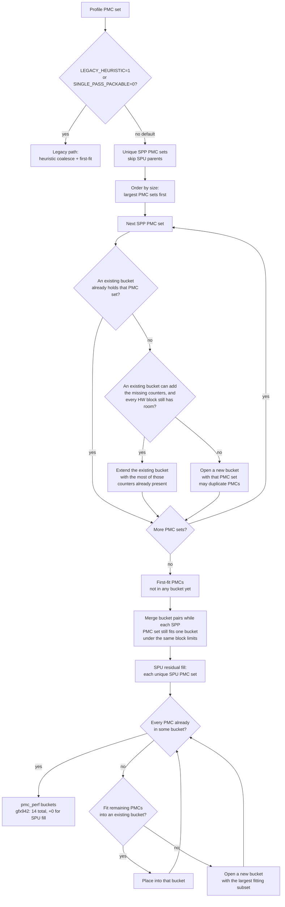

# Metric grouping (SPP / SPU)

**Parent:** [Overall plan](hld-plan.md)

This note is the packing algorithm. Same-pass bind and SPU composite operators stay in the overall plan.

---

## 1. Algorithm

**Replace** the shipping heuristic + priority coalesce as the default allocator in
`_allocate_perfmon_counter_files`.

1. Collect each **Single-pass packable(SPP)** metric's PMC set — the counters that must share one perfmon pass — and keep the unique sets (skip **Single-pass unpackable(SPU)** parents).
2. Largest-first: place each PMC set with the existing-bucket and per-block slot checks in §2 (duplicate PMCs across passes when needed).
3. Run **SPU residual fill** so residual SPU PMC pieces appear somewhere (+0 extra passes on gfx942).
4. Harden **TCC series affinity + coverage** (and ACCUM slot charging where required). See §3.

**Locked decisions:**

- Default path is SPP packing; optional `ROCPROF_COMPUTE_PERFMON_LEGACY_HEURISTIC=1` during migration.
- Do **not** use `WEIGHTED_AVG` for former POLICY_GAP metrics — packing covers them (they are SPP).
- Priority policy YAML is not required for the packable guarantee.
- gfx942 offline packing gates: `packable_multi == 0`, passes ≈ **14**, SPU count == **16**, SPU extra passes == **0**. The `packable_multi == 0` gate is the SPP allocator before the panel-1805 grouping follow-up in §3.

**Primary packing code:** `counter_grouping_single_pass.py`, `counter_grouping_buckets.py`, `soc_base.py`.

---

## 2. Flowchart

A **bucket** is one perfmon pass. Flow — single-pass packable + SPU residual fill (default). TCC series affinity is **not** in this chart; it is the layout harden in §3.

**How an SPP PMC set is placed.** Candidates are the unique sets, visited largest first. For each set the allocator tries buckets already opened before it opens a new one:

1. **Fit an existing bucket.** If some bucket already holds the whole PMC set, leave it. Otherwise extend the opened bucket that already contains the most of those counters, and add only the missing ones there.
2. **Fit each hardware block's slot limit.** That extend is allowed only when every hardware block the new counters touch still has room in that bucket (GRBM budget, SQ budget, and so on). Each counter is charged to its own block. If any block is full, that bucket is skipped. A new bucket is opened only when no existing bucket can hold the set under those block limits. The same counter may still be copied into another pass when two PMC sets cannot share one bucket.

### Sample walk-through

Same toy as the legacy heuristic. Profile PMCs: `A B C D E F`. **3 counters per bucket** (one cap in the toy; a real bucket checks each hardware block's slot limit, as above).

SPP PMC sets:

- HBM-like = `{A, B}`
- M1 = `{C, D, E}`
- M2 = `{A, F}`
- M3 = `{B, D}`

Visit order: largest PMC sets first (M1, then HBM-like, M2, M3).

1. **M1 = `{C, D, E}`** — open bucket0 = `{C, D, E}`.
2. **HBM-like = `{A, B}`** — open bucket1 = `{A, B}`.
3. **M2 = `{A, F}`** — extend bucket1 → `{A, B, F}`.
4. **M3 = `{B, D}`** — B and D live in different buckets; cannot merge without breaking M1/M2 → open bucket2 = `{B, D}` (B duplicated in bucket1 and bucket2).
5. **First-fit / merge** — all packable PMCs placed.
6. **SPU residual fill** — if an SPU metric only needs PMCs already in these buckets → +0 passes (gfx942 case). Only missing PMCs open new buckets.

---

## 3. TCC series affinity + coverage

TCC channel series need packing rules beyond co-locating one SPP metric's PMC set in a single pass. On gfx942, TCC allows **4 event bases per pass** (channel instances `[i]` are dimensions of one base, not extra slots). Full policy: [TCC series affinity + coverage](https://github.com/ROCm/rocm-systems/blob/users/feizheng10/aiprofcomp-865-docs-backup/projects/rocprofiler-compute/docs/plans/aiprofcomp-865-tcc-series-affinity-coverage.md).

1. Pack by **series base**; when a TCC series is selected, expand **all collectable channel instances** in that pass.
2. Keep affinity pairs in the **same pass** (e.g. `TCC_EA0_RDREQ_LEVEL` with `TCC_EA0_RDREQ`, and WR/ATOMIC analogues) so latency ratios are not joined across replays — L2 channel maps can remap between passes.
3. Cover every selected series from the profile/YAML set; do **not** prune to runtime-nonzero channels.
4. Do **not** duplicate the same per-channel REQ series into a second pass with a different channel map (orphan REQ copies invite wrong same-pass bind / cross-pass joins).

**Impact:** Enforcing this on gfx942 default SPP is a **layout** harden and does **not** add passes (**14 → 14**). It is not a Phase 2 / SPU concern. Dropping orphan `RDREQ` / `WRREQ` copies means panel **1805** (an SPP metric whose PMC set is the read, write, and atomic columns together) no longer fits one bucket, so offline `packable_multi` would read **1** unless those columns are separate packing groups.
