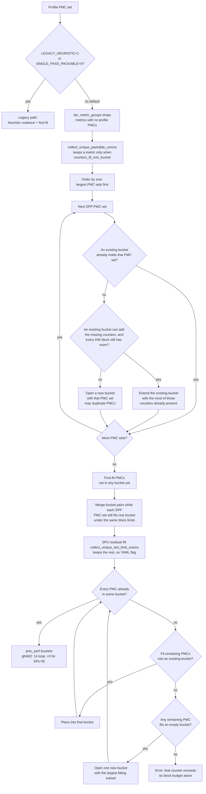
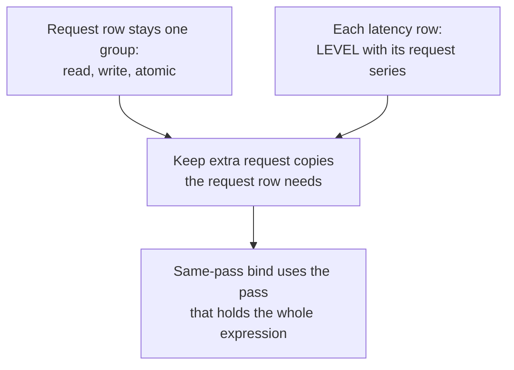

# Metric grouping (SPP / SPU)

**Parent:** [High-level design](hld-plan.md)

This note is the collection algorithm for Phase 1 in the high-level design (requirement FR-1). Same-pass bind and Single-pass unpackable (SPU) composite operators stay there.

A **PMC set** is the counters of one metric that must share one perfmon pass. A **bucket** is one perfmon pass. A block's slot budget is that block's capacity in `perfmon_config` (`CounterFile` in `soc_base.py`). GRBM and SQ are charged separately.

---

## 1. Algorithm

**Replace** the shipping heuristic + priority coalesce as the default allocator in
`_allocate_perfmon_counter_files`.

Why this allocator: the shipping pack minimizes passes for the whole counter list, so metrics whose PMC sets fit one pass stay split. Largest-first gives a large set a bucket before smaller sets fragment the open passes.

1. Collect each **Single-pass packable (SPP)** metric's PMC set and keep the unique sets (skip **Single-pass unpackable (SPU)** parents). `iter_metric_groups` drops metrics with no profile PMCs before that split, so those metrics are not SPU parents. `collect_unique_packable_unions` keeps a metric only when `counters_fit_one_bucket`. `collect_unique_slot_limit_unions` keeps the rest. No YAML flag.
2. Largest-first: place each PMC set with the existing-bucket and per-block slot checks in §2 (copy a PMC into another pass when two sets cannot share a bucket).
3. Run **SPU residual fill** so leftover SPU counters appear somewhere. Try the open buckets, then open one new bucket for the largest subset that fits an empty bucket (+0 extra passes on gfx942). If no remaining counter fits even that empty bucket, residual fill raises `ValueError` and does not drop the counter or keep looping.
4. Harden **TCC series affinity + coverage** (and ACCUM slot charging where required). See §3.

**Locked decisions** (from the high-level design):

- Default path is SPP packing. During migration, `ROCPROF_COMPUTE_PERFMON_LEGACY_HEURISTIC=1` or `ROCPROF_COMPUTE_PERFMON_SINGLE_PASS_PACKABLE=0` restores the shipping allocator.
- Do **not** use `WEIGHTED_AVG` for former POLICY_GAP metrics (shipping multi-pass layouts that are SPP). Packing covers them.
- Priority policy YAML is not required for the packable guarantee.
- gfx942 offline packing gates: `packable_multi == 0`, passes ≈ **14**, SPU count == **16**, SPU extra passes == **0**. `packable_multi` counts SPP metrics whose PMC set is not fully inside one bucket. Panel 1805 stays one packing group in one pass (§3), so that gate includes it.

**Primary packing code:** `counter_grouping_single_pass.py`, `counter_grouping_buckets.py`, `soc_base.py`.

---

## 2. Flowchart

A **bucket** is one perfmon pass. Flow — Single-pass packable (SPP) placement plus Single-pass unpackable (SPU) residual fill (default). TCC series affinity is **not** in this chart; it is the layout harden in §3. The TCC event-base budget is still this flow's hardware-block check.

**How an SPP PMC set is placed.** Candidates are the unique sets, visited largest first. For each set the allocator tries buckets already opened before it opens a new one:

1. **Fit an existing bucket.** If a bucket already holds the whole PMC set, leave it. Otherwise extend the opened bucket that already contains the most of those counters, and add only the missing ones.
2. **Fit each hardware block's slot limit.** Extend only when every block the new counters touch still has room (GRBM, SQ, and so on). Each counter is charged to its own block. If any block is full, skip that bucket. Open a new bucket only when no existing bucket can hold the set. The same counter may be copied into another pass when two PMC sets cannot share one bucket.

Overlap-first keeps the new counters in a pass that already has the rest of the set, so another pass does not replay them unless two PMC sets cannot share a bucket. The per-block check is why a mixed GRBM and SQ set is still one pass: a full SQ budget skips that bucket even when GRBM still has room. None of the 16 SPU metrics on gfx942 include GRBM.

**How an SPU parent is recognized.** `iter_metric_groups` drops metrics with no profile PMCs before that split, so those metrics are not SPU parents. `collect_unique_packable_unions` keeps a metric only when `counters_fit_one_bucket`. `collect_unique_slot_limit_unions` keeps the rest. No YAML flag.

### Sample walk-through

Same toy as the legacy heuristic. Profile PMCs: `A B C D E F`. **3 counters per bucket** (one cap in the toy; a real bucket checks each hardware block's slot limit, as above).

SPP PMC sets:

- HBM-like = `{A, B}`
- M1 = `{C, D, E}`
- M2 = `{A, F}`
- M3 = `{B, D}`

Visit order: largest PMC sets first (M1, then HBM-like, M2, M3).

1. **M1 = `{C, D, E}`** — open bucket0 = `{C, D, E}`.
2. **HBM-like = `{A, B}`** — open bucket1 = `{A, B}`.
3. **M2 = `{A, F}`** — extend bucket1 → `{A, B, F}`.
4. **M3 = `{B, D}`** — B and D live in different buckets; cannot merge without breaking M1/M2 → open bucket2 = `{B, D}` (B duplicated in bucket1 and bucket2).
5. **First-fit / merge** — all packable PMCs placed.
6. **SPU residual fill** — if an SPU metric only needs PMCs already in these buckets → +0 passes (gfx942 case). Only missing PMCs open new buckets.

---

## 3. TCC series affinity + coverage

The TCC handling here is a **short-term solution**. Those rules live in one module so a later design can replace them. A general hardware-instance framework is **out of scope**. [Instance-aware metrics](#instance-aware-metrics-out-of-scope) records that boundary.

An L2 channel map can change between replays, so the counters one expression joins share a pass. gfx942 is the example, not the only architecture, and the pass count there stays **14**. A selected series keeps every collectable channel. Channel expansion follows that architecture's own L2 channels, and single-die parts (gfx908, gfx115x) are not an XCD multiple of a multi-die (XCD) part.

A multi-column L2-fabric request row (read, write, and atomic; panel 1805) stays one group so those columns are one replay. Each latency row keeps its LEVEL counter with its request series. Extra request copies stay when the request row needs them. Same-pass bind uses the pass that holds the whole expression. `key` in `{counter}@pass:{key}` is the result-file stem (`pmc_perf_3`). Only a counter copied into more than one pass is suffixed; a counter that appears in one pass keeps its bare name. If several passes each hold the whole expression, the earliest stem in natural order wins (`pmc_perf_2` before `pmc_perf_10`).

### Instance-aware metrics (out of scope)

Today the replicated block is a TCC channel. TCP, a shader engine, and SDMA come later. TCC is the first consumer. The later framework would cover:

- **Per-instance counters.** Each replica of a block exposes its own counter.
- **Aggregation strategies.** A metric sums, averages, or otherwise combines those readings.
- **Balance metrics.** A balance metric compares instances with each other.
- **Affinity requirements.** Joined counters share a pass when the instance map can change between replays.
