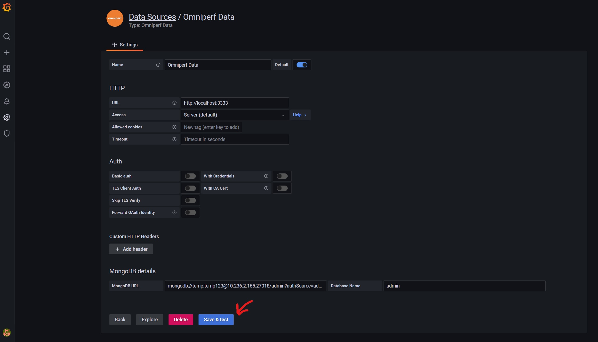
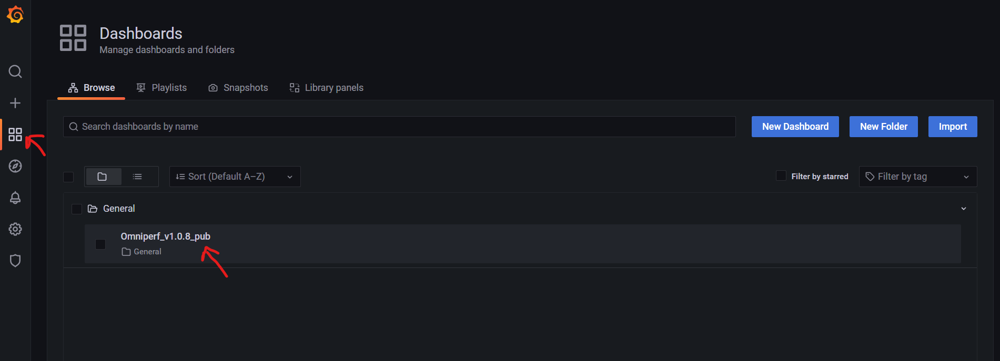

# Deployment

```eval_rst
.. toctree::
   :glob:
   :maxdepth: 4
```

Omniperf is broken into two installation components:

1. **Omniperf Client-side (_Required_)**
   - Provides core application profiling capability
   - Allows collection of performance counters, filtering by hardware block, dispatch, kernel, etc
   - CLI based analysis mode
   - Stand alone web interface for importing analysis metrics
2. **Omniperf Server-side (_Optional_)**
   - Mongo DB backend + Grafana instance
   - Packaged in a Docker container for easy setup

Determine what you need to install based on how you would like to interact with Omniperf. See the decision tree below to help determine what installation is right for you.


---

## Client-side Installation

Omniperf client-side requires the following basic software dependencies prior to usage:

* Python (>=3.8)
* CMake (>= 3.19)
* ROCm (>= 5.7.1)

In addition, Omniperf leverages a number of Python packages that are
documented in the top-level `requirements.txt` file.  These must be
installed prior to Omniperf configuration.  

The recommended procedure for Omniperf usage is to install into a shared file system so that multiple users can access the final installation.  The following steps illustrate how to install the necessary python dependencies using [pip](https://packaging.python.org/en/latest/) and Omniperf into a shared location controlled by the `INSTALL_DIR` environment variable.

```{admonition} Configuration variables
The following installation example leverages several
[CMake](https://cmake.org/cmake/help/latest/) project variables
defined as follows:
| Variable             | Description                                                          |
| -------------------- | -------------------------------------------------------------------- |
| CMAKE_INSTALL_PREFIX | controls install path for Omniperf files                             |
| PYTHON_DEPS          | provides optional path to resolve Python package dependencies        |
| MOD_INSTALL_PATH     | provides optional path for separate Omniperf modulefile installation |

```

A typical install will begin by downloading the latest release tarball
available from the
[Releases](https://github.com/ROCm/omniperf/releases) section
of the Omniperf development site. From there, untar and descend into
the top-level directory as follows:

```shell-session
$ tar xfz omniperf-v{__VERSION__}.tar.gz
$ cd omniperf-v{__VERSION__}
```

Next, install Python dependencies and complete the Omniperf configuration/install process as follows:

```shell-session
# define top-level install path
$ export INSTALL_DIR=<your-top-level-desired-install-path>

# install python deps
$ python3 -m pip install -t ${INSTALL_DIR}/python-libs -r requirements.txt

# configure Omniperf for shared install
$ mkdir build
$ cd build
$ cmake -DCMAKE_INSTALL_PREFIX=${INSTALL_DIR}/{__VERSION__} \
        -DPYTHON_DEPS=${INSTALL_DIR}/python-libs \
        -DMOD_INSTALL_PATH=${INSTALL_DIR}/modulefiles ..

# install
$ make install
```

```{tip}
You may require `sudo` during the final install step if you
do not have write access to the chosen install path.
```


After completing these steps, a successful top-level installation directory looks as follows:
```shell-session
$ ls $INSTALL_DIR
modulefiles  {__VERSION__}  python-libs
```

### Execution using modulefiles

The installation process includes creation of an environment
modulefile for use with [Lmod](https://lmod.readthedocs.io). On
systems that support Lmod, a user can register the Omniperf modulefile
directory and setup their environment for execution of Omniperf as
follows:


```shell-session
$ module use $INSTALL_DIR/modulefiles
$ module load omniperf
$ which omniperf
/opt/apps/omniperf/{__VERSION__}/bin/omniperf

$ omniperf --version
ROC Profiler:   /opt/rocm-5.1.0/bin/rocprof

omniperf (v{__VERSION__})
```

```{tip} Users relying on an Lmod Python module locally may wish to
customize the resulting Omniperf modulefile post-installation to
include additional module dependencies.
```

### Execution without modulefiles

To use Omniperf without the companion modulefile, update your `PATH`
settings to enable access to the command-line binary. If you installed Python
dependencies in a shared location, update your `PYTHONPATH` config as well:

```shell-session
export PATH=$INSTALL_DIR/{__VERSION__}/bin:$PATH
export PYTHONPATH=$INSTALL_DIR/python-libs
```

### rocProf

Omniperf relies on a rocProf binary during the profiling
process. Normally the path to this binary will be detected
automatically, but it can also be overridden via the setting the
optional `ROCPROF` environment variable to the path of the binary the user
wishes to use instead.


%%% ### Generate Packaging
%%% ```console
%%% cd build
%%% cpack -G STGZ
%%% cpack -G DEB -D CPACK_PACKAGING_INSTALL_PREFIX=/opt/omniperf
%%% cpack -G RPM -D CPACK_PACKAGING_INSTALL_PREFIX=/opt/omniperf
%%% ```

---

## Server-side Setup

> Note: Server-side setup is not required to profile or analyze performance data from the CLI. It is provided as an additional mechanism to import performance data for examination within a detailed [Grafana](https://github.com/grafana/grafana) GUI.

Omniperf server-side requires the following basic software dependencies prior to usage:

* [Docker Engine](https://docs.docker.com/engine/install/)

The recommended process for enabling the server-side of Omniperf is to use the provided Docker file to build the Grafana and MongoDB instance.

Once you have decided which machine you would like to use to host the Grafana and MongoDB instance, please follow the set-up instructions below.

### Install MongoDB Utils
Omniperf uses [mongoimport](https://www.mongodb.com/docs/database-tools/mongoimport/) to upload data to Grafana's backend database. Install for Ubuntu 20.04 is as follows:

```bash 
$ wget https://fastdl.mongodb.org/tools/db/mongodb-database-tools-ubuntu2004-x86_64-100.6.1.deb
$ sudo apt install ./mongodb-database-tools-ubuntu2004-x86_64-100.6.1.deb
```
> Installation instructions for alternative distributions can be found [here](https://www.mongodb.com/download-center/database-tools/releases/archive)

### Persistent Storage

The user will also bind MongoDB to a directory on the host OS to create a local backup in case of a crash or reset. In the Docker world, this is known as "creating a persistent volume":

```bash
$ sudo mkdir -p /usr/local/persist && cd /usr/local/persist/
$ sudo mkdir -p grafana-storage mongodb
$ sudo docker volume create --driver local --opt type=none --opt device=/usr/local/persist/grafana-storage --opt o=bind grafana-storage
$ sudo docker volume create --driver local --opt type=none --opt device=/usr/local/persist/mongodb --opt o=bind grafana-mongo-db
```

### Build and Launch

We are now ready to build our Docker file. Navigate to your Omniperf install directory to begin.
```bash
$ sudo docker-compose build
$ sudo docker-compose up -d
```
> Note that TCP ports for Grafana (4000) and MongoDB (27017) in the docker container are mapped to 14000 and 27018, respectively, on the host side.

### Restart (Debug)
In the event that your Grafana or MongoDB instance crash fatally, you can always restart the server. Just navigate to your install directory and run:
```bash
$ sudo docker-compose down
$ sudo docker-compose up -d
```

### Setup Grafana Instance
Once you have launched your docker container you should be able to reach Grafana at **http://\<host-ip>:14000**. The default login credentials for the first-time Grafana setup are:

- Username: **admin**
- Password: **admin**


### MongoDB Datasource Configuration

The MongoDB Datasource must be configured prior to the first-time use. Navigate to Grafana's Configuration page (shown below) to add the **Omniperf Data** connection.


Configure the following fields in the datasource settings:

- HTTP URL: set to *http://localhost:3333*
- MongoDB URL: set to *mongodb://temp:temp123@\<host-ip>:27018/admin?authSource=admin*
- Database Name: set to *admin*

After properly configuring these fields click **Save & Test** (as shown below) to make sure your connection is successful.

> Note to avoid potential DNS issue, one may need to use the actual IP address for the host node in the MongoDB URL.



### Omniperf Dashboard Import

From *Create* → *Import*, (as shown below) upload the dashboard file, `/dashboards/Omniperf_v{__VERSION__}_pub.json`, from the Omniperf tarball.

Edit both the Dashboard Name and the Unique Identifier (UID) to uniquely identify the dashboard he/she will use. Click Import to finish the process.


### Using your dashboard

Once you have imported a dashboard you are ready to begin! Start by browsing available dashboards and selecting the dashboard you have just imported.



Remember, you will need to upload workload data to the DB backend before analyzing in your Grafana interface. We provide a detailed example of this in our [Analysis section](./analysis.md#grafana-gui-import).

After a workload has been successfully uploaded, you should be able to select it from the workload dropdown located at the top of your Grafana dashboard.


For more information on how to use the Grafana interface for analysis please see the [Grafana section](./analysis.md#grafana-based-gui) in the Analyze Mode tab.

