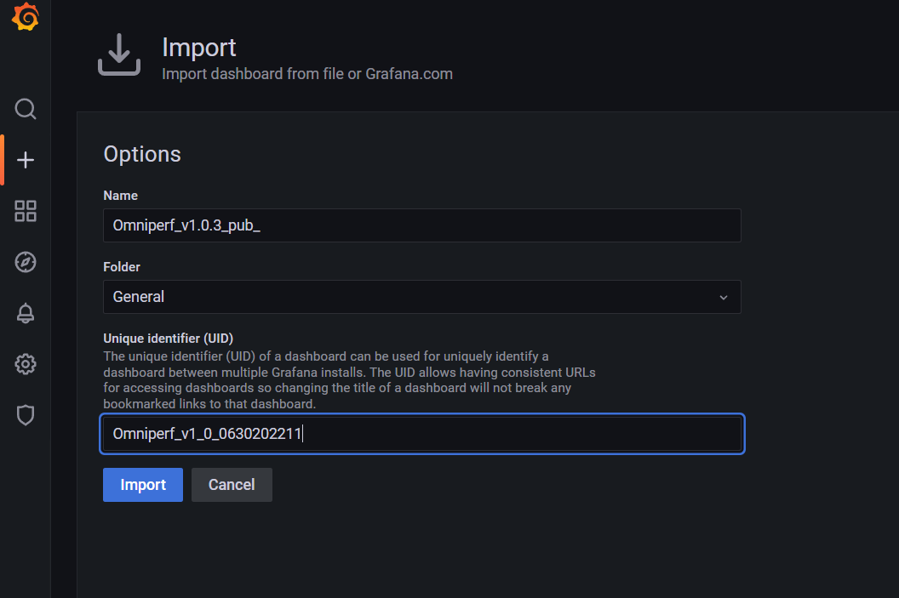

# Deployment

```eval_rst
.. toctree::
   :glob:
   :maxdepth: 4
```

Omniperf is broken into two installation components:

1. **Omniperf Client-side (_Required_)**
   - Provides core application profiling capability
   - Allows collection of performance counters, filtering by IP block, dispatch, kernel, etc
   - CLI based analysis mode
   - Stand alone web interface for importing analysis metrics
2. **Omniperf Server-side (_Optional_)**
   - Mongo DB backend + Grafana instance

---

## Client-side Installation

Omniperf requires the following basic software dependencies prior to usage:

* Python (>=3.7)
* CMake (>= 3.19)
* ROCm (>= 5.2.0)

In addition, Omniperf leverages a number of Python packages that are
documented in the top-level `requirements.txt` file.  These must be
installed prior to Omniperf configuration.  

The recommended procedure for Omniperf usage is to install into a shared file system so that multiple users can access the final installation.  The following steps illustrate how to install the necessary python dependencies using [pip](https://packaging.python.org/en/latest/) and Omniperf into a shared location controlled by the `INSTALL_DIR` environment variable.

```{admonition} Configuration variables
The following installation example leverages several
[CMake](https://cmake.org/cmake/help/latest/) project variables
defined as follows:
| Variable             | Description                                                          |
| -------------------- | -------------------------------------------------------------------- |
| CMAKE_INSTALL_PREFIX | controls install path for Omniperf files                             |
| PYTHON_DEPS          | provides optional path to resolve Python package dependencies        |
| MOD_INSTALL_PATH     | provides optional path for separate Omniperf modulefile installation |

```

A typical install will begin by downloading the latest release tarball
available from the
[Releases](https://github.com/AMDResearch/omniperf/releases) section
of the Omniperf development site. From there, untar and descend into
the top-level directory as follows:

```shell
$ tar xfz omniperf-v{__VERSION__}.tar.gz
$ cd omniperf-v{__VERSION__}
```

Next, install Python dependencies and complete the Omniperf configuration/install process as follows:

```shell
# define top-level install path
$ export INSTALL_DIR=<your-top-level-desired-install-path>

# install python deps
$ python3 -m pip install -t ${INSTALL_DIR}/python-libs -r requirements.txt

# configure Omniperf for shared install
$ mkdir build
$ cd build
$ cmake -DCMAKE_INSTALL_PREFIX=${INSTALL_DIR}/{__VERSION__} \
        -DPYTHON_DEPS=${INSTALL_DIR}/python-libs \
        -DMOD_INSTALL_PATH=${INSTALL_DIR}/modulefiles ..

# install
$ make install
```

```{tip}
You may require `sudo` during the final install step if you
do not have write access to the chosen install path.
```


After completing these steps, a successful top-level installation directory looks as follows:
```shell
$ ls $INSTALL_DIR
modulefiles  {__VERSION__}  python-libs
```

### Execution using modulefiles

The installation process includes creation of an environment
modulefile for use with [Lmod](https://lmod.readthedocs.io). On
systems that support Lmod, a user can register the Omniperf modulefile
directory and setup their environment for execution of Omniperf as
follows:


```shell
$ module use $INSTALL_DIR/modulefiles
$ module load omniperf
$ which omniperf
/opt/apps/omniperf/{__VERSION__}/bin/omniperf

$ omniperf --version
ROC Profiler:   /opt/rocm-5.1.0/bin/rocprof

omniperf (v{__VERSION__})
```

```{tip} Users relying on an Lmod Python module locally may wish to
customize the resulting Omniperf modulefile post-installation to
include additional module dependencies.
```

### Execution without modulefiles

To use Omniperf without the companion modulefile, update your `PATH`
settings to enable access to the command-line binary. If you installed Python
dependencies in a shared location, update your `PYTHONPATH` config as well:

```shell
export PATH=$INSTALL_DIR/{__VERSION__}/bin:$PATH
export PYTHONPATH=$INSTALL_DIR/python-libs
```

### rocProf

Omniperf relies on a rocprof binary during the profiling
process. Normally the path to this binary will be detected
automatically, but it can also be overridden via the setting the
optional `ROCPROF` environment variable to the path of the binary the user
wishes to use instead.


%%% ### Generate Packaging
%%% ```console
%%% cd build
%%% cpack -G STGZ
%%% cpack -G DEB -D CPACK_PACKAGING_INSTALL_PREFIX=/opt/omniperf
%%% cpack -G RPM -D CPACK_PACKAGING_INSTALL_PREFIX=/opt/omniperf
%%% ```

---

## Server-side Setup

Note: Server-side setup is not required to profile or analyze
performance data from the CLI. It is provided as an additional mechanism to import performance
data for examination within a detailed [Grafana](https://github.com/grafana/grafana) GUI.

The recommended process for enabling the server-side of Omniperf is to
use the provided Docker file to build the Grafana and MongoDB
instance.

### Install MongoDB Utils
Omniperf uses [mongoimport](https://www.mongodb.com/docs/database-tools/mongoimport/) to upload data to Grafana's backend database. Install for Ubuntu 20.04 is as follows:
```bash 
$ wget https://fastdl.mongodb.org/tools/db/mongodb-database-tools-ubuntu2004-x86_64-100.6.1.deb
$ sudo apt install ./mongodb-database-tools-ubuntu2004-x86_64-100.6.1.deb
```
> Installation instructions for alternative distributions can be found [here](https://www.mongodb.com/download-center/database-tools/releases/archive)

### Persistent Storage

The user may also choose to bind MongoDB to a directory on the host OS to create a local backup in case of a crash or reset:

```bash
$ sudo mkdir -p /usr/local/persist && cd /usr/local/persist/
$ sudo mkdir -p grafana-storage mongodb
$ sudo docker volume create --driver local --opt type=none --opt device=/usr/local/persist/grafana-storage --opt o=bind grafana-storage
$ sudo docker volume create --driver local --opt type=none --opt device=/usr/local/persist/mongodb --opt o=bind grafana-mongo-db
```

### Build and Launch
```bash
$ sudo docker-compose build
$ sudo docker-compose up -d
```
> Note that TCP ports for Grafana (4000) and MongoDB (27017) in the docker container are mapped to 14000 and 27018, respectively, on the host side.

### Setup Grafana Instance
Once you've launced your docker container you should be able to reach Grafana at **http://\<host-ip>:14000**. The default login credentials for the first-time Grafana setup are:

- Username: **admin**
- Password: **admin**


MongoDB Datasource Configuration

The MongoDB Datasource shall be configured prior to the first-time use. Navigate to Grafana's Configuration page (shown below) to add the **Omniperf Data** connection.


Configure the following fields in the datasource:

- HTTP URL: set to *http://localhost:3333*
- MongoDB URL: set to *mongodb://temp:temp123@\<host-ip>:27018/admin?authSource=admin*
- Database Name: set to *admin*

After properly configuring these fields click **Save & Test** to make sure your connection is successful.

> Note to avoid potential DNS issue, one may need to use the actual IP address for the host node in the MongoDB URL.


Omniperf Dashboard Import

From *Create* → *Import*, (as seen below) upload the dashboard file, `/dashboards/Omniperf_v{__VERSION__}_pub.json`, from the Omniperf tarball.

Edit both the Dashboard Name and the Unique Identifier (UID) to uniquely identify the dashboard he/she will use. Click Import to finish the process.

