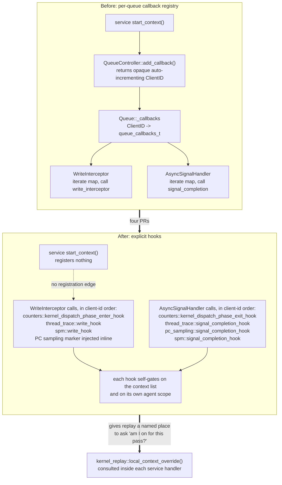
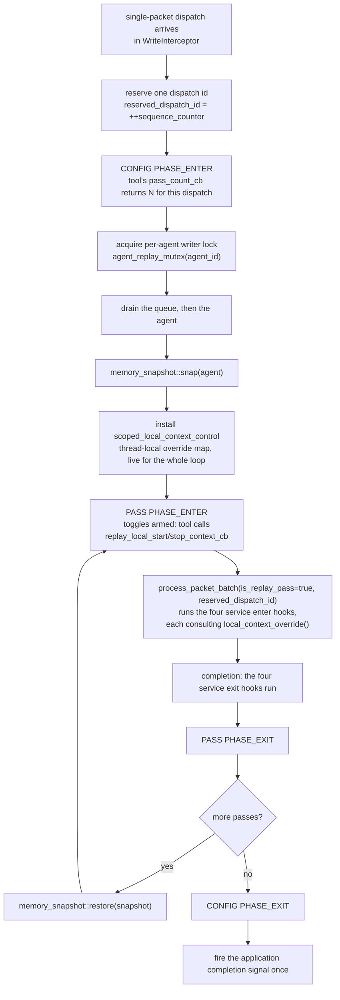

# Kernel Replay and the Queue Callback Removal

How the four queue-callback-removal PRs relate to kernel replay: what the per-queue callback registry
made impossible, what each service's migration changes, how per-pass service control is expressed on
top of the migrated hooks, and which engineering tradeoffs each PR makes.

This is a design document rather than user documentation. For current behavior of kernel replay,
read the pages listed in the kernel replay conceptual index. For the mechanics of the migration
itself, read `conceptual/queue_hooks/queue_callback_removal_architecture.md`, which ships with
[#8891](https://github.com/ROCm/rocm-systems/pull/8891). This page is the join between the two: it
exists because no single PR contains both halves, so the interaction between them is not reviewable
from any one diff.

## Which trees this describes

Nothing described here is on `develop`. The pieces live on separate branches, and two of them have
**diverged**, which matters enough that the divergence is called out explicitly in
[Localized context control](#5-localized-context-control-the-integration-point) rather than smoothed
over.

| Piece | Where it lives | State (2026-08-25) |
|---|---|---|
| Counter collection off the registry | [#8891](https://github.com/ROCm/rocm-systems/pull/8891) | Open, `CHANGES_REQUESTED` |
| Thread trace off the registry | [#8790](https://github.com/ROCm/rocm-systems/pull/8790) | Open, three approvals |
| PC sampling off the registry | [#8895](https://github.com/ROCm/rocm-systems/pull/8895) | Open, one approval |
| SPM off the registry | [#8887](https://github.com/ROCm/rocm-systems/pull/8887) | Open, `CHANGES_REQUESTED` |
| Original design | [#8586](https://github.com/ROCm/rocm-systems/pull/8586) | Draft, kept as reference |
| Kernel replay | [#7960](https://github.com/ROCm/rocm-systems/pull/7960) | Open, `CHANGES_REQUESTED` |
| Both halves composed | [#10193](https://github.com/ROCm/rocm-systems/pull/10193) | Draft, **DO NOT MERGE** |

[#8622](https://github.com/ROCm/rocm-systems/pull/8622), the callback-tracing-domain rework that
[#10193](https://github.com/ROCm/rocm-systems/pull/10193)'s replay layer was derived from, is now
**closed**. The live replay PR is [#7960](https://github.com/ROCm/rocm-systems/pull/7960).

## 1. What the registry made impossible

A service that wants to see every dispatch subscribes at `start_context()` by calling
`QueueController::add_callback()`, which returns an auto-incrementing `ClientID` and installs a
`queue_callbacks_t` — three function pointers — into every queue's `_callbacks` map. On each
dispatch the write interceptor and the async signal handler walk that map and invoke whatever they
find.

Kernel replay needs something that mechanism cannot express: **turn an individual service off for one
pass of one dispatch, on one thread, and back on for the next pass.** A tool collecting four counter
groups replays each dispatch four times and wants a different group armed each time.

Against the registry there are three available handles, and all three are wrong:

1. **The `ClientID`.** It is opaque, allocated inside `start_context()`, and never surfaced to
   anything that could use it. There is no way to name "the counters client" from the replay loop.
2. **`remove_callback()` and `add_callback()` per pass.** Process-wide and racy. Deregistering
   counters for the duration of a pass deregisters it for every other thread's dispatches too, and
   re-registering mid-flight reopens the in-flight-completion problem described in section 2.
3. **The service's global `enabled` flag.** Same leak. Every queue in the process observes it, and
   the flag has to be restored on a path that must not be missed if the pass aborts.

None of these is per-thread or per-dispatch. The registry conflates "this service is subscribed"
with "this service is on right now", and replay needs those to be different questions.

The resolution is the one both OMPT and Kokkos Tools arrive at from the other direction: stop trying
to un-subscribe, and push the decision into the subscriber. Rather than removing a callback for a
pass, the service asks whether it is on *for this unit of work*. That requires an explicit, named
call site to hang the question on — which is exactly what the migration produces.



The architecture doc states the relationship as a soft prerequisite, and the replay design doc agrees
from its side:

> Kernel replay is **not** gated on removing the queue callback registration mechanism. That removal
> would make per-pass enable/disable cleaner and is a planned improvement, but the feature works
> without it.

That is accurate and worth preserving: replay does not block on the migration. But the *shape* of the
per-pass mechanism is determined by it, and the cost of building it without the migration is that
every service handler needs a conditional that has no natural home.

## 2. The shared convention

All four PRs follow one convention, introduced by [#8891](https://github.com/ROCm/rocm-systems/pull/8891)
along with the shared `hsa/queue_hooks/` infrastructure. Each service exposes a trio in its own
`<service>/queue_hooks.{hpp,cpp}`: an enter hook, an exit hook, and an activity predicate.

**The two phases use different context sets.** This is the central design point and the one place
where a plausible-looking simplification is a silent data-loss bug:

- The **enter hook** iterates `context::get_active_contexts()`. New instrumentation must stop being
  added the moment the tool stops the context.
- The **exit hook** iterates `context::get_registered_contexts()`. A dispatch already executing on
  the GPU must still be able to deliver its record after its context has stopped.

Routing the exit hook over *active* contexts loses every dispatch in flight when its context stops:
`completed_cb` never runs, the record is never delivered, and the `packet_return_map` entry leaks the
AQL packet and its profile allocation. Because pause and resume are implemented as `stop_context` and
`start_context`, this surfaces as counter records missing around every pause.

**Provenance versus liveness.** Underneath the convention is a routing question: when a completion
signal fires, who owns it? *Liveness* answers "whoever is active now" — one cheap query, and wrong
exactly at stop boundaries. *Provenance* answers "whoever created the packet" — correct, but it
requires the packet to carry its own origin.

The registry had provenance for free: the callback pair captured at enqueue *was* the routing
decision. Removing the registry means reimplementing that property explicitly, per service, which is
the real cost of this refactor and is not visible in any individual diff. `hsa/queue_hooks/client_ids.hpp`
supplies the tags that make it possible:

```cpp
enum client_id : int64_t
{
    COUNTERS_CLIENT_ID     = 1,
    THREAD_TRACE_CLIENT_ID = 2,
    PC_SAMPLING_CLIENT_ID  = 3,
    SPM_CLIENT_ID          = 4,
};
```

The values deliberately overlap the registry's auto-incrementing `ClientID`, which also starts at 1
and stays in use by services that have not migrated. That is inert only because no consumer
*dispatches* on the tag — each service identifies its own packets by pointer lookup or `dynamic_cast`
— and it stops being inert the moment something routes on these values.

The first version of this stack chose liveness, which is why the same root cause blocks two PRs:
Ben Welton's `CHANGES_REQUESTED` on [#8891](https://github.com/ROCm/rocm-systems/pull/8891) and
[#8887](https://github.com/ROCm/rocm-systems/pull/8887) both identify completion routing regressing
from provenance to liveness, made reachable by `context::stop_context` nulling the active slot
*before* it calls the service's own `stop_context`. The fixes landed as
[#9586](https://github.com/ROCm/rocm-systems/pull/9586) for counters and
[#10098](https://github.com/ROCm/rocm-systems/pull/10098) for SPM, both merged into their respective
branch tips.

**Why the drain is kept.** Provenance routing guarantees a completion that *arrives* is delivered;
the `hsa::queue_controller_sync()` drain bounds *when completions arrive at all*. Teardown depends on
the second: it is what makes "the callback thread and the `counter_callback_info` objects outlive
every in-flight dispatch" literally true rather than true by argument. The two answer different
questions, so neither replaces the other — which is the open question on
[#8887](https://github.com/ROCm/rocm-systems/pull/8887#discussion_r3677282155), where SrirakshaNag
asks whether the sync is still needed now that there is no per-queue callback to remove.

## 3. The four migrations

Each subsection uses the same four headings so the services can be compared directly. They are not
four copies of one patch, and the differences are the substance of this section.

### 3.1 Counter collection — [#8891](https://github.com/ROCm/rocm-systems/pull/8891)

29 files, +2669/−172. The largest of the four, because it introduces the shared infrastructure the
other three build on: `hsa/queue_hooks/client_ids.hpp`, the enter/exit convention, and the
architecture document itself.

**Migration mechanics.** `counters::kernel_dispatch_phase_enter_hook` iterates active contexts
filtered to those with a `dispatch_counter_collection` service, then narrows to the dispatching agent
via `collects_on(agent_id)`. `counters::kernel_dispatch_phase_exit_hook` early-outs unless `inst_pkt`
carries `COUNTERS_CLIENT_ID`, then iterates *registered* contexts; ownership is resolved inside
`completed_cb` by looking the packet up in that context's `packet_return_map`. `counters::is_any_active()`
feeds both the `no_real_consumers` gate and the `should_batch_packets` guard in `hsa/queue.cpp`.
`start_context()` no longer calls `add_callback()`. The stop path is ordered: clear `enabled`,
`queue_controller_sync()`, `disable_serialization()`, `callback_thread_stop()`.

**Replay integration.** Counters is the service replay actually exists for, and the only one wired
into per-pass control on every branch. Its dispatch handler folds the override into the enabled
decision:

```cpp
const bool is_enabled = [&] {
    bool enabled = false;
    ctx->dispatch_counter_collection->enabled.rlock([&](const auto& c) { enabled = c; });
    if(auto ov = kernel_replay::local_context_override({.handle = ctx->context_idx}))
        enabled = enabled && *ov;
    return enabled;
}();
```

**Engineering tradeoffs.** Provenance routing costs a `packet_return_map` lookup per completion plus
a full `get_registered_contexts()` walk, where liveness would have cost one active-context query.
That is accepted deliberately: the walk is the price of not dropping in-flight records. The
`is_any_active()` gate is global, so a counter context scoped to one agent still disables packet
batching for every queue in the process — the routing is per-agent but the interception decision is
not. Per-agent scoping exists (`collects_on`, `intersects`, and a runtime
`rocprofiler_dispatch_counting_service_set_agents`) and does not yet reach the gate.

**Open review items.** Ben Welton's `CHANGES_REQUESTED` (2026-07-23) is answered by
[#9586](https://github.com/ROCm/rocm-systems/pull/9586), merged into the branch tip, but has not been
re-reviewed. A second `CHANGES_REQUESTED` from bgopesh (2026-08-25) is a direct consequence of that
fix: `get_registered_contexts()` is now walked unsynchronized from the HSA async signal handler while
`register_context` can emplace concurrently. Fixing "completions are dropped" produced "completions
are routed through an unlocked container read", which is the honest shape of refactoring a chokepoint.
bgopesh separately flags a mutex held across the GPU drain, serializing all context lifecycle
operations behind one context's teardown.

### 3.2 Thread trace — [#8790](https://github.com/ROCm/rocm-systems/pull/8790)

15 files, +803/−85. Approved by ApoKalipse-V, bwelton and MythreyaK in July 2026.

**Migration mechanics.** `thread_trace::write_hook` and `thread_trace::signal_completion_hook`,
following the enter-active / exit-registered convention. The distinguishing choice is routing:
instead of a return map, `post_kernel_call` filters on `THREAD_TRACE_CLIENT_ID` and then
`dynamic_cast<TraceControlAQLPacket*>` on the packet, because ATT's instrumentation packet is a
distinct type and the cast is the natural discriminator. Agents come from the service's configure-time
`params` map through `DispatchThreadTracer::collects_on()`; there is no runtime `set_agents`
equivalent.

**Replay integration.** ATT honors the override, but asymmetrically — it skips only when *forced
off*, and deliberately keeps serialization even then:

```cpp
if(auto ov = kernel_replay::local_context_override(parameters.context_id); ov && !*ov)
    return {nullptr, parameters.bSerialize};
```

Returning `parameters.bSerialize` rather than `false` is the load-bearing detail: dropping
serialization for a single pass would change how that pass's dispatch interleaves with other work,
which is precisely the property replay is trying to hold constant across passes.

**Engineering tradeoffs.** `dynamic_cast` per candidate packet versus a hash lookup is the visible
cost, and it buys not having to maintain a return map for a service whose packets are already
type-distinguished. Configure-time-only agent binding is simpler than counters' runtime `set_agents`
and is adequate because ATT sessions are not reconfigured mid-run, but it means the two services do
not share an agent-scoping API. ATT carries the same global `is_any_active()` batching cost as
counters and SPM.

**Open review items.** No outstanding changes-requested. Two follow-ups were accepted rather than
blocked: an unused `client` global in `thread_trace/core.cpp`, and multi-context ATT ownership, where
a second concurrent `dispatch_thread_trace` context could cross-talk — resolved by documenting a
single-context invariant plus a conflict guard. One documentation defect should be fixed before merge:
the exit hook's declaration comment in `thread_trace/queue_hooks.hpp` says it iterates *active*
contexts, while the implementation correctly iterates registered ones. The code is right and the
comment is stale, which is the more dangerous direction for a convention this easy to get wrong.

### 3.3 PC sampling — [#8895](https://github.com/ROCm/rocm-systems/pull/8895)

9 files, +205/−31. An order of magnitude smaller than the others, and the outlier in every dimension.
Approved by vlaindic.

**Migration mechanics.** Completion path only. There is **no enter hook**: marker packet injection
stays inline in the write interceptor, gated on `pc_sampling::is_pc_sample_service_configured()`.
`pc_sampling::signal_completion_hook` forwards to `kernel_completion_cb`, which self-filters on the
session, the agent, and a non-null correlation id. It iterates neither active nor registered
contexts, needs no provenance because it contributes nothing to `inst_pkt`, and has no
`is_any_active()`. Its gate is `is_configured_on_agent(agent_id)` — the only **per-agent** gate of
the four. `queue_id` is dropped from the PC sampling types.

**Replay integration.** PC sampling does **not** consult `local_context_override()`. A local start or
stop naming a PC sampling context returns `ROCPROFILER_STATUS_SUCCESS` and changes nothing, because
the override map is service-agnostic and the sampler is agent-wide rather than per-dispatch. Its own
unit test enshrines this as intended:

```cpp
// PC sampling is agent-wide and does not consult local_context_override(). A recorded
// local stop must succeed (the TLS map is service-agnostic) but must not flip the
// sampler's enabled flag.
```

**Engineering tradeoffs.** The service is agent-wide and continuous, so there is nothing per-dispatch
to arm or disarm — the per-agent gate is the correct granularity and the absence of an enter hook is
not an omission. The costs are two. First, the marker is injected whenever the service is
*configured* on an agent, even while it is stopped, so a configured-but-inactive sampler still forces
interception. Second, a tool cannot express "sample on pass 0 only", and gets no diagnostic saying
so — the call succeeds. That silence is the sharpest edge in the whole per-pass design and is
discussed in section 5.

The symmetry is worth naming: PC sampling is the outlier in the migration *and* in replay
integration, for the same underlying reason. It is a sampler, not a per-dispatch instrument. Both
refactors surface the same fault line.

**Open review items.** vlaindic asked for validation on MI300A, which has not run for want of
hardware and remains recommended before merge. A suggestion for a single "master hook" dispatching to
per-service hooks was left open as a design note rather than adopted; the composed branch calls the
four hooks explicitly.

### 3.4 SPM — [#8887](https://github.com/ROCm/rocm-systems/pull/8887)

18 files, +938/−154. Structurally the closest to counters.

**Migration mechanics.** `spm::write_hook` and `spm::signal_completion_hook`, enter-active and
exit-registered, with the same two-level self-filter as counters: `SPM_CLIENT_ID` scanned in
`inst_pkt` at the hook, then a `packet_return_map` lookup in `post_kernel_call`. `is_any_active()`
mirrors counters. It has a runtime `rocprofiler_spm_dispatch_counting_service_set_agents`, and its
stop path drains via `queue_controller_sync()` before `disable_serialization()`.

**Replay integration.** Branch-dependent, and the sharpest divergence in this stack. On
[#7960](https://github.com/ROCm/rocm-systems/pull/7960) SPM consults the override with the same
`enabled && *ov` pattern as counters and has a dedicated `spm/tests/local_context.cpp`. On the
composed preview [#10193](https://github.com/ROCm/rocm-systems/pull/10193) it does **not** — there,
SPM is a silent no-op exactly like PC sampling. See section 5.

**Engineering tradeoffs.** Identical to counters by construction, which is the point: SPM
deliberately does not invent a third pattern. The one SPM-specific cost is that it inherits the
global batching gate while being the service most likely to be scoped to a single agent, which is
where Copilot's multi-GPU submission-overhead concern was raised. Per-agent scoping work landed;
making the *gate* agent-aware did not.

**Open review items.** Ben Welton's `CHANGES_REQUESTED` (2026-07-23) raised two issues. The first,
in-flight completions dropped at stop, is addressed by
[#10098](https://github.com/ROCm/rocm-systems/pull/10098), merged into the branch tip. The second is
narrower and appears unresolved: a **serialization gap during the stop drain**. `write_hook` gates on
active contexts, which empties before `disable_serialization()` runs, so dispatches submitted during
the drain window bypass SPM serialization. The suggested fix is a "draining" state keeping SPM
visible to the enter hook until sync and disable both complete. Neither review has been revisited
since the fixes landed.

## 4. How replay drives the migrated hooks

The replay window lives in the write interceptor. There is no replay worker thread: a replayed
dispatch expands synchronously, on the submitting thread, into a drain, a device memory snapshot, and
a loop of passes with a restore between them.



Three properties of that loop matter for the migrated hooks.

**The service hooks fire once per pass, not once per dispatch.** They live inside
`process_packet_batch`, and each pass is a separate submit. So a four-pass dispatch runs
`counters::kernel_dispatch_phase_enter_hook` four times, creates four instrumentation packets, and
produces four `packet_return_map` entries. This is what raises the stakes on the enter/exit
convention from section 2: a dropped completion costs one record without replay, and N leaked packets
plus a silently missing counter group with it. The replay loop's drain waits then escalate the
failure rather than absorbing it: `replay_wait_or_fatal` warns each ~5 second slice and aborts the
process after ~60 seconds, so a stall on the completion path becomes a hard failure instead of silent
data loss. That is the deliberate beta convention — abort rather than proceed on questionable state —
and it means a routing regression in any of the four exit hooks surfaces as a killed application.

**One logical dispatch keeps one identity.** A single `reserved_dispatch_id` is minted before the
CONFIG callback and threaded through every pass, so CONFIG, all N passes, and every record share one
`dispatch_id`. The `is_replay_pass` flag suppresses attaching the application's completion signal on
each pass; the interceptor fires it exactly once after the loop. From the application's point of
view: one dispatch, one completion. From the tool's: N record sets distinguished by a pass column,
with no cross-run join key needed.

**The per-agent lock and service serialization are different mechanisms.** `agent_replay_mutex()`
returns a `std::shared_mutex` per agent. The replaying thread holds it in write mode across the whole
drain-snapshot-passes-restore-completion window; non-replay dispatches take it shared. That protects
*memory snapshot isolation*. The `enable_serialization()` that counters, SPM and ATT call at context
start governs *packet ordering on the queue*. They compose rather than overlap, and the replayed
measurement is taken under both — which is why counters collected under replay are measured with
concurrent kernel execution suppressed, and are not directly comparable to a natural run for
occupancy or cache-contention metrics.

## 5. Localized context control: the integration point

Per-pass control is a thread-local override map, not a mutation of context state. Two nested scopes:

- **Loop scope** — `scoped_local_context_control` installs the map for the duration of one replay
  loop, so services can query it while a pass dispatches. Overrides are *sticky*: set on pass 0, they
  persist through pass 3 unless changed.
- **Arm window** — `set_toggles_armed()` makes `replay_local_start_context` and
  `replay_local_stop_context` legal only while the tool's PASS_ENTER callback is running. A stray
  call outside either scope fails and records nothing.

Two consequences deserve to be stated plainly, because both are load-bearing and neither is obvious
from the code.

**`get_active_contexts()` is never modified.** Global context state is immutable for the whole replay
window, which is exactly what keeps other threads unaffected — the property the registry could not
provide. Filtering happens *inside* the consumer.

**Therefore every consumer must individually opt in.** Filtering at the consumer is safe but requires
all N consumers to be updated; filtering at the dispatcher would be uniform but global. This design
chose the former, and the cost is precisely measurable as the table below.

### Which services honor the override

**This table is branch-dependent, and the difference is not cosmetic.**

| Service | On [#7960](https://github.com/ROCm/rocm-systems/pull/7960) | On [#10193](https://github.com/ROCm/rocm-systems/pull/10193) |
|---|---|---|
| Dispatch counter collection | Honors — `enabled && *ov` | Honors — `enabled = *ov` |
| Thread trace (ATT) | Honors, forced-off only | Honors, forced-off only |
| SPM | **Honors** — `enabled && *ov` | **Silent no-op** |
| PC sampling | Silent no-op | Silent no-op |
| Device counting service | Silent no-op | Silent no-op |
| Kernel dispatch tracing | Honors, via context filtering in `hsa/queue.cpp` | Same |

Two things changed on [#7960](https://github.com/ROCm/rocm-systems/pull/7960) after
[#10193](https://github.com/ROCm/rocm-systems/pull/10193)'s replay layer was derived:

1. **SPM was wired up**, with `spm/tests/local_context.cpp` alongside equivalents for counters, thread
   trace and PC sampling. [#10193](https://github.com/ROCm/rocm-systems/pull/10193) carries only
   `kernel_replay/tests/local_context_test.cpp`.
2. **A local start can no longer promote a globally stopped context.** On
   [#10193](https://github.com/ROCm/rocm-systems/pull/10193) counters assigns `enabled = *ov`, so a
   local start turns on a context the tool had globally stopped — whose callback thread may already
   be gone. [#7960](https://github.com/ROCm/rocm-systems/pull/7960) changes the fold to
   `enabled && *ov` so local stop always wins, and adds a `pre_active` set captured at loop entry:

```cpp
// Only contexts globally active when the loop began may be toggled: a local start must not
// promote a globally-stopped context (its service/callback thread is stopped), and there is
// nothing to stop for one either. Reject and record nothing otherwise.
if(tl_control->pre_active.count(context_id.handle) == 0)
    return ROCPROFILER_STATUS_ERROR_CONTEXT_NOT_STARTED;
```

So [#10193](https://github.com/ROCm/rocm-systems/pull/10193)'s statement that the override is "a
silent no-op for PC sampling, SPM, and device counters", and its note that a local start can promote
a globally stopped context, are both **accurate for that branch** and **stale relative to**
[#7960](https://github.com/ROCm/rocm-systems/pull/7960). Anyone reading the preview to understand
end-state behavior should read the per-pass semantics from
[#7960](https://github.com/ROCm/rocm-systems/pull/7960) instead.

### The unresolved edge

A tool that calls `replay_local_stop_context` on a PC sampling context gets
`ROCPROFILER_STATUS_SUCCESS` and no behavior change. The status code is honest about the *recording*
— the override was stored — and silent about the *effect*, because the map does not know which
services read it. There is no mechanism today for a service to declare that it participates, and no
diagnostic distinguishing "recorded and honored" from "recorded and ignored". Closing this needs
either a per-service participation registry consulted at toggle time, or an explicit documented list
of participating services in the public API. It should be closed before the beta label comes off,
because the current failure mode is a tool silently collecting the wrong thing.

## 6. Engineering tradeoffs, consolidated

| Tradeoff | Chosen | Cost | State |
|---|---|---|---|
| Provenance vs liveness routing on completion | Provenance | `packet_return_map` lookup or `dynamic_cast` per completion, plus a full `get_registered_contexts()` walk | Accepted; the walk is now the subject of an open data-race review |
| Registry vs explicit hooks | Explicit hooks | Provenance must be reimplemented per service, having been free in the registry | Accepted; the readability and ordering gains are the point |
| Interception gate granularity | Global `is_any_active()` for counters, ATT, SPM; per-agent for PC sampling | A context scoped to one agent disables packet batching process-wide | **Open**; per-agent routing landed, the gate did not |
| Per-pass filtering site | Inside each consumer | Every service must opt in individually; PC sampling and device counters silently do not | **Open**, see section 5 |
| Exit-hook fast path | `CLIENT_ID` pre-scan for counters and SPM; none for ATT | ATT pays the registered-context walk on every completion | Accepted deliberately |
| Client id space | Values 1-4, overlapping legacy registry ids | Inert only while nothing dispatches on the tag | Deferred to registry deletion |
| Registry deletion | Deferred | `Queue::_callbacks`, `get_notifiers()` and `add_callback()` survive as dead code once all four land | Follow-up, by consensus |
| Drain on stop | Kept | Serializes context lifecycle behind one context's teardown | **Open**; removal deferred pending the drain design |
| Agent scoping API | Runtime `set_agents` for counters and SPM; configure-time for ATT and PC sampling | Two different shapes for the same concept | Accepted |
| Multi-service arbitration in replay | Last-writer-wins on the shared CONFIG payload | Two replay-configuring contexts silently interfere | **Open** |

### Merge order

The four PRs are all based on `develop` and conflict only in `hsa/queue.cpp` and `client_ids.hpp`, at
four textual sites: the include block, the completion block in `AsyncSignalHandler`, the
`no_real_consumers` gate, and the `should_batch_packets` guard. `client_ids.hpp` is byte-identical
across the copies and merges silently. The suggested order is
**[#8895](https://github.com/ROCm/rocm-systems/pull/8895) →
[#8891](https://github.com/ROCm/rocm-systems/pull/8891) →
[#8790](https://github.com/ROCm/rocm-systems/pull/8790) →
[#8887](https://github.com/ROCm/rocm-systems/pull/8887)**.

The one asymmetry a reviewer of the composed gate should expect is that `no_real_consumers` becomes
an AND of three global negations and one per-agent negation, because PC sampling's predicate is
per-agent. That is not an inconsistency to normalize away — it reflects a real difference in what the
services are.

### Consolidation worth doing

`no_real_consumers` is edited by all four PRs. Folding it into a single `needs_interception(queue)`
helper would remove the recurring conflict and give the per-agent gate work a single place to land.
