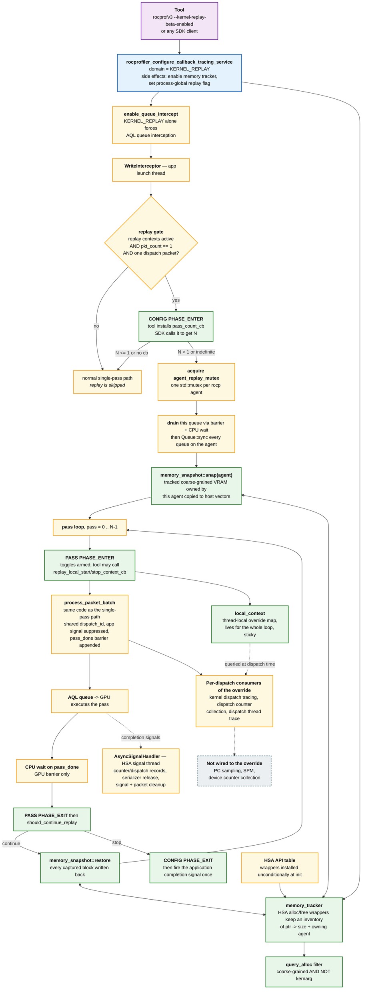
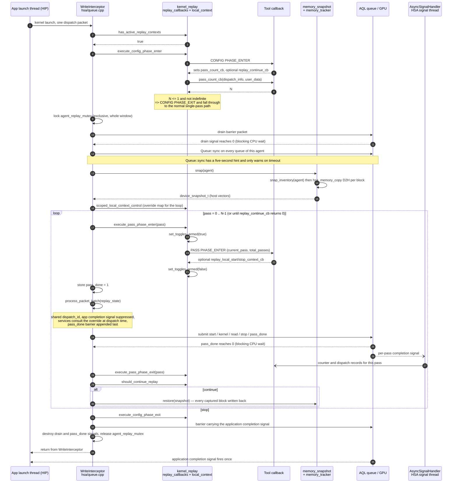

# Kernel Replay — Software Architecture

Companion to `kernel_replay_callback_api_design.md`. That document specifies the public API and its
semantics; this one records where the implementation lives and what order things happen in.

Paths are relative to `projects/rocprofiler-sdk/source/`, except in the test table, which is given in
full because the tests live outside `source/`. Elements are named by symbol rather than cited by line
number, since line numbers rot faster than the code they point at.

## 1. Component architecture

Green is the new subsystem, yellow is existing code modified to accommodate it, grey dashed is a
service that does not consult the per-pass override.

## 2. Component inventory

### 2.1 Public API

| Element | Location |
|---|---|
| Domain `ROCPROFILER_CALLBACK_TRACING_KERNEL_REPLAY` | `include/rocprofiler-sdk/fwd.h` |
| `rocprofiler_kernel_replay_operation_t` (`NONE`, `CONFIG`, `PASS`) | `include/rocprofiler-sdk/fwd.h` |
| `rocprofiler_callback_tracing_kernel_replay_data_t` | `include/rocprofiler-sdk/experimental/kernel_replay.h` |
| `pass_count_cb`, `replay_continue_cb` | `experimental/kernel_replay.h` |
| `current_pass`, `total_passes` | `experimental/kernel_replay.h` |
| `replay_local_start_context_cb`, `replay_local_stop_context_cb` | `experimental/kernel_replay.h` |
| Enum label and `static_assert` on the domain count | `include/rocprofiler-sdk/cxx/enum_string.hpp` |
| Service configuration and its side effects | `lib/rocprofiler-sdk/callback_tracing.cpp` |
| Operation name / id tables | `kernel_replay/kernel_replay.cpp` |

### 2.2 `kernel_replay/` subsystem

| Element | Location |
|---|---|
| Process-global service gate, `has_active_replay_contexts` | `kernel_replay/replay_callbacks.cpp` |
| `make_dispatch_info` | `kernel_replay/replay_callbacks.cpp` |
| `execute_config_phase_enter`, `execute_config_phase_exit` | `kernel_replay/replay_callbacks.cpp` |
| `execute_pass_phase_enter` (arms toggles), `execute_pass_phase_exit` | `kernel_replay/replay_callbacks.cpp` |
| `should_continue_replay` | `kernel_replay/replay_callbacks.cpp` |
| `replay_plan_t`, `pass_context_state_t` | `kernel_replay/replay_callbacks.hpp` |
| Thread-local override map and arm flag | `kernel_replay/local_context.cpp` |
| `record_override` (rejects unarmed calls) | `kernel_replay/local_context.cpp` |
| `scoped_local_context_control` | `kernel_replay/local_context.{cpp,hpp}` |
| `replay_local_start_context` / `_stop_context` | `kernel_replay/local_context.cpp` |
| `local_context_has_overrides`, `local_context_override` | `kernel_replay/local_context.cpp` |
| Tracking flag, alloc/free wrappers (pool + region) | `kernel_replay/memory_tracker.cpp` |
| `record_alloc` / `record_free` (fini-guarded) | `kernel_replay/memory_tracker.cpp` |
| `snap_inventory(agent)` — agent-filtered | `kernel_replay/memory_tracker.cpp` |
| `update_table` (core + amd_ext) | `kernel_replay/memory_tracker.cpp` |
| `query_alloc` pool filter | `kernel_replay/utils.cpp` |
| `snap(agent)`, `restore(snapshot)` | `kernel_replay/memory_snapshot.cpp` |
| `mem_block_t`, `device_snapshot_t` | `kernel_replay/memory_snapshot.hpp` |
| HSA table install site | `lib/rocprofiler-sdk/registration.cpp` |

### 2.3 Queue interception

| Element | Location |
|---|---|
| `replay_pass_state_t`, `agent_replay_mutex` | `hsa/queue.cpp` |
| `has_active_replay_contexts` call and interceptor gate | `hsa/queue.cpp` |
| Local-override pruning of dispatch-tracing contexts | `hsa/queue.cpp` |
| Shared `dispatch_id` across passes | `hsa/queue.cpp` |
| Application completion signal suppressed per pass | `hsa/queue.cpp` |
| `pass_done` barrier appended | `hsa/queue.cpp` |
| Replay gate and replay window (lock, drain, snap, loop, restore, signal) | `hsa/queue.cpp` |
| `AsyncSignalHandler` | `hsa/queue.cpp` |
| `Queue::sync` (five-second hint, warn-only on timeout) | `hsa/queue.cpp` |
| `enable_queue_intercept` and the interposition predicate | `hsa/queue_controller.cpp` |

### 2.4 Services that honor the per-pass override

| Service | Location | Mechanism |
|---|---|---|
| Kernel dispatch tracing | `hsa/queue.cpp` | Removes disabled contexts from the per-packet callback and buffered context vectors |
| Dispatch counter collection | `counters/dispatch_handlers.cpp` | Override folded into the computed `is_enabled` |
| Dispatch thread trace | `thread_trace/core.cpp` | Returns `{nullptr, bSerialize}` — skips the trace, keeps serialization |
| PC sampling | not wired | — |
| SPM (`dispatch_spm`) | not wired | — |
| Device counter collection | not wired | — |

### 2.5 Tool integration (`rocprofv3`)

| Element | Location |
|---|---|
| `--kernel-replay-beta-enabled` CLI flag | `bin/rocprofv3.py` |
| `--pmc` requirement and environment plumbing | `bin/rocprofv3.py` |
| Counter-group merge (single application run, no per-group relaunch) | `bin/rocprofv3.py` |
| `config::kernel_replay` (`ROCPROF_KERNEL_REPLAY`) | `lib/rocprofiler-sdk-tool/config.hpp` |
| Per-thread published pass index | `lib/rocprofiler-sdk-tool/tool.cpp` |
| `replay_user_data_t` pack/unpack (tid + pass in one 64-bit slot) | `tool.cpp` |
| `get_replay_profile` (pass index to counter group) | `tool.cpp` |
| Group selection in the dispatch callback | `tool.cpp` |
| `replay_pass` on the record | `tool.cpp`, `lib/output/counter_info.hpp` |
| `kernel_replay_pass_count_callback` | `tool.cpp` |
| `kernel_replay_callback` (CONFIG + PASS) | `tool.cpp` |
| Context creation and start | `tool.cpp` |

`Replay_Pass` is serialized to JSON but is not emitted in `counter_collection.csv`; the header list
and row writer are both in `lib/output/generateCSV.cpp`.

### 2.6 Tests

| Test | Location |
|---|---|
| Snapshot / restore unit tests | `kernel_replay/tests/snap_restore.cpp` |
| Local context override unit tests | `kernel_replay/tests/local_context_test.cpp` |
| Integration binary (vecAdd, saxpy, vecScale; self-validating) | `projects/rocprofiler-sdk/tests/bin/kernel-replay/kernel_replay.cpp` |
| End-to-end rocprofv3 test across counter groups | `projects/rocprofiler-sdk/tests/rocprofv3/kernel-replay/CMakeLists.txt` |
| Structural validation of passes | `projects/rocprofiler-sdk/tests/rocprofv3/kernel-replay/validate.py` |

## 3. Sequence — one replayed dispatch, N passes

The pass loop waits on `pass_done`, which is a GPU barrier. It is not synchronized with
`AsyncSignalHandler`, so the restore for a pass can begin before the handler has finished reading
that pass out.

## 4. Current scope

What the implementation covers today, as a reader of the code needs to know it:

- Replay applies to a single-dispatch write of one packet. Multi-packet writes and graph launches
  take the normal path.
- Exclusion is a per-agent mutex acquired inside the replay branch, so it covers replayed dispatches
  against each other rather than against all dispatches on the agent.
- Snapshots are held in host memory as one buffer per tracked allocation, and restore writes back
  every captured block rather than only modified ones.
- The tracked inventory comes from the HSA pool and region allocators. Allocations that establish
  their address through `hsa_amd_vmem_map`, and module-scope device variables, are not tracked.
- Host memory is deliberately out of scope, as is cache state, so cache-sensitive counters can vary
  across passes.
- Both replay waits use an unbounded timeout, and the agent-wide drain is best-effort because
  `Queue::sync` warns and returns rather than failing on timeout.
- The per-pass override is consulted by kernel dispatch tracing, dispatch counter collection and
  dispatch thread trace. PC sampling, SPM and device counter collection do not consult it, and the
  override cannot activate a context that is globally inactive.
- Snapshot and restore failures are logged and skipped rather than failing the replay.
- There is no unit test of the replay loop itself, and no multi-threaded, multi-stream, multi-GPU or
  graph-launch coverage.
