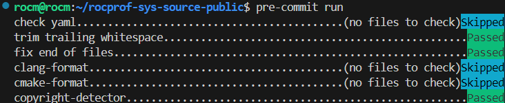

<head>
  <meta charset="UTF-8">
  <meta name="description" content="Contributing to rocprofiler-systems">
  <meta name="keywords" content="ROCm, contributing, rocprofiler-systems">
</head>

# Contributing to ROCm Systems Profiler

Contributions must conform to the MIT license, pass `ctest`, and satisfy the checks
described below. The author must be able to respond to review comments and make
requested changes.

This project is developed in-tree at `projects/rocprofiler-systems/` within the
[ROCm/rocm-systems](https://github.com/ROCm/rocm-systems) repository. This guide covers
everything specific to rocprofiler-systems; for repository-wide topics it does not cover
(sparse checkout, DVC large files, NPI/NTI development), see the
[repository contributing guide](https://github.com/ROCm/rocm-systems/blob/develop/CONTRIBUTING.md).

## Issue Discussion

Use the GitHub Issues tab to notify us of issues.

* Search [existing issues](https://github.com/ROCm/rocm-systems/issues) before filing a new one.
* If your issue is already listed, upvote it and comment with additional details, such as how you reproduced it.
* If you're not sure whether your issue is the same, file it anyway and link the similar issue number. Duplicates are closed after evaluation.
* Use the issue template. Provide as much information as possible, including script output, so we can collect your configuration.
* Check your issue regularly — we may require additional information to reproduce it.
* Issues may also be used to ask maintainers whether a proposed change meets the acceptance criteria.

GitHub Issues are recommended for any significant change that adds a feature or fixes
a non-trivial issue. A large code change with no issue and no prior discussion with AMD
may not be reviewed. Small fixes for broken behavior are always welcome, with or without
an associated issue.

## Where things live

All paths below are relative to `projects/rocprofiler-systems/`.

| What you're adding | Where it goes |
| --- | --- |
| Executable / CLI front end | `source/bin/<tool>/` (`rocprof-sys-avail`, `-sample`, `-causal`, `-instrument`, `-run`, `-attach`) |
| Shared CLI helper (argument registration, presets, JSON config) | `source/bin/common/` |
| Header-only helper used by multiple libraries or executables | `source/lib/common/` — not installed or exported outside the build tree |
| Functionality with no component dependencies | `source/lib/core/` — static PIC library, not installed or exported |
| Binary reading / analysis (used by causal profiling) | `source/lib/binary/` — static PIC library, not installed or exported |
| Logging | `source/lib/logger/` |
| Data-source backend | `source/lib/backends/<amd_smi\|procfs\|rocprofiler_sdk>/` |
| Main profiling capability | `source/lib/rocprof-sys/` |
| Front-end `dlopen` shim and instrumentation entry points | `source/lib/rocprof-sys-dl/` |
| Dyninst runtime (`DYNINSTAPI_RT`) injected into instrumented processes | `source/lib/rocprof-sys-rt/` |
| Python bindings (rocprof-sys-python) | `source/python/` |
| Unit tests | a `tests/` subdirectory next to the code under test (e.g. `source/lib/common/tests/`) |
| Integration / end-to-end tests, validators, pytest suites | `tests/` |
| CMake modules and dependency setup | `cmake/` |
| Vendored third-party sources | `external/` |
| Developer and CI helper scripts | `scripts/` |
| Sphinx documentation | `docs/` |
| Example workloads | `examples/` |

For the design rationale behind each library and executable, see
[docs/reference/development-guide.rst](docs/reference/development-guide.rst).

### Ownership

* This project is owned by `@ROCm/rocprof-sys` and `@jrmadsen`. Documentation changes
  (`*.md`, `*.rst`, `docs/`, `.readthedocs.yaml`) additionally require
  `@ROCm/rocm-documentation`.
* Reviewers and labels are assigned automatically from the changed file paths, via the
  top-level [`CODEOWNERS`](https://github.com/ROCm/rocm-systems/blob/develop/.github/CODEOWNERS).
* Never hand-edit files under `external/` — they are vendored third-party sources.

## Libraries to use

Extend the existing in-tree libraries before introducing a dependency or writing
something from scratch.

### In-tree utilities

| Need | Use |
| --- | --- |
| Logging | `LOG_CRITICAL` / `LOG_ERROR` / `LOG_WARNING` / `LOG_INFO` / `LOG_DEBUG` / `LOG_TRACE` from `source/lib/logger/debug.hpp` |
| Joining values with a delimiter | `rocprofsys::join()` — `source/lib/common/join.hpp` |
| Splitting strings | `rocprofsys::delimit()` — `source/lib/common/delimit.hpp` |
| Path manipulation | `rocprofsys::path::*` — `source/lib/common/path.hpp` |
| Environment variables | `source/lib/common/environment.hpp`, names in `source/lib/common/env_vars.hpp` |
| Unit conversion | `source/lib/common/units.hpp` |
| Mutex-guarded values | `source/lib/common/synchronized.hpp` |
| Lifetime-safe statics | `source/lib/common/static_object.hpp` |
| MD5 hashing | `source/lib/common/md5sum.hpp` |

### Third-party dependencies

These are already vendored under `external/` and wired up by the matching module in
`cmake/`. Prefer them over adding a new dependency:

* **spdlog** — logging backend (`cmake/Spdlog.cmake`)
* **nlohmann/json** — JSON parsing and serialization (`cmake/NlohmannJson.cmake`)
* **Perfetto** — trace output (`cmake/Perfetto.cmake`)
* **PAPI** — hardware counters (`cmake/PAPI.cmake`)
* **Dyninst** — binary instrumentation and rewriting
* **ELFIO** — ELF parsing
* **oneTBB** — concurrent containers and parallelism
* **pybind11** — Python bindings
* **GoogleTest** — unit tests (`cmake/GTest.cmake`)

Adding a new external dependency requires a proposal — see
[Proposing architectural changes](#proposing-architectural-changes).

### Discouraged: timemory

**timemory is in the process of being removed from this project.** It is a frozen
dependency: the surface in use shrinks over time and never grows. Treat every
remaining call site as debt that is scheduled for migration, not as a pattern to copy.

* **Do not introduce new `tim::` types or functions.** Use an in-tree utility from the
  table above, or the standard library.
* **The `rocprofsys::` aliases in `source/lib/core/timemory.hpp` are timemory too.**
  `audit::`, `comp::`, `dmp::`, `operation::`, `quirk::`, and `settings` are re-exports
  of `tim::` namespaces. Using them counts as new timemory usage even though no `tim::`
  appears in the diff. Do not add new aliases to that header.
* **Do not add new `#include <timemory/...>` lines.** Where a timemory header is
  unavoidable in code that has not yet been migrated, it must use angle brackets —
  `#include "timemory/..."` fails the `check-includes` CI job.
* **Existing usage is not a licence to add more.** timemory remains in `external/` and
  is still referenced by unmigrated code, most heavily in `source/bin/rocprof-sys-avail/`
  and `source/bin/rocprof-sys-instrument/`.
* **Migrate, don't wrap.** When your change removes the last call site of a `tim::`
  symbol, delete it rather than leaving a thin `rocprofsys::` forwarder behind — a
  wrapper keeps the dependency alive while hiding it from review.
* **Keep migrations in their own commit.** A `refactor(rocprofiler-systems):` commit
  that replaces timemory usage must not be mixed with a feature or a fix, per
  [Commit hygiene](#commit-hygiene).

> This is review policy, not a gate. CI checks the include *form* only; nothing
> automatically rejects a new `tim::` symbol. Reviewers do.

## Code style

### Language standard

* **C++20** (`CMAKE_CXX_STANDARD 20`, set in `CMakeLists.txt`). Use standard-library
  facilities — concepts, ranges, `std::span`, `std::format` — in preference to
  hand-rolled or vendored equivalents.

### Formatting

Formatting is defined entirely by the config files in this directory. Do not override
them locally.

| Language | Tool | Config |
| --- | --- | --- |
| C / C++ | `clang-format-18` | `.clang-format` |
| CMake | `gersemi` 0.23.1 | `.gersemirc` |
| Python | `black` | `pyproject.toml` |
| Markdown | `markdownlint-cli2` | `.markdownlint.yaml` |

Key C++ settings from `.clang-format`: column limit 90, indent width 4, spaces only,
`PointerAlignment: Left`, custom brace wrapping (braces on their own line for
namespaces, classes, functions, and control statements), `SortIncludes: true`,
`NamespaceIndentation: None`.

### Naming

Enforced by `readability-identifier-naming` in `.clang-tidy`:

| Kind | Case |
| --- | --- |
| Class, struct, union, enum | `lower_case` |
| Function, method | `lower_case` |
| Variable, parameter, member | `lower_case` |
| Private / protected / public member | `m_` prefix |
| Enum constant, global constant, macro | `UPPER_CASE` |
| Template parameter | `CamelCase` |
| Namespace | `lower_case` |
| Type alias, typedef | `lower_case` |

Use names that reveal intent. Avoid single-letter variables outside trivial loop
indices.

### Project-specific checks

* **Fixed-width integers must be `std`-qualified** — `std::uint32_t`, not `uint32_t` —
  and included via `<cstdint>`, not `<stdint.h>`. Enforced by
  `scripts/check-fixedwidth-types.sh`, which supports `--fix`. Note that `--fix` uses
  regex and will also rewrite matches inside comments and string literals; review the
  result.
* **Every source file needs an SPDX copyright header** in its first five lines:

  ```cpp
  // Copyright (c) Advanced Micro Devices, Inc.
  // SPDX-License-Identifier: MIT
  ```

  Use the `#` form for Python and CMake. Enforced by `scripts/check-copyright.sh`;
  `scripts/fix_license_headers.py` adds missing headers.

### Running the linters

The repository supports [pre-commit hooks](https://pre-commit.com/#introduction) that
verify formatting before a commit is created. **pre-commit 3.0.0 or higher is required.**

There are two configurations, and both apply to rocprofiler-systems. Run all commands
from the repository root — the project config uses root-relative paths.

| Config | Covers |
| --- | --- |
| `.pre-commit-config.yaml` (repository root) | whitespace, YAML, large files, `black`, `clang-format`, `gersemi` |
| `projects/rocprofiler-systems/.pre-commit-config.yaml` | the above plus `markdownlint`, JSON checks, the copyright header check, and the fixed-width type check |

```shell
pip install pre-commit   # or: apt-get install pre-commit
cd rocm-systems

pre-commit install       # install the git hook (root config)
pre-commit run           # run on staged files
pre-commit run --all-files --show-diff-on-failure

# project-specific hooks (copyright, fixed-width types, markdownlint)
pre-commit run -c projects/rocprofiler-systems/.pre-commit-config.yaml --all-files
```



`clang-tidy` is not part of pre-commit. Run it against a configured build directory
(one containing `compile_commands.json`) when changing C++.

### Testing

* Add tests for new functionality. Unit tests go in a `tests/` subdirectory next to
  the code under test; name files `test_<subject>.cpp`.
* Run the suite: `ctest --test-dir build`
* Ensure zero compiler warnings before submitting.

## Proposing architectural changes

Large changes must be proposed and agreed before implementation. This avoids wasted
effort on work that conflicts with the project direction or duplicates something
already underway.

Changes that require a proposal:

* Adding, removing, or restructuring a library or executable under `source/`
* Changing output formats or their schemas (Perfetto, ROCpd)
* Introducing a new external dependency
* Changing the instrumentation, sampling, or causal-profiling pipeline

Bug fixes, test additions, documentation, and localized improvements do not need a
proposal — open a PR directly.

### Process

1. Open a [GitHub issue](https://github.com/ROCm/rocm-systems/issues) with a clear title
   describing the proposed change.
2. Include a design document, inline or attached, covering:
   * **Motivation** — what problem this solves and why now
   * **Design** — proposed architecture, component interactions, data flow
   * **Alternatives considered** — what else was evaluated and why it was rejected
   * **Migration / compatibility** — impact on existing code, tests, and users
   * **Scope** — what is and is not included
3. Wait for review and approval from the rocprofiler-systems CODEOWNERS
   (`@ROCm/rocprof-sys`, `@jrmadsen`) before starting implementation.
4. Reference the issue from every PR that implements the change.

Discussion happens on the issue.

## Commit hygiene

* **Format: [Conventional Commits](https://www.conventionalcommits.org/) with a scope.**

  ```text
  type(scope): short description
  ```

  Types in use: `feat`, `fix`, `refactor`, `test`, `docs`, `ci`, `build`, `chore`.
  Scope is `rocprofiler-systems` for project changes and `workflows` or `deps` for
  CI and dependency changes. Examples from history:

  ```text
  feat(rocprofiler-systems): add rocSHMEM host-stream API tracing
  fix(rocprofiler-systems): Restore main thread identification in cached Perfetto
  refactor(rocprofiler-systems): replace custom span with std::span
  ci(rocprofiler-systems): Enable `jpeg-decode` tests
  ```

* **Write the message about the *why*, not the *what*.** The diff already shows what
  changed.
* **Keep commits atomic.** One logical change per commit. Do not mix a refactor with a
  feature, or a formatting sweep with a fix.
* **Never commit untested code.** Verify end-to-end before pushing.
* **Rebase, don't merge.** Keep history linear:

  ```bash
  git fetch origin
  git rebase origin/develop
  ```

* **Squash on merge.** PRs land via **Squash & Merge** so each change is a single
  logical commit — this is what keeps later cherry-picks into release branches
  tractable.

## PR size and scope

* **One PR does one thing** — one feature, one fix, or one refactor. Not all three.
* Move large auto-generated or vendored file changes into their own PR.
* Large changes must be split into a **stack of small PRs** using GitHub's PR stacking.
  Each PR in the stack targets the branch below it rather than `develop` directly.
* Every PR in a stack must be **independently reviewable and mergeable** — it must
  build, pass CI, and make sense on its own.
* The whole stack lands as a **single squashed commit** on `develop`.
* Fill in every section of the PR template: Motivation, Technical Details, Issue
  Tracking, Test Plan, Test Result.

> PR size is *not* automatically enforced — no size limits are configured in the PR
> bot's `policy.yml`. The rules above are review policy, not a gate.

## Repository guidelines

These are enforced repository-wide, not by this project. They are summarized here
because they gate every PR.

* **Target branch:** `develop`.
* **Branch naming:** `users/<github-username>/<branch-name>` — descriptive but concise,
  ideally referencing the issue number. Prefer a branch in the repository over a fork:
  some build and test infrastructure grants forks fewer privileges.
* **PR description:** at least 30 characters and must reference a tracking item
  (`JIRA ID : ABC-1234`, `Closes #123`, or a bare `#123`). Missing it adds the
  **`Not ready to Review`** label, which reviewers filter on.
* **Commit signing:** **TODO: confirm.** No verified-user or commit-signing requirement
  is documented in the repository `CONTRIBUTING.md`, `docs/`, `policy.yml`, or any
  workflow. Confirm with the ROCm Policy Council (`rocm-repo-policy@amd.com`) before
  relying on its presence or absence.

### CI expectations

Changes under `projects/rocprofiler-systems/**` trigger these project workflows:

| Workflow | Checks |
| --- | --- |
| `rocprofiler-systems Formatting` | markdownlint, spelling, `black`, `gersemi`, `clang-format-18`, timemory/`<bits/>` includes, fixed-width types |
| `rocprofiler-systems Continuous Integration` | build and `ctest`; skipped for docs-only and `CMakePresets.json` changes |

Repository-wide checks also apply: `pre-commit`, CodeQL (fails on critical/high/error
alerts), and the Azure CI dispatcher. Forbidden-file and missing-unit-test checks are
warning-only and never block.

### Who can merge

* A PR needs approval from the assigned CODEOWNERS.
* **Developers cannot bypass pre-submit checks.** Only an admin or the gardener on
  rotation can push a change through a red tree, and only for reverts that fix breakage,
  fast-forward fixes where a revert is unclear, or changes unrelated to code health such
  as docs.
* Gardeners keep post-submit `develop` green and may revert offending commits, including
  bulk reverts.
* Never push directly to a `release-staging/*` branch — always open a PR.

## C++ Core Guidelines

The [C++ Core Guidelines](https://isocpp.github.io/CppCoreGuidelines/CppCoreGuidelines)
are the baseline for any C++ style or design decision not covered above. When this guide
and the Core Guidelines disagree, this guide wins; when this guide is silent, follow the
Core Guidelines.

This is enforced, not aspirational: `.clang-tidy` enables the `cppcoreguidelines-*`
check family. The exclusion list in that file is the authoritative record of which
guidelines this project waives — if a rule is not excluded there, `clang-tidy` will flag
a violation.

## Code License

All code contributed to this project is licensed under the license identified in
[LICENSE.md](LICENSE.md). Your contribution is accepted under the same license. By
opening a pull request you agree to this.

## Release Cadence

Any contribution is released with the next version of ROCm if the contribution window
for that release is still open. If the window is closed but the PR contains a critical
security or bug fix, an exception may be made.

## References

1. [ROCm Systems Profiler Documentation](https://rocm.docs.amd.com/projects/rocprofiler-systems/en/latest/index.html)
2. [ROCm Systems Profiler README](README.md)
3. [Development guide](docs/reference/development-guide.rst)
4. [Repository-wide docs](https://github.com/ROCm/rocm-systems/tree/develop/docs) — CI, gardening, PR bot policy
