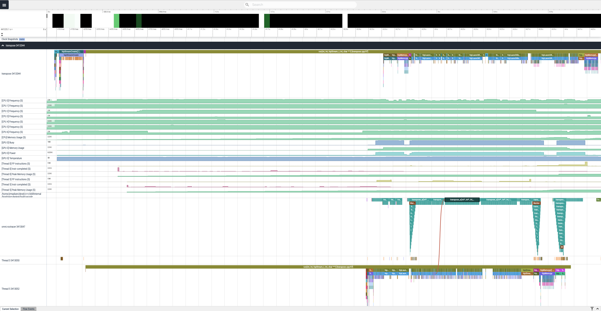

# Omnitrace: Application Profiling, Tracing, and Analysis

[](https://github.com/AMDResearch/omnitrace/actions/workflows/ubuntu-bionic.yml)
[](https://github.com/AMDResearch/omnitrace/actions/workflows/ubuntu-focal-external.yml)
[](https://github.com/AMDResearch/omnitrace/actions/workflows/ubuntu-focal.yml)
[](https://github.com/AMDResearch/omnitrace/actions/workflows/opensuse.yml)

> ***[Omnitrace](https://github.com/AMDResearch/omnitrace) is an AMD open source research project and is not supported as part of the ROCm software stack.***

## Documentation

The full documentation for [omnitrace](https://github.com/AMDResearch/omnitrace) is available at [amdresearch.github.io/omnitrace](https://amdresearch.github.io/omnitrace/).

## Quick Start

### Omnitrace Settings

Generate an omnitrace configuration file using `omnitrace-avail -G omnitrace.cfg`. Optionally, use `omnitrace-avail -G omnitrace.cfg --all` for
a verbose configuration file with descriptions, categories, etc. Modify the configuration file as desired, e.g. enable
[perfetto](https://perfetto.dev/), [timemory](https://github.com/NERSC/timemory), sampling, and process-level sampling by default
and tweak some sampling default values:

```console
# ...
OMNITRACE_USE_PERFETTO         = true
OMNITRACE_USE_TIMEMORY         = true
OMNITRACE_USE_SAMPLING         = true
OMNITRACE_USE_PROCESS_SAMPLING = true
# ...
OMNITRACE_SAMPLING_FREQ        = 50
OMNITRACE_SAMPLING_CPUS        = all
OMNITRACE_SAMPLING_GPUS        = $env:HIP_VISIBLE_DEVICES
```

Once the configuration file is adjusted to your preferences, either export the path to this file via `OMNITRACE_CONFIG_FILE=/path/to/omnitrace.cfg`
or place this file in `${HOME}/.omnitrace.cfg` to ensure these values are always read as the default. If you wish to change any of these settings,
you can override them via environment variables or by specifying an alternative `OMNITRACE_CONFIG_FILE`.

### Omnitrace Executable

The `omnitrace` executable is used to instrument an existing binary.

```shell
omnitrace --help
omnitrace <omnitrace-options> -- <exe-or-library> <exe-options>
```

#### Binary Rewrite

Rewrite the text section of an executable or library with instrumentation:

```shell
omnitrace -o app.inst -- /path/to/app
```

In binary rewrite mode, if you also want instrumentation in the linked libraries, you must also rewrite those libraries.
Example of rewriting the functions starting with `"hip"` with instrumentation in the amdhip64 library:

```shell
mkdir -p ./lib
omnitrace -R '^hip' -o ./lib/libamdhip64.so.4 -- /opt/rocm/lib/libamdhip64.so.4
export LD_LIBRARY_PATH=${PWD}/lib:${LD_LIBRARY_PATH}
```

> ***Verify via `ldd` that your executable will load the instrumented library -- if you built your executable with***
> ***an RPATH to the original library's directory, then prefixing `LD_LIBRARY_PATH` will have no effect.***

Once you have rewritten your executable and/or libraries with instrumentation, you can just run the (instrumented) executable
or exectuable which loads the instrumented libraries normally, e.g.:

```shell
./app.inst
```

If you want to re-define certain settings to new default in a binary rewrite, use the `--env` option. This `omnitrace` option
will set the environment variable to the given value but will not override it. E.g. the default value of `OMNITRACE_PERFETTO_BUFFER_SIZE_KB`
is 1024000 KB (1 GiB):

```shell
# buffer size defaults to 1024000
omnitrace -o app.inst -- /path/to/app
./app.inst
```

Passing `--env OMNITRACE_PERFETTO_BUFFER_SIZE_KB=5120000` will change the default value in `app.inst` to 5120000 KiB (5 GiB):

```shell
# defaults to 5 GiB buffer size
omnitrace -o app.inst --env OMNITRACE_PERFETTO_BUFFER_SIZE_KB=5120000 -- /path/to/app
./app.inst
```

```shell
# override default 5 GiB buffer size to 200 MB
export OMNITRACE_PERFETTO_BUFFER_SIZE_KB=200000
./app.inst
```

#### Runtime Instrumentation

Runtime instrumentation will not only instrument the text section of the executable but also the text sections of the
linked libraries. Thus, it may be useful to exclude those libraries via the `-ME` (module exclude) regex option
or exclude specific functions with the `-E` regex option.

```shell
omnitrace -- /path/to/app
omnitrace -ME '^(libhsa-runtime64|libz\\.so)' -- /path/to/app
omnitrace -E 'rocr::atomic|rocr::core|rocr::HSA' --  /path/to/app
```

### Visualizing Perfetto Results

Visit [ui.perfetto.dev](https://ui.perfetto.dev) in your browser and open up the `.proto` file(s) created by omnitrace.




## Merging the traces from rocprof and omnitrace

This section requires installing [Julia](https://julialang.org/).

### Installing Julia

Julia is available via Linux package managers or may be available via a module. Debian-based distributions such as Ubuntu can run (as a super-user):

```shell
apt-get install julia
```

Once Julia is installed, install the necessary packages (this operation only needs to be performed once):

```shell
julia -e 'using Pkg; for name in ["JSON", "DataFrames", "Dates", "CSV", "Chain", "PrettyTables"]; Pkg.add(name); end'
```

> ***Using `rocprof` externally for tracing is deprecated. The current version has built-in support for***
> ***recording the GPU activity and HIP API calls. If you want to use an external rocprof, either***
> ***configure CMake with `-DOMNITRACE_USE_ROCTRACER=OFF` or explicitly set `OMNITRACE_ROCTRACER_ENABLED=OFF` in the***
> ***environment.***

Use the `omnitrace-merge.jl` Julia script to merge rocprof and perfetto traces.

```shell
export OMNITRACE_USE_ROCTRACER=OFF
rocprof --hip-trace --roctx-trace --stats ./app.inst
omnitrace-merge.jl results.json omnitrace-app.inst-output/2021-09-02_01.03_PM/*.proto
```

## Use Perfetto tracing with System Backend

Enable `traced` and `perfetto` in the background:

```shell
pkill traced
traced --background
perfetto --out ./omnitrace-perfetto.proto --txt -c ${OMNITRACE_ROOT}/share/omnitrace.cfg --background
```

Configure omnitrace to use the perfetto system backend:

```shell
export OMNITRACE_PERFETTO_BACKEND=system
```

And finally, execute your instrumented application. Either the binary rewritten application:

```shell
omnitrace -o ./myapp.inst -- ./myapp
./myapp.inst
```

Or with runtime instrumentation:

```shell
omnitrace -- ./myapp
```
