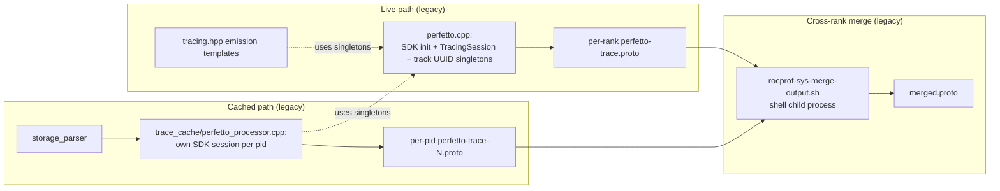
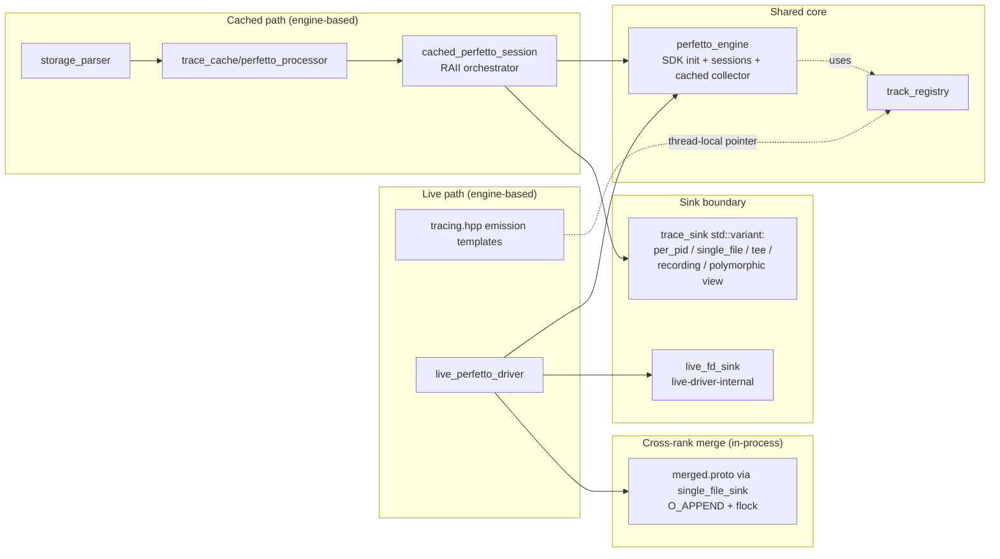
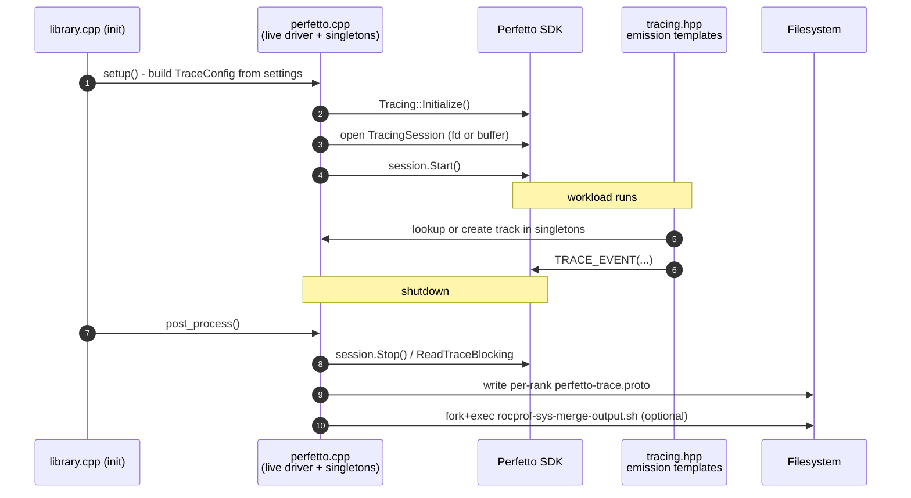
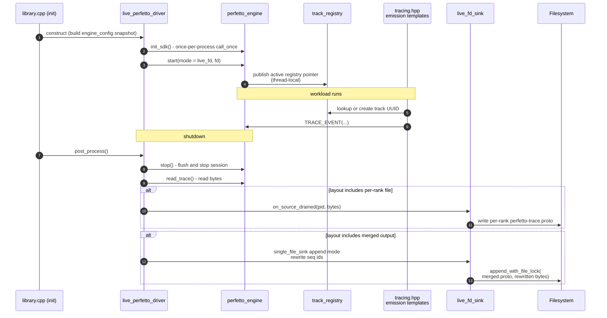
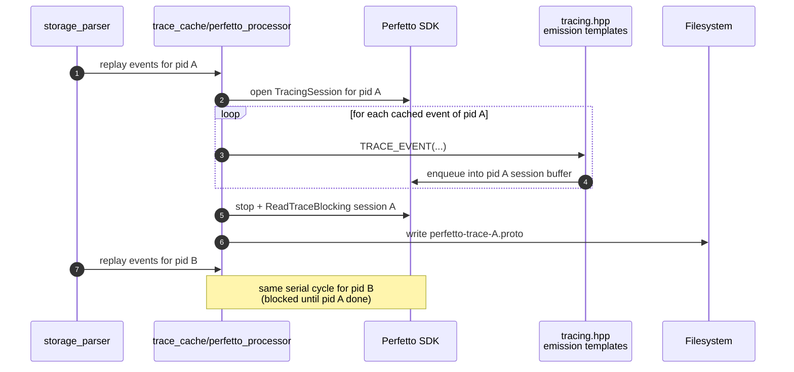
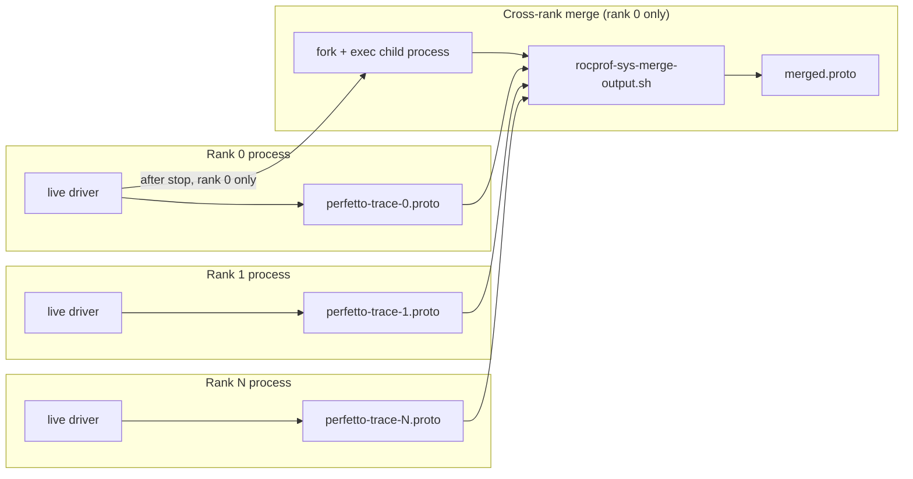
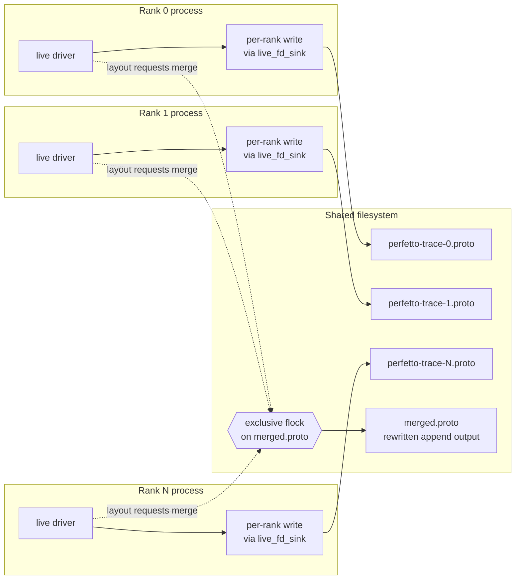

# Perfetto Output Architecture

This document describes the Perfetto output pipeline inside ROCm
Systems Profiler. It contrasts the previous architecture (referred to
here as the *legacy pipeline*) with the current architecture (the
*engine-based pipeline*) and records the rationale for each major
design decision.

Audience: developers maintaining the Perfetto output code under
source/lib/core and source/lib/rocprof-sys/library. Readers are
expected to understand the broad shape of Perfetto's SDK (tracing
sessions, TracePackets, trusted packet sequence ids, interned data)
and the difference between the live and cached emission paths.

---

## Chapter 1. Pipeline Overview and Components

### What the pipeline does

ROCm Systems Profiler produces Perfetto traces along two parallel
emission paths. The *live path* is wired up at process startup and
captures events through the Perfetto SDK's normal in-process tracing
service: each event handler in the project calls Perfetto's
TRACE_EVENT primitives, the SDK buffers and serialises them, and the
runtime writes the resulting bytes to disk during process shutdown.
The *cached path* runs at post-process time, after the workload has
exited and the storage-parser has reconstructed events from the
binary trace cache; the same TRACE_EVENT primitives are reused, but
the bytes never reach the SDK's normal tracing service - they are
intercepted and grouped per-pid so that the post-process step can
emit one Perfetto trace per source process from a single host
process.

Both paths must agree on a small but load-bearing set of cross-cutting
mechanics: where Perfetto SDK initialisation happens, who owns the
TracingSession, how track descriptors and category names interned by
the SDK get registered, and where the final bytes land on disk. The
shape of those mechanics is what changed between the two architectures.

### Legacy pipeline (still present on develop)

In the legacy pipeline the live and cached paths each carry their own
copy of the SDK setup, tracing session, and track-descriptor
management. The live driver lives inside one large translation unit
that bundles Perfetto SDK initialisation, the live TracingSession,
the live shutdown sequence, and a handful of singleton helpers that
the emission templates in tracing.hpp consult for track UUIDs. The
cached driver lives in a second translation unit that opens its own
TracingSession per processed pid, calls into the same singletons
that the live path established, and writes its own per-pid output
files. Cross-rank aggregation of the produced per-rank files happens
out of process: at the very end of the run, a shell helper script is
invoked as a child process to concatenate per-rank Perfetto files
into a single merged file.



The legacy diagram shows two implications worth calling out. First,
both drivers reach into a shared set of process-global helpers
declared inside the live driver's translation unit; testing either
driver in isolation requires bringing the other one along. Second,
the merge step happens outside the runtime: the rocprof-sys runtime
writes per-rank files, then asks the operating system to invoke a
shell helper. The runtime has no return-channel for merge failures
beyond the script's exit code, and the script itself depends on a
POSIX shell being available on the launcher's path.

### Engine-based pipeline (current branch)

The current architecture promotes a single Perfetto engine to a
first-class component. The engine owns SDK initialisation, the
TracingSession map, and the cached-mode packet collector.
The two drivers (live and cached) become thin orchestrators that hand the
engine a sink and a mode parameter, then let the engine drive the
rest.
Track-descriptor and category-name management are extracted out
of the live driver's translation unit into a standalone track
registry that the engine publishes through a thread-local pointer.
Cross-rank aggregation no longer requires a shell helper: it is
performed in-process by the live driver through the same single-file
sink used by cached aggregation. Each rank appends rewritten bytes to
a shared merged-file path under an exclusive file lock.



Several things differ from the legacy diagram. The engine is the
shared central component that both paths route through. The track
registry is a peer component, no longer hidden behind the live
driver's translation-unit boundary. The cached path's per-pid file
writing and the cached-mode merge writing both go through the same
sink boundary, exposed as a closed variant of concrete sink
alternatives. The live driver retains its own internal sink
(live_fd_sink) for the single per-rank file because that path does
not need the sink variant's polymorphism. Cross-rank merging is now
a runtime concern and no longer involves a child process.

### Component table - legacy versus engine-based

The table below maps each architectural responsibility to where it
lives in each pipeline. Read it as a translation guide for someone
familiar with one pipeline who needs to find the equivalent piece in
the other.

| Responsibility                                       | Legacy pipeline                                              | Engine-based pipeline                                  |
|------------------------------------------------------|--------------------------------------------------------------|--------------------------------------------------------|
| Perfetto SDK initialisation                          | Inside live driver translation unit                          | perfetto_engine, guarded by a process-wide call_once   |
| Live TracingSession lifecycle                        | Inside live driver translation unit                          | perfetto_engine, mode = live_fd                        |
| Cached per-pid TracingSession lifecycle              | trace_cache/perfetto_processor, one session per pid          | perfetto_engine, mode = cached_interceptor             |
| Track UUID and category-name interning               | Meyer singletons inside live driver translation unit         | track_registry, accessed via thread-local pointer      |
| Emission helpers (push, pop, mark)                   | tracing.hpp templates calling into live driver singletons    | tracing.hpp templates calling into track_registry      |
| Cached event handlers (per sample type)              | trace_cache/perfetto_processor sample handlers (unchanged)   | Unchanged from legacy                                  |
| Sink boundary for cached output                      | Implicit - cached driver writes files directly               | trace_sink variant (per_pid, single_file, tee, ...)    |
| Sink boundary for live output                        | Implicit - live driver writes its own file                   | live_fd_sink owned by live driver                      |
| Cross-rank merge mechanism                           | rocprof-sys-merge-output.sh shell child process              | In-process O_APPEND with exclusive flock               |
| User control of merge behaviour                      | Two boolean knobs (COMBINE_TRACES + MERGE_FILES)             | ROCPROFSYS_PERFETTO_OUTPUT_LAYOUT (enum string)        |
| Cached parallelism                                   | Serial (one parser thread emits at a time)                   | Parallel (per-pid sources emit concurrently)           |
| Per-source seq_id management for merged output       | Not applicable - merge happens out of process                | rewrite_trace_packet applies per-source offset         |

### Why the legacy structure could not stay

Three pressures motivated the engine extraction. The first is
testability: the live driver's translation unit owned process-global
state that the cached driver depended on, so neither driver could be
exercised in isolation by a unit test. The second is parallelism: the
cached path is the natural place to run post-process work concurrently
(matching what the RocPD post-processor already does), but doing so
required a per-pid emission model that the legacy structure could not
express because all cached emissions ultimately wrote into the shared
SDK state established by the live driver. The third is fork safety:
the shell-based merge step requires fork plus exec at runtime
shutdown, which interacts poorly with libfabric and other libraries
that the workload may have left in inconsistent post-fork state.

The engine-based structure addresses each: the engine is a unit-
testable seam, the cached collector enables per-pid concurrency
without sharing SDK state across pids, and the in-process merge
removes the fork dependency at shutdown time.

---

## Chapter 2. Live Mode Data Flow

Live mode is the original Perfetto path: the SDK's in-process tracing
service is initialised at startup, every TRACE_EVENT macro call from
inside the running workload is buffered by the SDK, and the buffered
bytes are written to disk during runtime shutdown. The live path
exists for users who want a Perfetto trace alongside the executing
workload (the default behaviour when ROCPROFSYS_TRACE is enabled).

Live mode is single-process in scope. Each rank or worker invocation
of the workload owns its own Perfetto SDK instance and produces its
own output. Cross-rank aggregation is a separate concern handled at
the end of the run - see Chapter 4.

### Legacy live mode

In the legacy pipeline the live driver carries the full lifecycle of
the Perfetto SDK as well as the file-writing endpoint. Initialisation
happens during library bring-up: the driver builds a TraceConfig,
calls into the SDK to initialise tracing, opens a TracingSession and
points it at either a temporary file descriptor (so the SDK streams
bytes directly to disk) or its internal ring buffer (so the bytes are
held until the session stops). The same translation unit also defines
the Meyer singletons that hold track UUIDs and category names; the
emission templates in tracing.hpp reach into those singletons
directly.

While the workload runs, each TRACE_EVENT call passes through the
emission templates, which look up or create the appropriate track in
the singletons and then call the SDK macro. The SDK serialises the
event into the active TracingSession's buffer.

At shutdown, the driver stops the session, reads the bytes (either
from the temporary file or by calling ReadTraceBlocking on the SDK
session), writes them to the configured per-rank output path, and
fires a child-process invocation of the merge helper script if the
user opted in to combined traces.



The legacy diagram shows two structural features. The live driver
holds three responsibilities at once (SDK init, session lifecycle,
file write), and the emission templates have a direct dependency on
state that lives inside the live driver's translation unit. Neither
responsibility is reachable from a unit test without instantiating
the full driver, including its filesystem write and its shell-merge
side effect.

### Engine-based live mode

In the engine-based pipeline the live driver is reduced to an
orchestrator. It holds a unique pointer to a perfetto_engine, sets up
the SDK once through the engine, asks the engine to start in live
mode, and at shutdown asks the engine to stop and surrender the
buffered bytes to a live-mode sink that knows how to write them.

Initialisation runs during library bring-up. The live driver
constructs an engine_config value (a small snapshot of the perfetto-
related settings, taken once at driver-construction time so the
engine never has to re-read the global config), then constructs a
perfetto_engine and calls init_sdk on it. SDK init runs at most once
per process - the engine guards it with a process-global once-flag -
so it is safe for the cached path to be constructed later and call
init_sdk again from its own engine instance.

Emission during the workload differs from the legacy path only in
where the emission templates look up track state. Instead of reaching
into a Meyer singleton inside the live driver, they consult a
thread-local pointer to the active track registry. The engine
publishes that pointer when it starts; the live driver and the
cached session both go through this same mechanism.

At shutdown, the live driver reads the per-rank bytes from the SDK
(either from the temporary file or via the engine's session) and
hands them to a live_fd_sink. The same shutdown then consults
ROCPROFSYS_PERFETTO_OUTPUT_LAYOUT to decide whether to also
contribute the per-rank bytes to a cross-rank merged file. If the
layout requests merged output, the driver invokes its in-process
single_file_sink, which rewrites the rank's packet sequence ids into a
disjoint range, opens the shared merged-file path in append mode, takes
an exclusive file lock, writes the rewritten bytes, releases the lock,
and closes.



The engine-based diagram differs in three places. The live driver no
longer owns SDK state; it owns an engine. The emission templates no
longer call into the live driver's translation unit; they call into a
peer component (the track registry) through a thread-local indirection
that the engine controls. And the shutdown path no longer forks a
shell helper; cross-rank aggregation is two filesystem calls
(an append-with-lock) executed in the same process that produced the
bytes.

### Per-step differences

The table below maps each lifecycle step of live mode to what changed
between the two pipelines. Use it when porting an existing live-mode
modification from develop to the engine-based branch.

| Lifecycle step                            | Legacy live mode                                              | Engine-based live mode                                                |
|-------------------------------------------|---------------------------------------------------------------|-----------------------------------------------------------------------|
| SDK initialisation                        | In live driver, on first call                                 | In perfetto_engine, guarded by process-wide once-flag                 |
| TraceConfig source                        | Built inline from config singleton                            | engine_config snapshot taken once at driver construction              |
| TracingSession ownership                  | Live driver                                                   | perfetto_engine session map                                           |
| Track UUID / category state               | Meyer singletons in live driver TU                            | track_registry, accessed via thread-local pointer                     |
| Emission template dependency              | Live driver translation unit                                  | track_registry (peer component)                                       |
| Output file write                         | Direct ofstream from live driver                              | live_fd_sink owned by live driver                                     |
| Cross-rank merge decision                 | ROCPROFSYS_PERFETTO_COMBINE_TRACES boolean                    | ROCPROFSYS_PERFETTO_OUTPUT_LAYOUT enum                                |
| Cross-rank merge mechanism                | fork plus exec of shell helper                                | In-process append-with-flock from each rank                           |
| Failure surfacing for merged output       | Shell exit code                                               | Logger error and runtime flag                                         |

### Why the live-mode change matters even in single-rank runs

The engine extraction looks like a win mainly for multi-rank or
cached cases, but it also tightens the single-rank live path in two
practical ways. Initialisation no longer pulls a constellation of
singletons into the live driver's translation unit, so a build that
links only the live path (a future minimal embedding, for example)
no longer has to drag in the shell-merge helper or any of the cached
path's headers. And the live driver becomes constructible in a unit
test against an engine_config literal, so changes to the lifecycle
shape (start-stop sequencing, ReadTraceBlocking semantics) can be
covered without spinning up the full library.

---

## Chapter 3. Cached Mode Data Flow

Cached mode runs after the workload exits. During the workload itself,
a binary trace cache (the storage layer) records every collected
event into a compact on-disk format without any Perfetto SDK
involvement. When the workload finishes, a post-processing step
replays those cached records through the same TRACE_EVENT primitives
the live path uses, producing one Perfetto trace per recorded source
process. This is the path that users opt into by default when they
want both a Perfetto trace and a RocPD database; only the live path
goes through the SDK while the workload is running, whereas the
cached path defers SDK work to the end so the workload runs with
minimal in-process overhead.

The defining structural concern of cached mode is that it processes
multiple source pids inside a single host process: the post-
processing host has to produce one independent Perfetto trace per pid
the workload spawned. The shape of that "one host emits many traces"
problem is what most distinguishes the two pipelines.

### Legacy cached mode

In the legacy pipeline, the cached driver treats each source pid as
an independent emission session. The cached perfetto_processor opens
a fresh Perfetto SDK TracingSession for the pid being processed,
walks the cached records via the storage_parser, calls the same
TRACE_EVENT primitives that the live path uses, and at the end stops
the session, reads the SDK's buffer, and writes the resulting bytes
to a per-pid output file. The next pid is processed after the
previous one has finished. Processing is serial across pids: even
though the storage_parser hands the post-processor a worker thread
per pid, those threads queue behind one another on the cached
processor because the SDK's tracing service and the live driver's
track-state singletons cannot safely service overlapping per-pid
emission.



The legacy diagram shows two architectural facts that constrain
cached mode. First, every pid pays the cost of a full SDK session
setup and teardown. Second, the queueing is structural: the cached
processor's interaction with both the SDK and the live driver's
singletons is not safe to run from multiple threads at the same time,
so the worker-thread pool that the storage_parser would otherwise
hand out serialises into a single emitter. End-of-run flush latency
on workloads with many pids therefore scales linearly with the pid
count.

### Engine-based cached mode

In the engine-based pipeline cached mode separates the
"replay an event" responsibility from the "associate that event with
a source pid" responsibility. The replay still calls TRACE_EVENT, but
the SDK is configured to route every emitted packet through a custom
interceptor rather than into the normal tracing service. The
interceptor consults a thread-local emitting-pid tag that each
parser thread sets at the start of its processing cycle, looks up
the corresponding per-pid byte buffer that the engine pre-allocated
before parsing began, and appends the packet bytes verbatim. There
is no per-pid TracingSession: a single SDK session feeds the
interceptor, and the interceptor fans out by pid.

End-of-run shutdown drives a sink. The sink is selected by the
cached_perfetto_session orchestrator based on
ROCPROFSYS_PERFETTO_OUTPUT_LAYOUT: a per_pid_file_sink writes one
Perfetto file per pid, a single_file_sink concatenates all pids'
bytes into one file (with per-source seq_id offsetting applied so
each pid's interned-data namespace stays intact across the
concatenation), and a tee_sink composes the two when the user asks
for both. The engine drains each per-pid buffer into the sink in
turn, then calls the sink's finalise method to flush.

```mermaid
flowchart LR
    subgraph Parse["Replay (storage_parser worker pool)"]
        T1[parser thread 1<br/>pid A]
        T2[parser thread 2<br/>pid B]
        T3[parser thread 3<br/>pid C]
    end

    subgraph Engine["perfetto_engine (mode = cached_interceptor)"]
        TLS[thread-local emitting_pid<br/>+ TLS engine pointer]
        ICP[cached_interceptor<br/>OnTracePacket callback]
        Buf[per-pid byte buffers<br/>preregistered, lock-free append]
    end

    subgraph Sink["trace_sink variant<br/>(chosen by OUTPUT_LAYOUT)"]
        S_pp[per_pid_file_sink]
        S_sf[single_file_sink<br/>seq_id offset per source]
        S_te[tee_sink<br/>composes per_pid + single_file]
    end

    subgraph Output["Filesystem"]
        O_pp[perfetto-trace-N.proto<br/>(per pid)]
        O_sf[merged.proto<br/>(concatenated)]
    end

    T1 --> ICP
    T2 --> ICP
    T3 --> ICP
    TLS -.read by interceptor.-> ICP
    ICP -->|append bytes keyed by pid| Buf
    Buf -->|drain at engine.stop| Sink
    S_pp --> O_pp
    S_sf --> O_sf
    S_te --> O_pp
    S_te --> O_sf
```

The engine-based diagram shows three structural changes. The fan-out
by pid happens inside the interceptor on a lock-free path, so per-pid
emission can run in parallel without serialising on the SDK or on
shared track state. The output shape is no longer hard-coded to one
file per pid; it is a sink choice resolved at orchestrator construction
time. And the merged-output path is part of the same sink boundary,
which means cached single-file mode and per-pid mode share the same
seq_id and iid handling rather than living in two different code
paths.

### Why per-source seq_id management matters for single-file output

Perfetto's interned-data fields (event_categories, event_names,
debug_annotation_names) carry small numeric identifiers (iids) that
are valid only within the same trusted_packet_sequence_id. When two
sources are concatenated into one Perfetto trace, their iids
collide: the same numeric id may name "rocm_hip_api" in one source
and "mpi" in the other, and the trace_processor that reads the
merged file will resolve later definitions back to earlier ones,
silently corrupting category attributions or dropping events whose
iid no longer resolves.

The cached path resolves this by giving each source a disjoint
seq_id sub-range and rewriting every packet's
trusted_packet_sequence_id to its source's original value plus an
offset. Because the offset is constant within a source, the source's
internal seq_id structure is preserved: the SDK placeholder value
that all packets share in cached input lands in the same effective
slot, and any in-source distinctions (which the cached interceptor
does not produce today, but may in a future change) would also be
preserved. The per-pid file path does not need this rewrite - each
pid's bytes end up in their own file with their own seq_id namespace

- so the seq_id offset is a feature of single_file_sink specifically.

### Per-step differences

The table below maps cached-mode lifecycle steps to what changed
between the two pipelines.

| Lifecycle step                                          | Legacy cached mode                                                   | Engine-based cached mode                                                                       |
|---------------------------------------------------------|----------------------------------------------------------------------|------------------------------------------------------------------------------------------------|
| Number of Perfetto SDK sessions                         | One per source pid                                                   | One per process, shared across all pids                                                        |
| Pid-to-emission association                             | Implicit - one session is active at a time                           | Explicit - thread-local emitting_pid tag, read by interceptor                                  |
| Per-pid buffer ownership                                | Inside SDK TracingSession                                            | Inside engine, preregistered, lock-free append                                                 |
| Concurrency                                             | Serial across pids                                                   | Parallel across pids (worker thread per pid)                                                   |
| Output shape decision                                   | Hard-coded one file per pid                                          | Sink variant chosen by ROCPROFSYS_PERFETTO_OUTPUT_LAYOUT                                       |
| Single-file output handling                             | Not supported - emerged later via shell merge                        | single_file_sink with per-source seq_id offset                                                 |
| Track UUID and category state across pids               | Shared singletons in live driver TU                                  | track_registry published via thread-local pointer (engine controls)                            |
| End-of-run sink finalisation                            | None - output is per-session                                         | Sink finalise call after all per-pid drains                                                    |
| Failure isolation across pids                           | One pid's failure can corrupt shared singletons                      | Per-source drain exceptions captured, first one rethrown after finalise                        |

### Why cached parallelism matters

The dominant cost of cached-mode end-of-run flush on a multi-pid
workload is the wall-time of emission, not the wall-time of byte
write. Each pid's events have to be replayed through the
TRACE_EVENT machinery and serialised by the SDK. Doing this serially
for N pids costs N × per-pid replay time; doing it in parallel costs
roughly per-pid replay time plus drain time. On runs with many pids
(for example, an MPI launcher that spawns several worker processes,
each profiled), the difference is enough to dominate the end-of-run
delay the user perceives as profiler overhead. The cached
interceptor exists specifically so that this parallelism is safe
without sharing SDK state across the parser threads.

---

## Chapter 4. Cross-Rank MPI Merge

When the workload is launched under an MPI launcher (mpiexec, srun,
or equivalent), each rank is a separate operating-system process and
each rank runs its own ROCm Systems Profiler instance independently.
Each instance produces its own Perfetto output following the rules
described in Chapters 2 and 3. The cross-rank merge step exists to
aggregate those independent outputs into a single combined Perfetto
trace that downstream consumers (the Perfetto UI, the trace
processor, custom analysis scripts) can load in one shot.

The merge step is the most user-visible change between the two
pipelines. The legacy approach reaches outside the runtime to a
shell helper, while the engine-based approach handles the
aggregation in-process inside each rank.

### Legacy cross-rank merge

In the legacy pipeline the merge runs as a separate child process at
the very end of the run. Each rank's live driver writes its per-rank
file as part of its normal shutdown sequence. One designated rank
(rank zero) then asks the operating system to fork and execute a
helper shell script. The script's job is to concatenate the per-rank
files into a single combined Perfetto file at a well-known path.
Cross-rank ordering is determined by filename sort order; cross-rank
correctness relies on each per-rank file being a complete and valid
Perfetto trace on its own, because the script does nothing beyond
byte-for-byte concatenation.



The legacy diagram surfaces three operational concerns. The merge
depends on a POSIX shell being present on the launcher's path and on
the helper script being installed at a discoverable location;
deployment regressions on either of those are silent until merge
time. The fork-plus-exec at shutdown happens long after the workload
has touched runtime libraries (libfabric, the GPU runtime, MPI
collectives), and any of those libraries may have left state that is
not safe to inherit into a forked child. And error reporting is
limited to the script's exit code - the rocprof-sys runtime has no
structured way to surface a partial concatenation or a missing
input file to the user.

Two boolean settings controlled this path on develop:
ROCPROFSYS_PERFETTO_COMBINE_TRACES, which the live driver inspected
to decide whether to invoke the merge at all, and
ROCPROFSYS_MERGE_PERFETTO_FILES, which an earlier iteration of the
code used as a parallel switch. Both are now deprecated in the
engine-based pipeline (see the next subsection).

### Engine-based cross-rank merge

In the engine-based pipeline cross-rank aggregation is performed by
the runtime itself. Each rank's live driver, during its normal
shutdown, writes its per-rank file as before. If the configured
output layout requests a merged output (either single_file_only or
the default full), the same shutdown feeds the per-rank bytes through
single_file_sink append mode. The sink rewrites each rank into a
disjoint packet-sequence-id range and appends the rewritten bytes to a
shared merged-file path under an exclusive file lock. The lock serialises
concurrent ranks: whichever rank
acquires it first writes its bytes first, the next rank queues
behind, and so on. The merged file is built in flock-arrival order rather than rank-id
order. Because each rank is rewritten into a disjoint sequence-id
range before append, interned-data references remain isolated across
ranks. The shell helper is no longer present.



The engine-based diagram differs in three places. The merge is in-
process: no fork, no exec, no dependency on a shell or on a script
being installed alongside the binary. The merged output is built up
incrementally as ranks finish, rather than as a single child-process
step after all ranks have completed. And per-rank append failures
are surfaced as logged errors and as a runtime flag that the driver
exposes back to the rest of the library; structured failure
reporting replaces a single exit-code byte.

### Per-rank versus per-pid merge - what the merge contains

A small terminology distinction matters here. Live mode produces one
file per rank; cached mode (which can run inside a single rank's
process) produces one file per pid. The cross-rank merge described
in this chapter applies to the live path's per-rank outputs.
Cached-mode single-file aggregation is a different mechanism - it
runs inside one host process across many pids, uses the
single_file_sink described in Chapter 3, and applies per-source
seq_id offsetting because all pids share one logical SDK namespace
in cached mode. Live cross-rank merge uses the same per-source
seq_id offsetting as cached single-file aggregation. This keeps the merged file independent
of assumptions about how Perfetto assigns trusted packet sequence ids
inside each process.

The table below distinguishes the two cases.

| Aggregation case                 | Where it runs                  | Bytes from each source                  |
|----------------------------------|--------------------------------|-----------------------------------------|
| Cross-rank merge (live)          | One write per rank, in-process | Rewritten with per-rank seq_id offset   |
| Single-file aggregation (cached) | One host process, many pids    | Rewritten with per-source seq_id offset |

Both live cross-rank merge and cached single-file aggregation rewrite
seq_ids before appending. The difference is the source identity used
for the offset: live mode uses the rank-derived source id, while
cached mode uses each reconstructed pid.

### How OUTPUT_LAYOUT replaces the old boolean knobs

The legacy pipeline exposed two boolean settings that controlled
cross-rank behaviour:
ROCPROFSYS_PERFETTO_COMBINE_TRACES (whether to invoke the shell
helper at all) and ROCPROFSYS_MERGE_PERFETTO_FILES (an older
parallel switch). The engine-based pipeline collapses both into one
enum-string setting, ROCPROFSYS_PERFETTO_OUTPUT_LAYOUT, with three
named values:

| Value of ROCPROFSYS_PERFETTO_OUTPUT_LAYOUT | What gets written                                                                           |
|--------------------------------------------|---------------------------------------------------------------------------------------------|
| per_process_only                           | Per-rank file (live) or per-pid file (cached) only. No merged.proto.                        |
| single_file_only                           | merged.proto only. No per-rank or per-pid files.                                            |
| full (default)                             | Both per-process files and merged.proto.                                                    |

The two legacy booleans are kept registered, marked deprecated, and
no longer consulted. Setting either of them produces a deprecation
banner that directs the user to ROCPROFSYS_PERFETTO_OUTPUT_LAYOUT.
The runtime does not attempt to migrate their bool values into the
new enum string, because there is no safe automatic mapping (the
legacy "off" value does not map cleanly onto a layout choice - the
user must explicitly pick per_process_only if that is what they
want).

### Per-step differences

| Lifecycle step                                       | Legacy cross-rank merge                          | Engine-based cross-rank merge                                  |
|------------------------------------------------------|--------------------------------------------------|----------------------------------------------------------------|
| Trigger                                              | Rank zero, after all ranks have written          | Each rank, during its own shutdown                             |
| Aggregation primitive                                | Shell script concatenating files                 | append + exclusive flock on a shared file                      |
| Process model                                        | fork + exec child shell process from rank zero   | In-process write from each rank                                |
| Cross-rank ordering of output                        | Filename sort order                              | flock arrival order                                            |
| User control                                         | ROCPROFSYS_PERFETTO_COMBINE_TRACES boolean       | ROCPROFSYS_PERFETTO_OUTPUT_LAYOUT enum string                  |
| Legacy boolean status                                | Active                                           | Deprecated, no longer consulted, deprecation banner            |
| Failure reporting                                    | Shell script exit code                           | Logged error and runtime output-error flag                     |
| Dependency on POSIX shell                            | Required                                         | Not required                                                   |
| Fork safety interaction                              | Affected by fork-sensitive libs (e.g. libfabric) | Not affected - no fork                                         |

### Operational caveats of the in-process merge

In-process merge moves the aggregation cost into the per-rank
shutdown wall-time. The cost is dominated by two factors: the size
of the per-rank bytes (each rank writes its own bytes plus, if the
layout requests merge, the same bytes again under the lock) and the
contention on the shared lock (ranks queue behind whichever rank
holds the lock). For a workload with a small number of ranks and a
trace size that fits comfortably in the per-rank disk write budget,
the in-process merge adds negligible wall-time. For very large
traces (single-rank trace sizes in the tens of gigabytes) or for
launchers that scale to hundreds of ranks, the queueing on the
lock becomes the dominant cost. The recommended workaround for
those scales is to set ROCPROFSYS_PERFETTO_OUTPUT_LAYOUT to
per_process_only and perform a separate offline merge if a combined
file is actually needed; this preserves all of the per-rank data
without paying the queueing cost during the workload's critical
shutdown window.

A second caveat is that the exclusive file lock is acquired through
the operating-system flock primitive, which is reliable on local
filesystems but has weaker semantics on shared network filesystems
(NFS in particular). On launchers that direct the output path to a
shared mount, the per-rank append still completes correctly because
flock degrades to a no-op rather than to a broken-lock state, but
two ranks may end up writing concurrently and the resulting
merged file may interleave bytes from different ranks. For shared-
mount workloads it is safest to direct the per-rank output to local
storage and perform any final aggregation as a separate post-run
step.

---

## Chapter 5. Key Design Decisions and Rationale

The five preceding chapters described what the engine-based pipeline
looks like and how data flows through it. This chapter records why
each major decision was made, what alternatives were considered, and
what trade-offs the decision accepts. The intent is that a developer
who later wants to revisit one of these decisions can find both the
original motivation and the constraints that ruled the rejected
alternatives out.

### Decision 1 - Single SDK session plus per-thread interceptor for cached mode

The cached path needs to produce one independent Perfetto trace per
recorded source pid, from a single host process, with per-pid
emission running in parallel.

Two alternatives were considered before the current design.

The first alternative was to open one Perfetto SDK TracingSession
per pid (the same shape the legacy cached path used, with parallel
sessions instead of serial ones). The SDK supports multiple
sessions in principle, but the cost is non-trivial: each session
carries its own buffer pool, its own clock-snapshot machinery, and
its own service-side state, and the SDK's internal locks serialise
several operations that would otherwise run concurrently. On
workloads with many small pids the per-session overhead dominates
the actual emission cost, and the parallelism win shrinks
substantially.

The second alternative was to open one engine per pid (one
TracingSession plus one set of host-side bookkeeping per pid). This
preserves SDK-level isolation but multiplies the engine's own state
by the pid count, including the per-pid track registry that the
emission templates consult. It also reopens the question of who
owns the shared SDK initialisation if every pid has its own engine.

The current design chooses to keep one SDK session per host process
and intercept packets before they reach the SDK's normal tracing
service. A custom interceptor is registered with the SDK; each
TRACE_EVENT call goes through the same emission templates as the
live path but is routed through the interceptor instead of the
tracing service. The interceptor reads a thread-local emitting-pid
tag (set by the parser thread at the start of its processing cycle)
and appends the packet bytes to a per-pid buffer the engine has
pre-allocated. There is no per-pid SDK state and no SDK lock on the
hot path; the only synchronisation cost is the atomic load of the
pre-registration flag that protects the per-pid buffer map from
late-arriving registrations.

The trade-off is that the engine takes on a responsibility the SDK
would otherwise own - namely, packet bytes-to-source attribution -
and accepts the load-bearing assumption that the thread-local
emitting-pid tag is always set correctly by the parser threads
before they emit. The engine guards that assumption with diagnostic
state (a process-wide map of pids to owning thread ids) that surfaces
violations at the first incorrect emit.

### Decision 2 - std::variant for the sink boundary instead of a virtual base class

The cached path needs a way to swap output destinations (per-pid
files, single concatenated file, the two combined, a test-only
recording target) without recompiling the engine or the cached_perfetto_session orchestrator. The standard C++ approach is a
virtual base class with a fixed interface and a small set of derived
classes; a less common approach is std::variant of the concrete sink
types plus std::visit dispatch at the call site.

The virtual base approach was rejected on two grounds. The first is
performance: every drain call would incur a virtual dispatch, and
drain calls happen per packet on the cached side and per rank on the
live side. The second is a more subtle build-system concern: a
virtual base class commits every consumer of the engine to depend
on the base class header, and any sink implementation that wanted to
live in a separate translation unit would either need its own
header in the engine's include set or a forward-declared base class
visible to the engine. The variant boundary keeps the engine's
header dependency confined to the concrete sink types it actually
dispatches to.

The variant approach has its own trade-off. The sink set is closed -
adding a new sink requires editing the variant alias and recompiling
every translation unit that visits the variant. This is acceptable
in practice because the sink set is small (four concrete sinks plus
a test-only recording sink plus a type-erased view used by tests)
and rarely changes. The polymorphic_sink_view is a deliberate escape
hatch for tests that need to inject a sink implementation without
adding it to the variant; tests construct a temporary target object
and a view around it, and the view forwards drain and finalise
calls through function pointers stored in the view.

The live driver's per-rank file sink (live_fd_sink) sits outside the
variant because the live path does not need polymorphism at that
boundary - the live driver owns its sink concretely and always
writes the same kind of file.

### Decision 3 - OUTPUT_LAYOUT enum string instead of two boolean knobs

The legacy pipeline had two boolean settings that together expressed
the user's intent about cross-rank aggregation. The combinations did
not factor cleanly: setting one without the other produced different
behaviour depending on path (live or cached), and a user reading
either setting's name had no way to know about the other.

The replacement uses one enum-string setting with three named values
(per_process_only, single_file_only, full). The values are
mutually exclusive and exhaustively cover the meaningful output
shapes. The enum is registered through the project's standard
configuration machinery with set_choices, so invalid values are
caught at parse time rather than at output time. The two legacy
booleans are kept registered, marked deprecated through the standard
deprecation banner mechanism, and no longer consulted.

The decision not to automatically migrate the legacy boolean values
into the new enum was made because the boolean values do not have a
single safe enum target. The legacy "off" value, for example, could
plausibly mean either per_process_only (the user wants no merge) or
the default full (the user wants no merge but does not mind getting
one). The deprecation handler was extended with an explicit
no-migrate option so the deprecation banner fires without parsing
a bool string into the enum-string namespace; the user is asked to
choose explicitly.

### Decision 4 - In-process cross-rank merge instead of a shell helper

The legacy cross-rank merge was a POSIX shell script invoked as a
child process after the workload finished. The two main motivations
for moving away from this were operational, not architectural.

The first motivation is fork safety at shutdown. Several runtime
libraries the workload may have linked against (libfabric for
high-performance network fabrics, the GPU runtime, MPI collectives)
leave internal state at shutdown that is not safe to inherit into a
forked child. Forking from rank zero at the end of the run is the
worst possible time for this: every library has had time to
accumulate state, and the child immediately execs a shell, which
does not give any library a chance to reset its inherited state.
Removing the fork removes the entire class of "rank zero crashes at
shutdown when libfabric is loaded" failures.

The second motivation is deployment and observability. The shell
helper had to be installed alongside the binary at a discoverable
path; misconfiguration was silent until merge time and reported only
through the script's exit code. The in-process approach has neither
of those problems: the merge code ships with the runtime, and merge
failures are surfaced through the project's standard logger and
through a runtime flag the driver exposes.

The trade-off is that cross-rank aggregation now consumes per-rank
shutdown wall-time rather than running once after all ranks have
written. The cost scales with the per-rank trace size and with rank
count via the exclusive file lock; the operational caveats section
of Chapter 4 records the regime where per_process_only plus an
explicit offline merge becomes preferable.

### Decision 5 - Per-source seq_id offset instead of replace

The single_file_sink concatenates bytes from multiple sources into
one Perfetto file. Each source's bytes carry their own
trusted_packet_sequence_id namespace; Perfetto's interned-data
fields (event_categories, event_names, debug_annotation_names) are
scoped to a sequence id, so two sources concatenated without
intervention would collide on iid values and trace_processor would
silently misresolve later definitions to earlier ones.

Two approaches were considered.

The first was to replace each source's seq_id with a single
per-source value, so all of source A's packets get one seq_id and
all of source B's packets get another. This works when every
source's input bytes use a single seq_id internally (the cached
interceptor's pre-stamping case), but it fails the moment a source's
bytes contain multiple internal seq_ids: collapsing them into one
merges previously-separate iid namespaces and silently drops or
misroutes events. The cached interceptor today produces single-seq_id
input, but the rewrite primitive is a general-purpose tool used by
other concatenation paths, and the replace semantics make those
other paths fragile.

The second approach - the one chosen - is to add a per-source
offset to each packet's original seq_id, so source A's seq_ids
become base_A + original and source B's seq_ids become base_B + original. As long as base_A and base_B are far enough apart that
the sources' offset ranges do not overlap, every input seq_id maps
to a distinct output seq_id and each source's interned-data
namespace is preserved. The offset is constant within a source, so
its internal seq_id structure (one or many) survives the rewrite.

The trade-off is that source bases have to be allocated with a
stride large enough to accommodate the largest expected per-source
seq_id range. The current design uses a stride large enough to fit
the few-hundred internal seq_ids any single Perfetto SDK session
would produce, while staying well inside the per-rank window used
by the MPI merge path so that many sources can fit inside one
rank's slot. If a future workload approaches the stride boundary,
the runtime logs a structured error rather than overflowing into
the next source's range.

### Decision 6 - track_registry extracted out of the live driver translation unit

The track UUIDs and category names that the emission templates
consult are process-global state. In the legacy pipeline they lived
in Meyer singletons inside the live driver's translation unit, which
meant the cached driver depended on the live driver's translation
unit being linked in even when the live path was not active, and
neither driver could be unit-tested without the other.

The extraction moves that state into a standalone track_registry
component. The component is constructible in isolation, exposes its
state through a small set of public methods, and is published by the
engine through a thread-local pointer that the emission templates
consult.

The trade-off considered was whether to pass the registry as an
explicit parameter through every emission template, rather than
through a thread-local pointer. The explicit-parameter approach
would have made the dependency visible at every call site and
eliminated the need for the thread-local indirection, but it would
also have required changes to every TRACE_EVENT-shaped call site
across the project - many of them outside the perfetto module. The
thread-local pointer keeps the emission template signatures
unchanged and confines the indirection to the engine and the
templates' bodies. Tests construct a registry and an engine
together; production constructs a registry through the engine.

### Extension points

The architecture exposes three extension points that future work is
expected to use.

The first is the sink variant. A new output destination - for example,
a sink that streams bytes to a network endpoint or one that writes
directly into a database table - can be added as a new alternative
of the trace_sink variant. The two requirements are that the new
sink implements the same drain and finalise calls as the existing
sinks and that the cached_perfetto_session orchestrator gains a
selection branch for it (likely driven by a new enum value of
ROCPROFSYS_PERFETTO_OUTPUT_LAYOUT or by a separate setting). Every
translation unit that visits the variant recompiles, but no
emission code changes.

The second is the engine mode. A new emission shape - for example,
a streaming mode that sends bytes off-node as they are produced
rather than buffering them per-pid - can be added as a new mode of
the engine. The new mode would extend the engine's start method
with a new branch and add whatever per-mode bookkeeping the mode
needs. Existing modes (live_fd, cached_interceptor) are unaffected.

The third is the configuration enum. The OUTPUT_LAYOUT setting can
grow new named values as new aggregation shapes become useful. The
runtime contract is that the cached_perfetto_session orchestrator
maps each layout value to a concrete sink construction, and the
live driver maps each layout value to a per-rank-write plus
optional merge-append combination. Adding a new layout value
requires updating both mappings.

---

## Document status

This document describes the engine-based Perfetto output pipeline
shipped in the current branch and the legacy pipeline as it appears
on the develop branch. Both descriptions are accurate as of the time
of writing; subsequent changes to either pipeline should update the
corresponding sections of this document.

Component locations referenced throughout this document live under
source/lib/core/perfetto (engine, drivers, sinks, packet framing,
counter track, forward declarations), source/lib/core/track_registry
(track UUID and category-name registry), source/lib/core/trace_cache
(cache_manager and perfetto_processor), and
source/lib/rocprof-sys/library (tracing.hpp emission templates,
library.cpp composition root). Configuration settings discussed in
this document are registered in source/lib/core/config.cpp; the
public getter functions used by the runtime live alongside in
source/lib/core/config.hpp.
