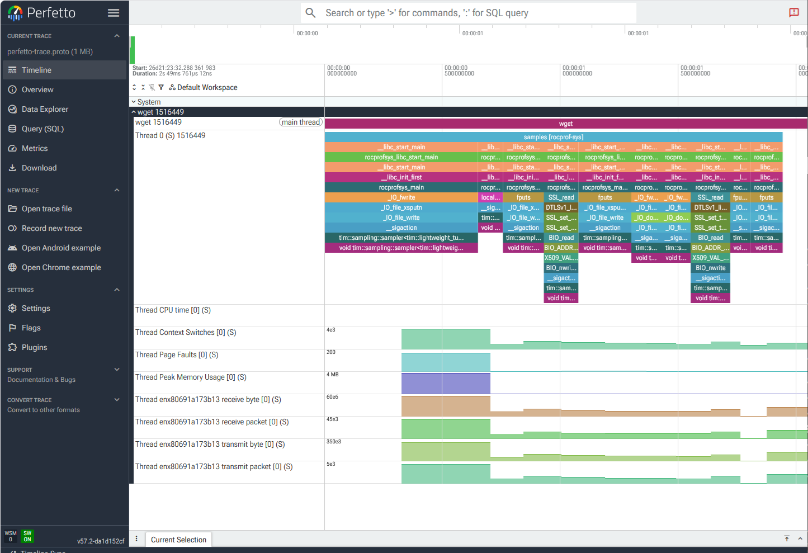
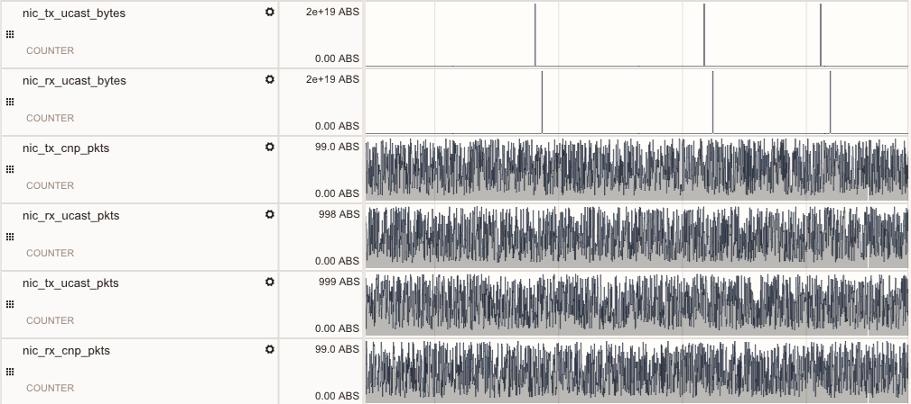

.. meta::
   :description: ROCm Systems Profiler network performance profiling
   :keywords: rocprof-sys, rocprofiler-systems, ROCm, tips, how to, profiler, tracking, NIC, network, AMD

********************************************
Network performance profiling
********************************************

`ROCm Systems Profiler <https://github.com/ROCm/rocm-systems/tree/develop/projects/rocprofiler-systems>`_
supports network performance profiling for two classes of network interface:

* **Conventional NICs** — standard TCP/IP interfaces (such as ``enp7s0``), profiled
  via PAPI network counters that read ``/proc/net/dev``.
* **AI NICs** — AMD Pensando RDMA interfaces, profiled via ``amd-smi``.

Both classes are configured through the unified ``--nics`` option
(``ROCPROFSYS_SAMPLING_NICS``). ROCm Systems Profiler automatically classifies
each requested interface as conventional or AI and routes it to the appropriate
backend.

.. code-block:: shell

   # Profile a single interface (works for both conventional and AI NICs)
   rocprof-sys-sample --nics=enp7s0 -- <your command>

   # Profile multiple interfaces in one run
   rocprof-sys-sample --nics=enp7s0,enp229s0 -- <your command>

   # Profile all available interfaces
   rocprof-sys-sample --nics=all -- <your command>

The equivalent environment variable is:

.. code-block:: shell

   ROCPROFSYS_SAMPLING_NICS=enp7s0,enp229s0

.. _event-based-profiling:

Profiling conventional NIC metrics using PAPI
==============================================

Network performance profiling for conventional network interfaces that support
TCP/IP is done using PAPI. This method profiles standard network events read
from ``/proc/net/dev``. By default, four counters per interface are collected:
received bytes, transmitted bytes, received packets, and transmitted packets.

.. note::

   PAPI network counters (``net:::`` events) read ``/proc/net/dev`` directly and
   do not require kernel perf event access. They work regardless of the value of
   ``/proc/sys/kernel/perf_event_paranoid``, so no special privileges or kernel
   configuration changes are needed.

List available network events
-------------------------------

To see the full list of per-interface counters available on the system, run:

.. code-block:: shell

    rocprof-sys-avail -H -r net

For example, if the system's NIC is ``enp7s0``, the output is:

.. code-block:: shell

  |-------------------------------|---------|-----------|-------------------------------|
  |       HARDWARE COUNTER        | DEVICE  | AVAILABLE |            SUMMARY            |
  |-------------------------------|---------|-----------|-------------------------------|
  | net:::enp7s0:rx:byte          |   CPU   |   true    | enp7s0 receive byte           |
  | net:::enp7s0:rx:packet        |   CPU   |   true    | enp7s0 receive packet         |
  | net:::enp7s0:rx:error         |   CPU   |   true    | enp7s0 receive error          |
  | net:::enp7s0:rx:droppe        |   CPU   |   true    | enp7s0 receive droppe         |
  | net:::enp7s0:rx:fif           |   CPU   |   true    | enp7s0 receive fif            |
  | net:::enp7s0:rx:fram          |   CPU   |   true    | enp7s0 receive fram           |
  | net:::enp7s0:rx:compresse     |   CPU   |   true    | enp7s0 receive compresse      |
  | net:::enp7s0:rx:multicas      |   CPU   |   true    | enp7s0 receive multicas       |
  | net:::enp7s0:tx:byte          |   CPU   |   true    | enp7s0 transmit byte          |
  | net:::enp7s0:tx:packet        |   CPU   |   true    | enp7s0 transmit packet        |
  | net:::enp7s0:tx:error         |   CPU   |   true    | enp7s0 transmit error         |
  | net:::enp7s0:tx:droppe        |   CPU   |   true    | enp7s0 transmit droppe        |
  | net:::enp7s0:tx:fif           |   CPU   |   true    | enp7s0 transmit fif           |
  | net:::enp7s0:tx:coll          |   CPU   |   true    | enp7s0 transmit coll          |
  | net:::enp7s0:tx:carrie        |   CPU   |   true    | enp7s0 transmit carrie        |
  | net:::enp7s0:tx:compresse     |   CPU   |   true    | enp7s0 transmit compresse     |
  |-------------------------------|---------|-----------|-------------------------------|

Configure and run
------------------

Pass the interface name to ``--nics``:

.. code-block:: shell

   rocprof-sys-sample --nics=enp7s0 -- <your command>

The equivalent configuration-file setting is:

.. code-block:: shell

   ROCPROFSYS_SAMPLING_NICS=enp7s0

A complete sample configuration file (``rocprofsys.cfg``) looks like:

.. code-block:: shell

  ROCPROFSYS_VERBOSE=1
  ROCPROFSYS_DL_VERBOSE=1
  ROCPROFSYS_SAMPLING_FREQ=10
  ROCPROFSYS_SAMPLING_DELAY=0.05
  ROCPROFSYS_SAMPLING_CPUS=0-9
  ROCPROFSYS_SAMPLING_GPUS=all
  ROCPROFSYS_TRACE=ON
  ROCPROFSYS_PROFILE=ON
  ROCPROFSYS_USE_SAMPLING=ON
  ROCPROFSYS_USE_PROCESS_SAMPLING=OFF
  ROCPROFSYS_TIME_OUTPUT=OFF
  ROCPROFSYS_FILE_OUTPUT=ON
  ROCPROFSYS_TIMEMORY_COMPONENTS=wall_clock papi_array network_stats
  ROCPROFSYS_USE_PID=OFF
  ROCPROFSYS_OUTPUT_PREFIX=foo/
  ROCPROFSYS_SAMPLING_NICS=enp7s0
  PAPI_NET_REFRESH_LATENCY=100000

Details of the configuration settings:

* **Sampling Frequency**: 10 samples per second.
* **TIMEMORY**: Outputs summaries for the ``wall_clock``, ``papi_array``, and
  ``network_stats`` components.
* **ROCPROFSYS_SAMPLING_NICS**: The network interface to profile (``enp7s0``).
* **PAPI_NET_REFRESH_LATENCY**: The shortest latency (in microseconds) with which
  PAPI updates network statistics. The default value is 1000000 (1 second).

To use the configuration file, set:

.. code-block:: shell

  ROCPROFSYS_CONFIG_FILE=/path/to/rocprofsys.cfg

Instrument and run the binary
-------------------------------------

1. Instrument the binary file using the ``rocprof-sys-instrument`` command:

.. code-block:: shell

  rocprof-sys-instrument -o foo.inst  \
    --log-file mylog.log --verbose --debug \
    "--print-instrumented" "functions" "-e" "-v" "2" "--caller-include" \
    "inner" "-i" "4096" "--" ./foo

This command generates an instrumented binary ``foo.inst``.

2. Run the instrumented binary using the following command:

.. code-block:: shell

  rocprof-sys-sample -- ./foo.inst

Visualize the event-based profiling results
---------------------------------------------

To view the generated ``.proto`` file in the browser, follow the steps:

1. Open the `Perfetto UI page <https://ui.perfetto.dev/>`_.

2. Click ``Open trace file`` and select the ``.proto`` file. In the browser, it looks like:

.. _AINIC-metric-collection:

Profiling AI NIC metrics using amd-smi
=========================================

On a host system that has AI network interface cards, ROCm Systems Profiler can track the following metrics:

* RX congestion notification packets
* TX congestion notification packets
* RX unicast bytes
* TX unicast bytes
* RX unicast packets
* TX unicast packets
* TX ACK timeout (the count of local ACK timeout errors)
* RESP TX PKT SEQ ERROR (the count of packet sequence errors detected by responder)
* REQ RX PKT SEQ ERROR (the count of packet sequence errors detected by requester)
* REQ RX IMPL NAK SEQ ERROR (the count of ACK packets with invalid PSN detected by requester)

AI NIC support in ROCm Systems Profiler
---------------------------------------
AI NIC interfaces support the Remote Direct Memory Access (RDMA) standard. RDMA
enables one computer to access another computer's memory directly, without
operating-system involvement. This capability provides high-throughput, low‑latency
data transfer, which is needed for large-scale clusters and high-performance
networking. You can measure AI NIC network performance by using ``amd-smi``.
By default, AI NIC support is enabled in ROCm Systems Profiler. However, you
can disable it by setting:

.. code-block:: shell

   -D ROCPROFSYS_USE_AINIC=OFF

Verifying AI NIC compile-time support
---------------------------------------

AI NIC metric collection requires ``ROCPROFSYS_BUILD_AINIC=ON`` at build time.
This flag is set automatically when the AMD SMI library version is 26.3 or
later and ``ROCPROFSYS_USE_AINIC=ON`` (the default).

The AI NIC settings (such as ``ROCPROFSYS_USE_AINIC``) are only available when
the ROCm Systems Profiler is compiled with ``ROCPROFSYS_BUILD_AINIC=ON``. Their
presence in the output of ``rocprof-sys-avail --settings`` is therefore a direct
indicator of whether AI NIC support was compiled in. This check requires no AI NIC
hardware.

.. code-block:: shell

   rocprof-sys-avail --settings | grep ROCPROFSYS_USE_AINIC

If ``ROCPROFSYS_USE_AINIC`` is listed, AI NIC support is compiled in. If the
command produces no output, the binaries were built without AI NIC support.

List available AI NICs
------------------------

List all the available AI NICs with their unique identifiers by running ``amd-smi list``:

.. code-block:: shell

   $ sudo amd-smi list
   AI_NIC: 0
       BDF: 0000:e2:00.0
       PERMANENT_ADDRESS: 04:90:81:2c:77:b0
       PRODUCT_NAME: POLLARA 1x400G QSFP112
       PART_NUMBER: POLLARA-1Q400P
       SERIAL_NUMBER: FPL250300A1EC0V2
       VENDOR_NAME: AMD Pensando Systems, Inc.

List the NETDEV name and more details of each available AI NIC by running ``amd-smi static``:

.. code-block:: shell

   $ sudo amd-smi static
   AI_NIC: 0
       NIC:
   ...
           RDMA_DEVICES:
               RDMA_DEVICE_0:
                   NAME: rocep229s0
                   NODE_GUID: 0690:81ff:fe2c:77b0
                   NODE_TYPE: CA
                   SYS_IMAGE_GUID: 0690:81ff:fe2c:77b0
                   FW_VER: 1.110.1-a-1
                   PORT_0:
                       NETDEV: enp229s0
                       PORT_NUM: 1
                       STATE: DOWN
                       MAX_MTU: N/A
                       ACTIVE_MTU: N/A

From this output, use the ``NETDEV`` value (here, ``enp229s0``) as the name of
the AI NIC.

Sampling the AI NICs
-----------------------

After the AI NIC support is enabled, specify the names of the AI NICs for which
you want to track the values using ``--nics``. For example, to profile an AI NIC
named ``enp229s0``:

.. code-block:: shell

   rocprof-sys-sample --nics=enp229s0 -- <your command>

To profile multiple AI NICs, provide them as a comma-separated list:

.. code-block:: shell

   rocprof-sys-sample --nics=enp229s0,enp229s1 -- <your command>

The equivalent environment variable is:

.. code-block:: shell

   ROCPROFSYS_SAMPLING_NICS=enp229s0

You can also pass ``all`` to profile every available NIC on the host:

.. code-block:: shell

   rocprof-sys-sample --nics=all -- <your command>

ROCm Systems Profiler automatically identifies which interfaces are AI NICs and
routes them to the ``amd-smi`` backend; no manual classification is needed.

.. _ai_nics_option_3:

As a concrete example, to profile the AI NIC interface ``enp229s0`` while running
``wget -O /dev/null --no-check-certificate https://example.com``:

.. code-block:: shell

   rocprof-sys-sample --nics=enp229s0 --device -- \
     wget -O /dev/null --no-check-certificate https://example.com

Visualize the AI NIC profiling results
------------------------------------------

To view the ``.proto`` file generated by ``rocprof-sys-sample`` in the browser, follow the steps:

1. Open the `Perfetto UI page <https://ui.perfetto.dev/>`_.

2. Click ``Open trace file`` and select the ``.proto`` file. The tracks for AI NIC in the generated ``.proto`` file look like:

.. image:: ../data/rocprof-sys-ai-nic-perfetto.png
   :alt: Visualization of a performance graph in Perfetto with AI NIC network tracks
   :width: 800

Save the profiling output to rocpd
-------------------------------------

To save the output to ``rocpd``, run ``rocprof-sys-sample`` as described
:ref:`above <ai_nics_option_3>` with the ``--output-format rocpd`` argument. This
generates a ``.db`` file, for example ``rocpd-2594634.db``.

.. code-block:: shell

   rocprof-sys-sample --output-format rocpd -- ./your_application

You can view the generated file in `ROCm Optiq <https://rocm.docs.amd.com/projects/roc-optiq/en/latest/what-is-optiq.html>`_.
The AI NIC tracks look like this:

.. _deprecated-ai-nics:

Deprecated: ``--ai-nics`` / ``ROCPROFSYS_SAMPLING_AINICS``
===========================================================

.. deprecated::

   The ``--ai-nics`` command-line flag and the ``ROCPROFSYS_SAMPLING_AINICS``
   environment variable are deprecated and will be removed in a future release.
   Use ``--nics`` / ``ROCPROFSYS_SAMPLING_NICS`` instead. AI NIC classification
   is now automatic: any interface that is recognized as an AMD Pensando device
   is routed to the ``amd-smi`` backend, while all other interfaces are profiled
   via PAPI.

   If both ``--nics`` and ``--ai-nics`` are specified, ``--nics`` takes full
   control and ``--ai-nics`` is ignored.
