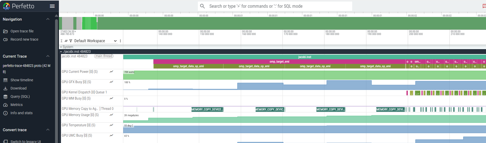

.. meta::
    :description: ROCm Systems Profiler OpenMP performance profiling
    :keywords: rocprof-sys, rocprofiler-systems, ROCm, tips, how to, profiler, tracking, OpenMP, OMPT, AMD

********************************************
OpenMP performance profiling
********************************************

`ROCm Systems Profiler <https://github.com/ROCm/rocm-systems/tree/develop/projects/rocprofiler-systems>`_ supports OpenMP profiling on ROCm 6.4.0 or higher.
OpenMP performance data is captured by intercepting callbacks generated by the OpenMP Tools Interface (OMPT).

Only a subset of the OMPT callbacks are processed:

.. code-block:: shell

  |----------------------------------+---------------------------|
  |          OMPT Callback           |        Track Name         |
  |----------------------------------+---------------------------|
  | ompt_callback_cancel             | omp_cancel                |
  | ompt_callback_dependences        | omp_dependences           |
  | ompt_callback_device_finalize    | omp_device_finalize       |
  | ompt_callback_device_initialize  | omp_device_initialize     |
  | ompt_callback_device_load        | omp_device_load           |
  | ompt_callback_dispatch           | omp_dispatch              |
  | ompt_callback_error              | omp_error                 |
  | ompt_callback_flush              | omp_flush                 |
  | ompt_callback_implicit_task      | omp_implicit_task         |
  | ompt_callback_lock_destroy       | omp_lock_destroy          |
  | ompt_callback_lock_init          | omp_lock_init             |
  | ompt_callback_masked             | omp_masked                |
  | ompt_callback_mutex_acquire      | omp_mutex_acquire         |
  | ompt_callback_mutex_acquired     | omp_mutex_acquired        |
  | ompt_callback_mutex_released     | omp_mutex_released        |
  | ompt_callback_nest_lock          | omp_nest_lock             |
  | ompt_callback_parallel_begin     | omp_parallel              |
  | ompt_callback_parallel_end       | omp_parallel              |
  | ompt_callback_reduction          | omp_reduction             |
  | ompt_callback_sync_region        | omp_sync_region           |
  | ompt_callback_sync_region_wait   | omp_sync_region_wait      |
  | ompt_callback_target_data_op_emi | omp_target_data_op_emi    |
  | ompt_callback_target_emi         | omp_target_emi            |
  | ompt_callback_target_submit_emi  | omp_target_submit_emi     |
  | ompt_callback_task_create        | omp_task_create           |
  | ompt_callback_task_dependence    | omp_task_dependence       |
  | ompt_callback_task_schedule      | omp_task_schedule         |
  | ompt_callback_work               | omp_work                  |
  |----------------------------------+---------------------------|

.. note::
   The ``omp_parallel`` track begins with ``ompt_callback_parallel_begin`` and ends when the corresponding ``ompt_callback_parallel_end`` is encountered.

Configuration
=============

To enable capturing of OMPT callbacks, the following parameter settings are required:

.. code-block:: shell

  ROCPROFSYS_USE_ROCM=ON
  ROCPROFSYS_USE_OMPT=ON

.. note::
   OMPT callbacks will not be traced if the system does not have a GPU.

These settings can be set as environment variables using ``export`` or can be saved in a configuration file. Here is an example of a complete configuration file, ``rocprofsys.cfg``:

.. code-block:: shell

  ROCPROFSYS_VERBOSE=1
  ROCPROFSYS_DL_VERBOSE=1
  ROCPROFSYS_USE_ROCM=1
  ROCPROFSYS_USE_OMPT=1
  ROCPROFSYS_OUTPUT_PREFIX=foo/
  ROCPROFSYS_FILE_OUTPUT=ON
  ROCPROFSYS_TIME_OUTPUT=OFF

To specify the configuration file, use the `ROCPROFSYS_CONFIG_FILE` setting:

.. code-block:: shell

  ROCPROFSYS_CONFIG_FILE=/path/to/rocprofsys.cfg

This setting defines the location of the ROCm Systems Profiler configuration file.

If you are tracing an OpenMP program that offloads to the GPU, ensure that the required OpenMP target library is in your path. For example, with ``amdflang``,
``libomptarget.so`` is required. With ROCm installed, it can be found in ``/opt/rocm/lib/llvm/lib``.

Instrumenting and running a program
===================================

Consider the `Fortran HPC Jacobi example program <https://github.com/amd/HPCTrainingExamples/tree/main/Pragma_Examples/OpenMP/Fortran/8_jacobi/2_jacobi_targetdata>`_.
To generate a trace of this program, first compile:

.. code-block:: shell

  make FC=amdflang

.. note::
   This program offloads to the GPU. Ensure that the OpenMP target library is present in your library path.

To generate the instrumented binary, we use `rocprof-sys-instrument`. An example command is:

.. code-block:: shell

  rocprof-sys-instrument -o jacobi.inst \
    --log-file mylog.log --verbose --debug -v 2 \
    --print-instrumented pair+ --all-functions \
    -- ./jacobi

This command generates an instrumented binary ``jacobi.inst``. Then, run it with the following command:

.. code-block:: shell

  rocprof-sys-run -- ./jacobi.inst

.. note::
   If ``ROCPROFSYS_USE_OMPT=ON`` is not specified, you can append ``-I "ompt"`` to ``rocprof-sys-run`` to capture OMPT callbacks.

To view the generated ``.proto`` file in the browser, open the `Perfetto UI page <https://ui.perfetto.dev/>`_. Then, click on ``Open trace file`` and select the ``.proto`` file.

The output should resemble:

