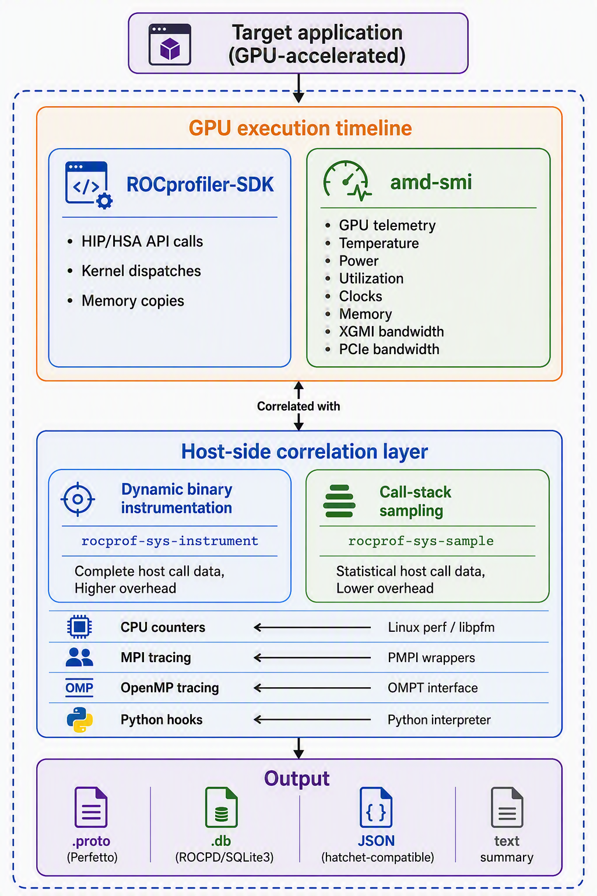

.. meta::
   :description: A high-level overview of ROCm Systems Profiler architecture, instrumentation modes, and command-line tools
   :keywords: ROCm Systems Profiler overview, rocprofiler-systems, rocprof-sys, instrumentation, sampling, presets, rocpd, perfetto, MPI, OpenMP, GPU metrics

.. _rocprofiler-systems-at-a-glance:

******************************************************
ROCm Systems Profiler at a glance
******************************************************

ROCm Systems Profiler (``rocprofiler-systems``) is a system-level profiler for GPU-accelerated applications. HIP/HSA API calls, kernel dispatches, memory copies, and GPU telemetry (temperature, power, utilization, and interconnect bandwidth) are the headline, captured in a single, unified timeline. Host call stacks, MPI/RCCL collectives, OpenMP regions, and Python frames exist to correlate with that GPU timeline - explaining why the device is busy, stalled, or waiting - rather than as a standalone CPU-profiling story.

This correlation matters because end-to-end GPU performance often depends on what's happening off the device. In a distributed training job, for example, the GPU can appear idle not because its kernels are slow, but because a data loader is starved, an MPI collective is blocking, or Python's GIL is stalling the dispatch queue. Diagnosing these cases means correlating host-side activity with the GPU timeline, not profiling the GPU in isolation.

This topic orients you to how ROCm Systems Profiler is put together and how to invoke it. For the full, categorized feature catalog and use cases, see :doc:`../conceptual/rocprof-sys-feature-set`; for a narrative introduction to output formats, see :doc:`../what-is-rocprof-sys`

.. _glance-capabilities:

Capabilities
==============

The feature set is spread across several how-to and conceptual pages; this table is a quick index into them.

.. rubric:: Tracing

.. list-table::
   :header-rows: 1
   :widths: 25 45 30

   * - Feature
     - Description
     - See also
   * - ROCm domain tracing
     - Traces ROCm API and runtime domains via ROCprofiler-SDK, including HIP, HSA, ROCTx, RCCL, kernel dispatches, memory events, rocDecode, and rocJPEG.
     - :ref:`rocprof-sys-feature-gpu-metrics`
   * - MPI and communication tracing
     - Records collective and point-to-point operation timing with per-rank attribution across MPI (via standard PMPI wrappers), RCCL, UCX, and OpenSHMEM/rocSHMEM.
     - :doc:`../how-to/communication-runtime-profiling`
   * - OpenMP tracing
     - Captures thread team creation, parallel regions, task execution, and synchronization via the OMPT callback interface.
     - :doc:`../how-to/openmp-profiling`

.. rubric:: Metrics

.. list-table::
   :header-rows: 1
   :widths: 25 45 30

   * - Feature
     - Description
     - See also
   * - GPU metrics
     - Samples GPU temperature, power, utilization, clocks, memory, and XGMI/PCIe bandwidth via ``amd-smi``; also collects GPU hardware counters via ``--gpu-events``.
     - :ref:`rocprof-sys-feature-gpu-metrics`, :doc:`../how-to/xgmi-pcie-sdma-sampling`, :doc:`../how-to/vcn-jpeg-sampling`
   * - CPU hardware counters
     - Reads IPC, cache misses, branch mispredictions, and other CPU PMU events via the Linux ``perf`` subsystem.
     - :ref:`rocprof-sys-feature-cpu-metrics`

.. rubric:: Collection mechanism (host-side correlation)

.. list-table::
   :header-rows: 1
   :widths: 25 45 30

   * - Feature
     - Description
     - See also
   * - Dynamic binary instrumentation
     - Rewrites the application binary to insert timing probes at every function entry and exit. No source changes needed; provides complete, deterministic host call-stack data to correlate with the GPU timeline.
     - :ref:`glance-modes-compared`
   * - Call-stack sampling
     - Interrupts the application at a configurable frequency to capture the host call stack, producing low-overhead statistical data to correlate with the GPU timeline.
     - :ref:`glance-modes-compared`
   * - Python hooks
     - Instruments Python interpreter call frames for mixed Python/C++/HIP workload analysis.
     - :doc:`../how-to/profiling-python-scripts`
   * - Process attachment
     - Attaches to an already-running process without restarting it, similar to the ``rocprofv3`` attach feature.
     - :doc:`../how-to/attaching-to-running-process`

.. rubric:: Analysis

.. list-table::
   :header-rows: 1
   :widths: 25 45 30

   * - Feature
     - Description
     - See also
   * - Causal profiling
     - Estimates the end-to-end speedup from optimizing a given function or line by selectively slowing other code regions.
     - :doc:`../how-to/performing-causal-profiling`

.. _glance-architecture:

How it works
=============

ROCm Systems Profiler couples GPU kernel dispatches, memory copies, and device telemetry with the host-side activity around them. GPU data is captured via ROCprofiler-SDK callbacks and ``amd-smi`` polling; host call stacks, MPI, OpenMP, and Python frames are captured via binary instrumentation, statistical sampling, callback APIs, or symbol interception. Everything is merged into a single trace/profile output, correlated on the GPU timeline.

For the full explanation of each collection mode, including overhead trade-offs and a worked instrumentation-vs-sampling example, see :doc:`../conceptual/data-collection-modes`.

.. _glance-modes-compared:

Binary instrumentation vs. call-stack sampling
================================================

Binary instrumentation and call-stack sampling can be used independently or together, trading overhead against completeness:

.. list-table::
   :header-rows: 1

   * - Mode
     - Overhead
     - Completeness
     - Best for
   * - Binary instrumentation
     - High
     - Complete (every call recorded)
     - Function-level profiling when overhead is acceptable
   * - Call-stack sampling
     - Low
     - Statistical (sampled)
     - Production profiling, long-running jobs, MPI workloads
   * - Combined (both enabled)
     - Medium
     - Best of both
     - When deterministic detail and low-overhead statistical coverage are both needed

.. _glance-cli-tools:

Command-line tools
====================

ROCm Systems Profiler ships as a set of standalone executables, each oriented toward a different profiling workflow:

.. list-table::
   :header-rows: 1
   :widths: 15 35 25 25

   * - Tool
     - Purpose
     - Example
     - See also
   * - ``rocprof-sys-avail``
     - Lists configuration settings, hardware counters, and data-collection components
     - ``rocprof-sys-avail``
     - :doc:`../how-to/general-tips-using-rocprof-sys`
   * - ``rocprof-sys-instrument``
     - Performs dynamic binary instrumentation, including binary rewriting
     - ``rocprof-sys-instrument -o ./app.inst -- ./app``
     - :doc:`../how-to/instrumenting-rewriting-binary-application`
   * - ``rocprof-sys-run``
     - Launches a binary-rewritten executable, or profiles an application directly using preset/domain flags
     - ``rocprof-sys-run -- ./app.inst``
     - :doc:`../how-to/instrumenting-rewriting-binary-application`, :ref:`using-preset-profiles-quick-start`
   * - ``rocprof-sys-sample``
     - Performs call-stack sampling without instrumentation
     - ``rocprof-sys-sample -f 1000 -- ./app``
     - :doc:`../how-to/sampling-call-stack`
   * - ``rocprof-sys-attach``
     - Attaches to an already-running process
     - ``rocprof-sys-attach -p $(pidof my_app)``
     - :doc:`../how-to/attaching-to-running-process`
   * - ``rocprof-sys-causal``
     - Performs causal profiling to estimate optimization impact
     - ``rocprof-sys-causal -l foo -- ./app``
     - :doc:`../how-to/performing-causal-profiling`

.. _glance-presets:

Preset profiles
=================

Presets replace manually setting numerous environment variables with a single ``--preset`` flag available on ``rocprof-sys-run`` and ``rocprof-sys-sample``. Presets were introduced in ROCm 7.12 and expanded into an extensible JSON-based system in ROCm 7.13.

Discover, inspect, and apply a preset as follows:

#. List available presets:

   .. code-block:: shell

      rocprof-sys-run --list-presets

#. See what a preset configures:

   .. code-block:: shell

      rocprof-sys-run --explain=balanced

#. Run with the preset (``balanced`` is a good starting point):

   .. code-block:: shell

      rocprof-sys-run --preset=balanced -- ./my_app

#. Optionally, combine the preset with domain flags for finer control:

   .. code-block:: shell

      rocprof-sys-run --preset=balanced --gpu=temp,power -- ./my_app

Each built-in preset enables a different combination of tracing, profiling, sampling, and domains, tuned for a specific workload scenario:

.. list-table::
   :header-rows: 1
   :widths: 18 22 40 20

   * - Category
     - Presets
     - Best for
     - See also
   * - General
     - ``balanced``, ``profile-only``, ``detailed``
     - Most profiling scenarios; minimal-overhead production profiling; in-depth full-system analysis
     - :ref:`using-preset-profiles-general`
   * - GPU and workload
     - ``trace-gpu``, ``workload-trace``, ``trace-hw-counters``
     - GPU device activity; AI/ML, HPC, and GPU-accelerated training; hardware counter collection
     - :ref:`using-preset-profiles-gpu-workload`
   * - HPC
     - ``trace-hpc``, ``trace-openmp``, ``profile-mpi``
     - MPI/OpenMP/Kokkos applications; OpenMP target offload; MPI communication latency analysis
     - :ref:`using-preset-profiles-hpc`
   * - API tracing
     - ``sys-trace``, ``runtime-trace``
     - Full system API visibility; runtime-only API tracing
     - :ref:`using-preset-profiles-api-tracing`

For the exact configuration behind a preset, run ``rocprof-sys-run --explain=<name>``. For domain flags, configuration export, and custom presets, see :doc:`../how-to/using-preset-profiles`.

.. _glance-output-formats:

Output formats
================

ROCm Systems Profiler supports several output formats, each suited to a different analysis or visualization workflow:

.. list-table::
   :header-rows: 1

   * - Format
     - File extension
     - Description
     - Viewer
   * - Perfetto (proto)
     - ``.proto``
     - Detailed trace stored as a protocol buffer for interactive timeline visualization
     - `ui.perfetto.dev <https://ui.perfetto.dev>`_
   * - ROCm Profiling Data (rocpd)
     - ``.db``
     - Detailed trace and counter data stored as a SQLite3 database; queryable with SQL or convertible to other formats via ``rocpd convert``
     - `ROCm Optiq <https://rocm.docs.amd.com/projects/roc-optiq/en/latest/>`_, SQLite browser, custom scripts
   * - Text
     - ``.txt``
     - Aggregated results (mean, min, max, stddev per function) as human-readable text
     - Text editor
   * - JSON
     - ``.json``
     - Aggregated high-level results for programmatic analysis; hatchet-compatible
     - Any JSON viewer, `hatchet <https://github.com/hatchet/hatchet>`_, custom scripts

Output-format selection differs by tool:

* When no ``--output-format`` is specified, ``rocprof-sys-run`` and ``rocprof-sys-sample`` produce a Perfetto trace by default:

  .. code-block:: shell

     rocprof-sys-run -- ./my_app

* ``--output-format`` (introduced in ROCm 7.14) selects one or more formats explicitly:

  .. code-block:: shell

     rocprof-sys-run --output-format proto rocpd json text -- ./my_app

* ``rocprof-sys-attach`` uses its own ``-F`` flag with different token names for the same formats (``perfetto`` instead of ``proto``):

  .. code-block:: shell

     rocprof-sys-attach -p 12345 -F perfetto,rocpd

For the legacy flags and the environment variables each ``--output-format`` token maps to, see :ref:`data-collection-modes-output-formats`. For output path conventions, metadata, and per-format details, see :doc:`../how-to/understanding-rocprof-sys-output`.
