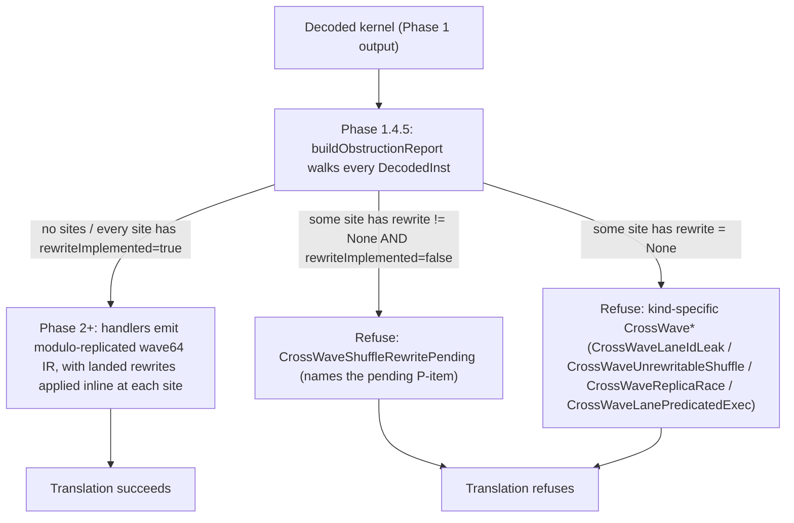

# Wave-Size Translation — EXEC Divergence and Cross-Wave Lowering

> **Status:** implemented end-to-end for the wave32 → wave64 path
> (gfx1250 → gfx942 / gfx950). Intra-block EXEC divergence is modelled
> via SIMT Predicated Execution (SPE). The wave-size gap is bridged via
> modulo-replication, guarded by a syntactic wave-size-obliviousness
> classifier (Phase 1.4.5) that decomposes the "does this kernel
> survive wave widening?" question into four obstruction classes (C1–C4)
> and a 3-outcome decision procedure (emit / rewrite / refuse). Every
> cross-lane primitive the GPT-OSS corpus exercises now has a landed
> rewrite path; kernels the analysis cannot discharge refuse loudly at
> raise time.
>
> **Scope:** gfx1250 (RDNA4, wave32) → gfx942 / gfx950 (CDNA3 / CDNA4,
> wave64). The axis also covers the identity / same-family case
> (gfx1250 → gfx1250 / gfx1251), which bypasses the projection
> machinery entirely via target-capability dispatch. The framework
> generalises to any future `(source, target)` ISA pair whose wave sizes
> differ.

---

## 1. Problem in one paragraph

The source binary and the target ISA do not agree on what a wavefront
is. gfx1250 executes 32 lanes in lockstep; gfx942 and gfx950 execute
64. The binary bakes that 32-lane assumption into three observable
places: the width of the hardware `EXEC` mask, the semantics of every
cross-lane primitive (whose fan-out is defined in hardware-wavefront
terms), and the bit patterns compiled-in for lane-id and workgroup-rank
math. On top of that, the source binary uses **intra-basic-block EXEC
manipulation** (`v_cmpx`, `s_and_saveexec`, direct SGPR-arithmetic on
EXEC) to gate lane-observable side effects — stores, atomics,
cross-lane reads — which the pre-SPE raiser modelled as a single-scalar
alloca and silently dropped. Translation must simultaneously (a)
re-emit every such EXEC-gated side effect as a real divergent LLVM-IR
construct the AMDGPU backend understands, and (b) project the source
32-lane semantics onto 64 physical target lanes without producing a
kernel whose observable behaviour differs from a real gfx1250
execution. Refusing wave32 kernels is not an option — the GPT-OSS North
Star is wave32-only — and a fallback that silently miscompiles is
explicitly out of bounds (`user_rules`: no fallback solutions, no
hidden errors). Section 2 derives why the solution space collapses to
SPE-plus-modulo-replication; §§3–6 specify the lowering; §7 specifies
the decision procedure; §§8–10 specify the gates, engineering status,
and known gaps.

## 2. Why the design space collapses to one option

Two questions have to be answered independently: **how do we represent
EXEC-gated side effects inside a SIMT LLVM-IR program**, and **how do
we project 32-lane source semantics onto a 64-lane target wave**.

### 2.1 EXEC-gated side effects: SPE is the only SIMT-compatible answer

The translator's output is LLVM IR that the stock AMDGPU backend
compiles as a SIMT program. That constraint is not negotiable —
giving it up means forking LLVM. Inside SIMT LLVM IR one "thread"
corresponds to one wave lane; per-lane state is thread-local SSA /
allocas; wave-level state is uniform; and there is no "dormant" state
in straight-line IR (any thread that reaches an instruction executes
it). EXEC masking of side effects is therefore only expressible via
divergent control flow or explicit masks carried into masked
intrinsics.

The archetypes explored in issue #11 collapse under this constraint:
detect-and-abort is a safety net rather than a solution;
`<waveSize × T>` vector-of-lanes IR is misinterpreted by the AMDGPU
backend as one value per lane of the abstract thread, so each lane
ends up doing `waveSize×` the work; per-lane masks threaded through
scalar allocas can only express "uniform-or-nothing"; opaque
target-handoff intrinsics require a combinatorial per-source/target
lowering; and structural re-lifting fails the "any kernel" bar by
construction. Everything that is general **and** fits SIMT LLVM IR
ends up at the same place:

> Every instruction whose commit is gated by EXEC must be wrapped in an
> LLVM-IR construct that is divergent on the lane's EXEC bit.

That is SPE. The two concrete encodings (a `br i1` diamond or a
masked intrinsic carrying the same `i1`) are semantically identical;
the rest of the pipeline is unchanged.

### 2.2 Wave-size projection: modulo-replication with a sound classifier

A wave32 binary run on wave64 hardware must answer "what do the other
32 lanes do?" Prior art (LLVM upstream's `SIConvertWaveSize` whitelist,
POCL's SIMD-to-scalar lowering, Ocelot's PTX-to-x86 thread-loop
transform, and the hetGPU / DynamoRIO family of wave-width GPU binary
translators) converges on a small ladder of projections; we enumerate
them and keep one as the default:

| Projection | Throughput | Correctness domain |
|---|---|---|
| **Modulo-replication** (default) | 100% | Wave-size-oblivious kernels (defined below). |
| Half-wave masking (legacy transpiler) | ~50% | Only kernels with `blockDim.x ≤ 32`. Empirically zero real kernels in the GPT-OSS / AITER corpora. Not available as a fallback. |
| Full-wave packing (two source waves per target wave) | 100% | None — breaks every wave-level operation. |
| Thread-loop transformation | ~50% | Lane-position-dependent EXEC kernels; Class 2 obstructions persist. |
| Scalarisation | 1 / W_s | Last-resort; near-total correctness at ~32× slowdown. |

The default is modulo-replication: treat the 64-lane target wave as
two independent wave32 replicas sharing the source EXEC mask, with the
lane's source EXEC bit selected at `lane_id MOD W_s`. Modulo-replication
is **correct iff the source binary is wave-size-oblivious**, which §6
defines precisely. The classifier in §7 discharges that obligation
statically, per kernel, with a three-outcome decision procedure
(emit / rewrite / refuse). Thread-loop and scalarisation are deferred
coverage extensions: a `ThreadLoopProjection` skeleton lives in
`transpiler/wave_projection.hpp` so one deferred rung is visible in
code, but every override aborts until a corpus kernel reaches outcome
(c) under modulo-replication and demands it. Scalarisation is
documented in this section only and has no class skeleton yet —
adding one is the MAINTENANCE protocol in the header when first
needed.

The principled reason half-wave masking cannot be a fallback, even
though the pre-Salmon transpiler depends on it: half-wave masking
silently drops the upper half of every workgroup launched with
`blockDim.x > 32`, which is every real kernel in both corpora we
survey. Keeping it available would give us a second wrong answer to
return when modulo-replication refuses. The analogous rule-out for the
remaining projections is stated inline in the table above — each one
either miscompiles a named construct (full-wave packing breaks every
wave-level op; thread-loop leaves Class 2 obstructions untouched) or
slows the program by a factor of the wave width (scalarisation).

## 3. Source model — gfx1250 wave32

Three load-bearing behaviours the source binary inherits from wave32:

1. **Hardware EXEC is 32 bits.** Written via `S_MOV_B32 EXEC_LO`,
   `S_AND_B32 EXEC_LO`, `V_CMPX`, `S_{AND,OR,XOR,ANDN2,ORN2}_SAVEEXEC_B32`,
   and indirectly via scalar arithmetic on `EXEC_LO`. The high half of
   the wave64 physical EXEC register does not exist in the source.
2. **Cross-lane primitives are defined relative to 32 lanes.**
   `V_PERMLANE16_B32` fans out across lanes 0..15 and 16..31;
   `V_PERMLANE16_SWAP_B32` exchanges those two halves;
   `DS_BPERMUTE_B32` takes a byte-address selector in `[0, 128)` whose
   valid range is wave32-bounded; `DS_SWIZZLE_B32` uses wave32-typed
   patterns. `V_PERMLANE64_B32` does not exist (no wave32 analogue to
   a 64-lane rotate).
3. **Lane-id and workgroup-rank math assumes wave32.**
   `V_MBCNT_LO_U32_B32` alone reconstructs the full lane id;
   `V_MBCNT_HI_U32_B32` is absent or constant-zero. A wave32-compiled
   kernel that builds an absolute lane id via `mbcnt_lo(...)` produces
   values in `[0, 32)`.

These are the semantic anchors every obstruction class in §6 violates
under a naive widening.

## 4. Target model — gfx942 / gfx950 wave64

Three symmetric behaviours the target hardware imposes:

1. **Hardware EXEC is 64 bits.** The backend materialises the mask
   through `EXEC_LO` / `EXEC_HI`; partial 32-bit writes to either half
   are first-class but must be honoured as such (fixed in
   commit `915c5a6c45`). `V_CMPX`, `S_AND_SAVEEXEC_B64`, and the full
   `*_SAVEEXEC_B64` family write the full 64-bit register.
2. **Cross-lane primitives span 64 lanes, but not all wave32 primitives
   have native analogues on gfx942.** `llvm.amdgcn.permlane16` and
   `llvm.amdgcn.permlanex16` fail ISel on CDNA targets; the same is
   true of `llvm.amdgcn.permlane16.swap`. `ds_bpermute`, DPP modifiers,
   and `ds_swizzle` are available on gfx8+ and can be used as
   target-independent rewrite building blocks. These absences constrain
   the rewrite table in §7.
3. **`V_MBCNT_HI_U32_B32` is a real instruction.** A direct
   modulo-replication raise of a wave32 kernel that builds its lane id
   via `mbcnt_lo(...) + mbcnt_hi(...)` observes values in `[0, 64)`
   rather than the source-intended `[0, 32)` — a Class 1 obstruction
   (§6).

## 5. Translation design

### 5.0 Target-capability dispatch (same-wave fast path)

Wave-size translation follows the cross-cutting target-capability
dispatch principle shared across all per-axis docs
(`target-capability-dispatch.md`). Every handler branches on whether
the source and target wave widths match; the match case is the fast
path.

| Condition | Action |
|---|---|
| `isa.waveSize == targetIsa.waveSize` (same-family, e.g. gfx1250 → gfx1250 / gfx1251) | SPE diamond emits the same `lshr`/`and`/`icmp` chain as the cross-wave path, but the `and lane_idx, (execBits - 1)` MOD fold collapses to the identity (since `lane_id < execBits` already) and LLVM opts erase it along with the diamond in uniform regions; cross-lane primitives emit their native intrinsics directly; the Phase 1.4.5 classifier short-circuits (`buildObstructionReport` returns an empty report when source and target wave sizes match). |
| `isa.waveSize != targetIsa.waveSize` (cross-family, e.g. gfx1250 → gfx942 / gfx950) | Phase 1.4.5 classifier runs; kernels in outcome (a) raise under modulo-replication (§5.2); outcome (b) kernels apply rewrites from the §7 table and re-analyse; outcome (c) kernels refuse. |

Source-wave width is read from the kernel's disassembled ISA; target
width is derived from `ISAProfile` via
`MCSubtargetInfo::hasFeature(FeatureWavefrontSize32)`, so both sides
track LLVM's TableGen directly.

### 5.1 SPE diamond: per-lane EXEC-gated side effects

Every decoded instruction whose hardware semantics is "commit only on
lanes where the EXEC bit is 1" is wrapped in:

```text
%exec             = load <execTy>, ptr %exec_alloca
%lane_lo          = call i32 @llvm.amdgcn.mbcnt.lo(i32 -1, i32 0)
%lane_id          = call i32 @llvm.amdgcn.mbcnt.hi(i32 -1, i32 %lane_lo)   ; wave64 only
%spe_lane_idx     = zext i32 %lane_id to <execTy>
%spe_lane_mod     = and  <execTy> %spe_lane_idx, (execBits - 1)
%spe_exec_at_lane = lshr <execTy> %exec, %spe_lane_mod
%spe_exec_bit     = and  <execTy> %spe_exec_at_lane, 1
%spe_lane_active  = icmp ne <execTy> %spe_exec_bit, 0
br i1 %spe_lane_active, label %spe_do, label %spe_skip
spe_do:
  <the side-effectful IR: store / atomic / divergent VGPR write>
  br label %spe_skip
spe_skip:
  ...
```

The shift-then-mask shape (rather than the equivalent
`shl 1, lane; and exec, bitmask`) is load-bearing for the cross-wave
path: the `and %lane_idx, (execBits - 1)` MOD fold clamps the shift
amount into `[0, execBits)` at source width, sidestepping LLVM's
`lshr iN, M` poison rule for `M ≥ N` when a target-hardware lane id
exceeds the source wave width. In the same-wave case the mask folds
to the identity (because `lane_id < execBits` already) and standard
LLVM opts erase the `and`.

`%spe_lane_active` is data-dependent on `workitem.id.x`, so LLVM's
divergence analysis flags the branch as divergent and the AMDGPU
backend emits `v_cmpx` to narrow hardware EXEC around the `spe_do`
block — exactly what the source binary was expressing manually.
Uniform regions (where EXEC is provably `-1`) collapse:
`%spe_lane_active` folds to `true`, the branch is removed, and the
emitted IR matches the pre-SPE baseline.

Emitters:

- `ModuloReplicationProjection::emitLaneActiveBit` in
  `wave_projection.cpp` emits the `lshr`/`and`/`icmp` chain above
  against the result of `regs.loadExec(B)`.
- `RaiseContext::emitLaneActiveBit` wraps the projection call with
  per-BB caching so multiple diamonds in the same source instruction
  reuse a single `i1`; `resetLaneActiveCache` is fired at every
  source-instruction boundary and on every `storeExec`.
- `RaiseContext::emitUnderExec(body)` splits the current BB into
  `spe_do` / `spe_skip`, runs `body` inside `spe_do`, and re-anchors
  the builder at `spe_skip`. Structurally linear expansions so the
  cached `i1` dominates every downstream diamond.

Write-routing contract (encoded in `RaiseContext::writeReg{32,64,Vec}`
and `storeVGPR{32,64}` / `storeAGPR32`):

- **Wrapped** in `emitUnderExec`: every write whose destination is a
  `ParsedReg::VGPR` or `ParsedReg::AGPR`, plus every side-effectful
  memory op routed through the context helpers. This is what gives
  LLVM the divergence signal — the SIMT alloca is per-thread, but
  without the conditional store mem2reg has nothing to phi across, so
  inactive lanes would observe the active-lane value.
- **Not wrapped**: SGPR / VCC / SCC / M0 / TTMP writes (wave-level
  scalar state, no per-lane commit), and EXEC writes (routed through
  `regs.storeExec`, which fires `onExecWritten` to invalidate the
  `lane_active` cache). `writeRegExecWidth` — used for wave-level
  commits whose value is itself computed cross-lane (VCC ballots,
  saveexec results) — also bypasses the diamond by construction.
- **Cross-lane primitives** (`ds_bpermute`, `readfirstlane`,
  `readlane`, `writelane`, `amdgcn.update.dpp`, `ds_swizzle`) emit
  their convergent call **outside** `emitUnderExec` so every hardware
  lane participates in the collective; the resulting VGPR store is
  then wrapped by the normal `writeReg32` routing.

The concrete handler coverage that flows from this contract:
`handle_flat`, `handle_mubuf`, and `handle_ds` wrap stores and
atomics; `handle_mfma` and `handle_valu` wrap VGPR/AGPR writes;
`handle_vopd` wraps through `storeVGPR32`; `handle_valu_vcmp` routes
`V_CMPX` through `regs.storeExec`; `handle_valu_cross_lane` emits the
convergent cross-lane intrinsics unwrapped and then hands the result
to a wrapping VGPR store.

Load-bearing implementation landmarks:

- `emitLaneActiveBit` / `emitUnderExec`: commit `2873d140b0`
  (`transpiler: model per-lane EXEC divergence via SIMT predicated execution (#11)`).
- `lane_active` caching + `onExecWritten` invalidation hook (same
  commit): the `i1` is cached per source instruction and invalidated
  centrally on any EXEC store, so handlers that write EXEC via
  low-level paths cannot forget to invalidate and silently misgate
  downstream diamonds.
- SSA-name contract (`spe_*`, `cmpx_exec`, `new_exec`, `and64`,
  `vcmp`, `vlshl`): deliberately assigned to give
  `lit_tests/allow_list_audit/`, `lit_tests/divergent_vgpr_ir/`, and
  friends FileCheck-level anchors. The audit protocol for renames is
  four steps executed in one patch: (1) update the emitter at the
  single assignment site; (2) update this contract list; (3) update
  every failing lit `CHECK` to the new name without loosening it to a
  regex; (4) run `ninja check-transpiler-lit` and confirm every
  anchor in the contract list above still binds.

### 5.2 Wave-size projection: modulo-replication

On the cross-wave path (`isa.waveSize != targetIsa.waveSize`), the
same `emitLaneActiveBit` computes the lane id on the target hardware
and selects the source-EXEC bit at position
`lane_id MOD source_wave_bits`. Concretely (wave32 → wave64), the
target wave is treated as two wave32 replicas running the same kernel
body, each seeing the same source EXEC mask applied to the same
relative lane positions.

Why modulo rather than masking the upper lanes off: the runtime
dispatches `blockDim.x` threads per workgroup and rewrites the kernel
descriptor to `.wavefront_size: 64`, so disabling the upper half would
drop half of the launched work, which hits 100% of our corpus. Every
pointwise-lifts-to-pointwise kernel (the overwhelming majority of the
AITER / MoE / vecadd corpus) is correct under modulo-replication
because its EXEC writers are lane-position-independent (bounds checks
like `lane < N` with a uniform `N ≥ target_wave_bits`). Shifting by
`lane_id MOD source_wave_bits` keeps the shift within the source width,
sidestepping LLVM's `lshr iN, M` poison rule for `M >= N`.

Implementation landmarks:

- Wave-size-aware `emitLaneActiveBit` with the MOD fold: commit
  `2873d140b0`.
- 32-bit EXEC partial-write handling on wave64 (`EXEC_LO` /
  `EXEC_HI`): commit `915c5a6c45`
  (`transpiler: fix wave64 EXEC_LO/EXEC_HI 32-bit partial-write crash`).
- Cross-wave surface consolidation + modulo-replication cementing:
  commits `0dfeb4652a`
  (`transpiler: consolidate the surface the new cross-wave strategy will touch`)
  and `055c83cb3d`
  (`transpiler: harden cross-wave wave32→wave64 lowerings + mark modulo-replication`).

### 5.3 Cross-lane primitive rewrites

Modulo-replication only preserves the source semantics of cross-lane
primitives when the primitive is itself lifted to an LLVM cross-lane
intrinsic. A same-lane C++-style "copy operand to dst" silently drops
the cross-lane remap — the exact latent miscompile the per-SemOp
table below is structured to prevent.

The committed status of every cross-lane primitive the GPT-OSS corpus
exercises, plus the principled refusal path for those that cannot be
rewritten:

| SemOp | Handling | Implementing commit |
|---|---|---|
| `V_READFIRSTLANE_B32` | `llvm.amdgcn.readfirstlane.i32`; SGPR destination bypasses `emitUnderExec`. | pre-SPE baseline |
| `V_READLANE_B32` / `V_WRITELANE_B32` | `llvm.amdgcn.readlane` / `writelane`. A never-written source VGPR reads as LLVM `undef` (the handler's intentional "unobservable" encoding — any downstream use on lanes that were never written is itself undefined on hardware). Static-const lane operands ≥ `W_s` are caught earlier by the Phase 1.4.5 classifier's `OutOfRangeLaneOperand` site (§6). | pre-SPE baseline |
| `V_MBCNT_LO_U32_B32` / `V_MBCNT_HI_U32_B32` | `llvm.amdgcn.mbcnt.{lo,hi}` | pre-SPE baseline |
| `DS_BPERMUTE_B32` (P1) | `llvm.amdgcn.ds.bpermute(byte_addr, val)`. Modulo-replication note: selector is assumed to stay in `[0, source_wave)`, giving naturally half-independent behaviour on wave64. | `d9bfd99626` (`transpiler: lower DS_BPERMUTE_B32 via amdgcn.ds.bpermute`) |
| `V_PERMLANE16_B32` / `V_PERMLANEX16_B32` (P2) | `ds_bpermute` emulation: decode the 4-bit per-lane selector nibbles from `src1` / `src2` and emit `ds_bpermute(group_base \| nibble, src0)` (with `^ 0x10` for permlanex16). Refuses `fi=0` or `bc=1` encodings (only `op_sel:[1,0]` supported). Target-independent because gfx942 lacks native ISel for the intrinsics. | `4ff69403f0` (landing), `01ca97e4aa` (hardening) |
| `V_PERMLANE16_SWAP_B32` (P4) | Paired `ds_bpermute` emulation with per-lane partner `lane_id XOR 16`; two bpermute calls per output VGPR. Bit-exactly verified against gfx942 hardware. | `0c3f526008` (landing), `5b721e8c91` (hardening), `bccdccfbb2` (regression test) |
| `V_PERMLANE32_SWAP_B32` | Unrewritable (XOR-32 partner spans wave64's two 32-lane halves; no wave32 analogue). Classifier refuses with `CrossWaveUnrewritableShuffle`. | n/a — principled refusal |
| `V_PERMLANE64_B32` | Unrewritable (no wave32 analogue; a wave32 source kernel cannot meaningfully encode a 64-lane rotate). Classifier refuses. | n/a — principled refusal |
| DPP modifiers (any base VOP) (P5) | Decode path lifts the modifier bits (`dppCtrl`, `dppRowMask`, `dppBankMask`, `dppBoundCtrl`) into `DecodedInst` **before** opcode canonicalisation. `RaiseContext::emitUpdateDpp` emits `llvm.amdgcn.update.dpp.{i32,i64}`; `OpResolver::src` / `srcF` / `src64` route src0 reads through the `wrapDppIfNeeded` hook when `di.hasDpp` is true (DPP is a src0-only hardware modifier; non-src0 reads pass through unwrapped). DPP8 detected and refused loudly pending P5.b. | `2dc9aa927e` (landing), `75cf67cc18` (hardening) |
| `DS_SWIZZLE_B32` (P6) | Imm extracted at decode into `DecodedInst::dsSwizzleImm`; classifier accepts QUAD_PERM, BITMASK_PERM, valid FFT_MODE, and valid ROTATE_MODE envelopes with strict reserved-bit validation per LLVM's `Swizzle::EncBits`. Reserved envelopes and FFT/ROTATE imms with reserved bits set refuse loudly. | `81e070c32b` (landing), `4d4b2deacd` (hardening), `0e770da0dd` (central imm extraction), `5cd9b6d210` (OpName lookup), `af5c8ba4a4` (envelope widening), `2c02750f66` (FFT/ROTATE validation tightening) |
| `DS_PERMUTE_B32` (P6.b) | Pending — no corpus demand. Would mirror P1 via `llvm.amdgcn.ds.permute`. | n/a — pending |

Cross-lane closure on the GPT-OSS corpus is complete as of P4
(`0c3f526008`): every previously-refusing kernel's cross-lane
obstruction is either rewritten or routed through a precise refusal.
After P1 / P2 / P4 / P5 / P6 land, the residual GPT-OSS failures are
downstream handler gaps (SMEM `s_load_b96`, VOP3 `v_xor3_b32`, etc.)
that are categorically **not** cross-lane concerns. The corpus-level
audit that predicted and then confirmed this closure lives in
`gpt-oss-derisking.md`; §9 below restates the numeric result.

VCC is bi-modal (per-lane `i1` for `v_cndmask`, wave-level `iN` mask
for SALU). Reads that reach a wave-level consumer are routed through
`readVCCAsWaveMask`, which emits `llvm.amdgcn.ballot.iN` at full EXEC
(an invariant of the caller); wave-level writes truncate to the lane's
bit via `extractLaneBitFromWaveMask` before storing into the `i1` VCC
alloca. Commit `b34d8e9bda`
(`transpiler: materialise V_CMP[X] EXEC/SGPR masks via amdgcn.ballot`).

### 5.4 EXEC-writer detection and the SPE allow-list gate

SPE's side-effect predication is only sound if every EXEC mutation the
source performs is routed through `regs.storeExec` — the single-entry
point that triggers `lane_active` cache invalidation and carries the
SSA-name contract. Rather than hand-roll a mnemonic list (which would
drift silently as LLVM adds new EXEC-writing opcodes), the detector
reads LLVM's own `MCInstrDesc`:

1. `DecodedInst::defsEXEC` is set by the decoder via an implicit-def
   walk over `MCInstrDesc::implicit_defs()`, catching every
   instruction whose `implicit_defs()` contains `EXEC` / `EXEC_LO` /
   `EXEC_HI`. This covers the `*_SAVEEXEC` family and `V_CMPX`.
2. An explicit operand walk over `MCInstrDesc::getNumDefs()` catches
   the remaining case where EXEC appears as an explicit defining
   operand (`S_MOV_B64 EXEC, sN`; `S_AND_B64 EXEC, EXEC, sN`).

Both data sources live in LLVM's target description; there is no
string matching and no way for the detector to drift out of sync with
LLVM's opcode tables.

The allow-list itself is encoded as a per-SemOp attribute —
`SemOpAttrs::routesExecThroughStoreExec` in `sem_op_attrs.{hpp,cpp}`,
declared `true` in each handler file's `get*Attrs()` registration
(`handle_sop1.cpp`, `handle_sop2.cpp`, `handle_valu_vcmp.cpp`) for
SemOps whose handler is verified to route every EXEC mutation through
`regs.storeExec` (either directly or via `writeReg*` which dispatches
to `storeExec` for `ParsedReg::EXEC`). The default is `false`, so
adding a new EXEC-writing SemOp without a deliberate attribute
declaration fails the allow-list by construction.

Two checks enforce the allow-list:

1. **Startup (implicit-def EXEC writers):** `verifyExecAttrCoverage`
   in `sem_op_attrs.cpp` walks every MC opcode whose
   `MCInstrDesc::implicit_defs()` contains EXEC (or EXEC_LO /
   EXEC_HI), looks up the mapped SemOp in the raiser's `OpcodeMap`,
   and fails loud at raiser init if any such SemOp is missing
   `routesExecThroughStoreExec = true`. This catches the
   `*_SAVEEXEC_B*` and `V_CMPX` families before any kernel is lifted.
2. **Per kernel (explicit-operand EXEC writers):** Phase 1.5 in
   `raiser.cpp` (the loop at `raiser.cpp:231`) walks every decoded
   instruction, calls `instructionWritesEXEC(di, mc)` (which checks
   both `di.defsEXEC` and the explicit-operand sweep from step 2
   above), and aborts the raise with
   `RaiseFailure::speUnsafeExecWriter` if
   `getSemOpAttrs(di.semOp).routesExecThroughStoreExec` is `false`.
   This catches the cases where EXEC is an explicit operand value
   (`s_mov_b32 exec_lo, s2`, `s_and_b64 exec, exec, s[4:5]`) that
   `MCInstrDesc` alone cannot predict.

The audit trail — the reasoning for each declared
`routesExecThroughStoreExec = true` — lives alongside each handler's
`get*Attrs()` registration in the handler source, next to the
implementation the attribute is claiming to audit.

### 5.5 HWREG policy

`s_getreg_b32` / `s_setreg_b32` / `s_setreg_imm32_b32` address a small
fixed space of hardware-configuration registers. A blanket no-op would
silently drop `FLAT_SCR` or `XNACK_MASK` writes; a blanket abort would
refuse every benign `s_setreg MODE` rounding-mode prologue. The policy
is therefore a direction-aware per-HWREG-ID classifier in
`handle_sopk.cpp::classifyHwreg(id)`:

| HWREG id(s) | Read | Write |
|---|---|---|
| `FLAT_SCR_LO/HI`, `MEM_BASES`, `XNACK_MASK` | `Abort` | `Abort` |
| `MODE` | `Zero` | `WarnDrop` |
| `TBA_LO/HI`, `TMA_LO/HI` (trap handler) | `Zero` | `Abort` |
| `STATUS`, `TRAPSTS`, `HW_ID` / `HW_ID1` / `HW_ID2`, `GPR_ALLOC`, `LDS_ALLOC`, `IB_STS` / `IB_STS2`, `POPS_PACKER`, `SCHED_MODE`, `PERF_SNAPSHOT_DATA_gfx11`, `SHADER_CYCLES` / `SHADER_CYCLES_HI`, `DVGPR_ALLOC_LO` / `DVGPR_ALLOC_HI` | `Zero` | `Drop` |
| *unknown id* | `Abort` | `Abort` |

`Read = Zero` materialises `i32 0`; `Read = Abort` refuses. `Write =
Drop` no-ops; `Write = WarnDrop` emits a `transpiler: WARNING:` on
stderr and drops; `Write = Abort` refuses. Unknown IDs fail closed —
adding a new one requires a deliberate row in `classifyHwreg`. The
rationale for `WarnDrop` on `MODE` (rather than `Abort`): symmetric
with the cross-wave warn/abort balance — `Abort` breaks existing tests
whose prologues `s_setreg_imm32_b32 MODE, 0x...` but whose FP is
insensitive to the written bits; `WarnDrop` preserves the green-tests
contract and flags every kernel whose correctness under the drop is
not proven.

### 5.6 EXEC / VCC / SCC / M0 initialisation

`AllocaRegFile::init` initialises the **condition-carrying** scalar
allocas to deterministic values so any raiser bug or unhandled
instruction yielding a read-before-write produces `false` / `0`
rather than `undef` / `poison`:

- `exec = -1` (all lanes active).
- `vcc = false` (i1 0).
- `scc = false` (i1 0).
- `m0 = 0`.

`flat_scr[lo/hi]` and `ttmp[i]` are allocated but intentionally left
uninitialised — the `HwregPolicy` entries in §5.5 classify their HWREG
companions as read-Abort / write-Abort, so a read-before-write on
either alloca is already trapped earlier by the HWREG gate; and `ttmp`
is touched only by SMEM kernarg loads that always write before they
read. If either property ever stops holding, the init list is the
right place to add the zero store.

`exec = -1` is load-bearing for SPE: it makes `emitLaneActiveBit` fold
to `true` in every straight-line uniform region, collapsing the
`emitUnderExec` diamond to straight-line IR.

## 6. Obstructions to wave-size-obliviousness

A wave32-sourced binary translated to wave64 under modulo-replication
is correct if and only if the source binary is **wave-size-oblivious**:
for every observable side effect at every reachable program point,
(1) the value flowing into the side effect is a function only of
`lane_id mod W_s` (and uniform inputs), (2) the EXEC bit gating that
side effect is a function only of `lane_id mod W_s`, and (3) the side
effect commutes with R-fold parallel execution of the gated body.

Equivalently: "execute the source program R times in parallel on R
disjoint lane groups, each group seeing `lane_id_local = lane_id mod
W_s`" produces the same observable state as "execute the source
program once on a single wave of width W_s." Modulo-replication is
exactly that R-fold parallel execution; the iff makes it falsifiable
per kernel.

The known violations partition into four classes. The catalog below is
exhaustive in the sense that every counterexample constructed by hand
falls into one of these classes; future counterexamples that do not
should be treated as bugs in the catalog, not in modulo-replication.

**Class 1 — absolute lane-ID leaks.** Source computes a value derived
from a lane's absolute position within the wave, beyond `lane_id mod
W_s`. Concrete instructions:

- `v_mbcnt_hi_u32_b32` reading `exec_hi`: non-zero in the upper 32
  lanes under modulo-replication, so `mbcnt_lo(...) + mbcnt_hi(...)`
  produces 32..63 in the upper half instead of the source-intended
  0..31.
- `v_readlane_b32` / `v_writelane_b32` with a lane operand whose range
  exceeds `[0, W_s)`.
- `llvm.amdgcn.wavefrontsize`, `llvm.amdgcn.ballot.i32 / .i64`: result
  width is wave-size-dependent at the type level.

**Class 2 — cross-lane operations with wave-size-dependent semantics.**
Some cross-lane primitives are defined relative to the hardware wave
size and have no replication-preserving lowering:

- `v_permlane64_b32` (full-wave rotate by 32; no wave32 analogue).
- DPP modifiers with `wave_ror`, `wave_shl/shr`, `row_bcast` shapes
  whose semantics span the full wave.
- `v_permlanex16_b32`, `v_permlane16_swap_b32`, `v_permlane32_swap_b32`
  — cross-lane fan-outs that do not commute with R-fold replication.

**Class 3 — inter-replica communication through shared state.**
Modulo-replication introduces R virtual replicas that share the
target's hardware resources (LDS, atomics). Each replica was, in the
source, the only participant for its addresses; under replication they
collide. Concrete failures:

- Atomic `cmpxchg` / `xchg` / non-commutative `atomicrmw` at an address
  derived from `lane_id mod W_s`: lane `i` and lane `i + W_s` race on
  the same address.
- LDS write-write race on `lds[lane_id mod W_s]`.
- Commutative atomics (`atomicAdd`, `atomicMax`) are **not** in this
  class — they double-count by exactly R, which is observable and
  wrong but structurally uniform and per-site recoverable (gate to a
  single replica).

**Class 4 — lane-position-dependent EXEC writes.** Source writes EXEC
with a value that depends on the lane's absolute position:

- `v_cmpx_lt_i32 v_lane_id, 32`: trivially true on every wave32 lane
  (no-op gate on a real wave32 device); under modulo-replication on
  wave64 it enables the lower 32 lanes and disables the upper 32 —
  the opposite of what the source meant.
- `s_and_saveexec_b32` with a mask produced from `mbcnt_hi`
  (Class 1 leaking into Class 4).
- Half-wave broadcasts: `if (lane_id < 16) { ... }` patterns the
  compiler lowered to an EXEC compare.

Classes 1 and 4 dominate real Triton / AITER output. Class 2 is the
set the rewrite table in §7 enumerates. Class 3 is rare in our current
corpus (Triton kernels mostly use commutative atomics) but is
unbounded in principle.

The code-level classifier in `wave_size_obstruction.{hpp,cpp}` names
each specific failure mode as an `ObstructionKind`; the §6 class
labels remain the authoritative grouping and appear parenthetically in
every per-site trace. The mapping:

| §6 Class | `ObstructionKind` | Trigger |
|---|---|---|
| Class 1 | `MbcntHiLaneIdLeak` | `v_mbcnt_hi_u32_b32` |
| Class 1 | `OutOfRangeLaneOperand` | `v_readlane` / `v_writelane` with static const operand outside `[0, W_s)` (i.e. `< 0` or `≥ W_s`) |
| Class 2 | `FullWaveRotate` | `v_permlane64_b32` |
| Class 2 | `LaneGroupShuffle` | `permlane16` / `permlanex16` / `permlane*_swap_b32` |
| Class 2 | `DsSwizzle` | `ds_swizzle_b32` |
| Class 2 | `DppCrossLane` | any `_dpp` modifier |
| Class 2 | `DsBpermuteGather` | `ds_bpermute_b32` (P1 handler landed) |
| Class 3 | `NonCommutativeAtomic` | `*atomic_cmpswap` / `*atomic_swap` / `*atomic_xchg` |
| Class 4 | `CmpxFromLaneId` | `v_cmpx` co-located with `v_mbcnt_*` |
| Class 4 | `SaveExecFromLaneId` | `s_*_saveexec_b32` co-located with `v_mbcnt_*` |

The classifier's refusal reason is one bucket coarser — the
`RaiseFailureReason::CrossWave*` bucket the failure-text classifier and
batch-test harness key on:

| `ObstructionKind`(s) | `RaiseFailureReason` |
|---|---|
| `MbcntHiLaneIdLeak`, `OutOfRangeLaneOperand` | `CrossWaveLaneIdLeak` |
| `FullWaveRotate` | `CrossWaveUnrewritableShuffle` |
| `LaneGroupShuffle`, `DsSwizzle`, `DppCrossLane` (when rewrite is pending) | `CrossWaveShuffleRewritePending` |
| `NonCommutativeAtomic` | `CrossWaveReplicaRace` |
| `CmpxFromLaneId`, `SaveExecFromLaneId` | `CrossWaveLanePredicatedExec` |

Lit fixtures pin one example per `ObstructionKind`, named after the §6
class label (`lit_tests/c1_lane_id_leak`, `c2_permlane_swap`,
`c2_dpp_quad_perm`, `c2_ds_swizzle`, `c3_atomic_cas`,
`c4_lane_dep_cmpx`) so the class link stays visible in `git ls-files`.

## 7. Decision procedure (per kernel)



The classifier does not run twice; there is no "re-analyse after
rewrite" step. `rewriteImplemented = true` is exactly the precondition
that lets the site pass through to Phase 2+ (instruction lowering),
where the responsible handler emits the rewrite inline at the site.
The classifier's output is a single report consumed by a single
`selectFailureFromReport` call in `raiser.cpp` Phase 1.4.5.

The rewrite table has two halves. §5.3 is the implementation view;
the decision view below separates what the classifier actually
discharges today from policy-level rewrites that are documented for
future work but are **not** in the code.

**Landed rewrites.** Every row here is what the classifier
(`buildObstructionReport` in `wave_size_obstruction.cpp`) tags with a
concrete `RewriteId` and `rewriteImplemented = true`, paired with a
handler in tree:

| Failing site (Class) | Rewrite | Classifier marker | Commit |
|---|---|---|---|
| `permlane16` / `permlanex16` (Class 2) | `ds_bpermute` emulation from decoded selector nibbles. | `LaneGroupShuffle` / `P2_PermLane16` | `4ff69403f0` |
| `permlane16_swap` (Class 2) | Paired `ds_bpermute` with lane partner `lane_id XOR 16`. | `LaneGroupShuffle` / `P4_PermLaneSwap` | `0c3f526008` |
| DPP16 modifiers (Class 2) | `llvm.amdgcn.update.dpp` lift with modifier bits preserved through decode. DPP8 refuses pending P5.b. | `DppCrossLane` / `P5_DppModifier` | `2dc9aa927e` |
| `ds_swizzle_b32` (Class 2) | `llvm.amdgcn.ds.swizzle`, imm validated against `Swizzle::EncBits` envelopes (QUAD_PERM, BITMASK_PERM, valid FFT_MODE, valid ROTATE_MODE). Reserved envelopes and reserved-bit imms refuse. | `DsSwizzle` / `P6_DsSwizzle` | `81e070c32b` |
| `ds_bpermute_b32` (Class 2) | `llvm.amdgcn.ds.bpermute`. | `DsBpermuteGather` / `P1_DsBpermute` | `d9bfd99626` |

**Unrewritable — principled refusal** (`rewrite = None` → hits
`firstUnrewritable`, produces a kind-specific `CrossWave*` diagnostic):

| Failing site (Class) | Outcome | Classifier marker | Refusal reason |
|---|---|---|---|
| `v_mbcnt_hi_u32_b32` read (Class 1) | Refuse. `mbcnt_hi` against a target-wave `EXEC_HI` produces 32..63 in the upper half, with no rewrite that preserves the source's intended `[0, W_s)` range without a dataflow analysis that does not exist yet. | `MbcntHiLaneIdLeak`, `rewrite = None` | `CrossWaveLaneIdLeak` |
| `v_readlane` / `v_writelane` with static const operand outside `[0, W_s)` (Class 1) | Refuse. | `OutOfRangeLaneOperand`, `rewrite = None` | `CrossWaveLaneIdLeak` |
| `v_permlane64_b32` (Class 2) | Refuse. No wave32 analogue — a wave32 source kernel cannot meaningfully encode a 64-lane rotate. | `FullWaveRotate`, `rewrite = None` | `CrossWaveUnrewritableShuffle` |
| Non-commutative atomics (Class 3): `GLOBAL_ATOMIC_{SWAP,CMPSWAP}`, `FLAT_ATOMIC_{SWAP,CMPSWAP}`, `BUFFER_ATOMIC_{SWAP,CMPSWAP}`, `S_ATOMIC_SWAP` | Refuse. Under modulo-replication, target lanes `i` and `i + W_s` race on the same address — no rewrite preserves the source's single-participant invariant. | `NonCommutativeAtomic`, `rewrite = None` | `CrossWaveReplicaRace` |
| `v_cmpx` / `s_*_saveexec_b32` co-located with any `v_mbcnt_*` in the same kernel (Class 4) | Refuse. Syntactic over-approximation of "gating expression flows from an absolute lane id"; see §10 for the dataflow-upgrade path that would tighten this. | `CmpxFromLaneId` / `SaveExecFromLaneId`, `rewrite = None` | `CrossWaveLanePredicatedExec` |
| Any other obstruction | Refuse (outcome c). | — | — |

**Pending rewrite — structurally recognised but not yet lowered**
(`rewrite != None && rewriteImplemented = false` → hits `firstPending`,
produces `CrossWaveShuffleRewritePending` naming the pending P-item):

| Failing site (Class) | Outcome | Classifier marker |
|---|---|---|
| `v_permlane32_swap_b32` (Class 2) | Refuse as pending. The kind-appropriate rewrite id is `P4_PermLaneSwap`, but its XOR-32 partner spans wave64's two 32-lane halves and no wave32 analogue exists, so the implementation is structurally impossible — the `pending` classification distinguishes this failure from the landed `V_PERMLANE16_SWAP_B32` case in the same `LaneGroupShuffle` row. | `LaneGroupShuffle`, `P4_PermLaneSwap`, `rewriteImplemented = false` |
| `ds_swizzle_b32` with imm outside QUAD_PERM / BITMASK_PERM / valid FFT_MODE / valid ROTATE_MODE envelopes (Class 2) | Refuse as pending. Reserved top-nibble or reserved-bit encodings are hardware-undefined and have no lift; a malformed-disassembly path (no imm operand) is also tagged pending. | `DsSwizzle`, `P6_DsSwizzle`, `rewriteImplemented = false` |
| DPP8 lane-permutation form (Class 2) | Refuse as pending. DPP16 is landed via `llvm.amdgcn.update.dpp`; DPP8 would require an `llvm.amdgcn.mov.dpp8` lift path. | `DppCrossLane`, `P5_DppModifier`, `rewriteImplemented = false` |

**Deferred rewrites (documented for future work, not yet in the code).**
These are sound-in-principle lowerings that no corpus kernel has
demanded yet, so they are not implemented in the classifier. Adding
any of them means (a) extending `ObstructionKind` / `RewriteId` to
name the rewrite, (b) landing the rewrite handler, and (c) flipping
the classifier site from `rewrite = None` to the new `RewriteId` with
`rewriteImplemented = true`:

| Failing site (Class) | Deferred rewrite |
|---|---|
| `mbcnt.hi` with a uniform `mbcnt.lo` predecessor that is provably masked back into `[0, W_s)` | Replace the `mbcnt.hi` feeding that chain with `mbcnt.lo`-only, with the mask made explicit. Requires a dataflow proof that today's syntactic classifier cannot discharge. |
| `ballot` whose bit-position uses are provably restricted to `[0, W_s)` | Reinterpret as the target-width type and let modulo-replication apply. Requires a dataflow proof of the bit-position constraint. |
| Commutative atomic with R-fold double-count (Class 3) | Per-replica gate (`if (lane_id < W_s) atomicOp(...)`) that disables the op on R−1 replicas. Trades correctness for `1/R` throughput; not on the table without a corpus kernel that would benefit. |
| `v_cmpx` whose operand chain is provably `lane_id < W_s` (Class 4) | Recognise as a wave32 no-op gate and rewrite to `(lane_id mod W_s) < W_s` (true on every replica). Requires the same dataflow upgrade as the `mbcnt.hi` case. |

Classifier implementation: commit `d6fcc58e34`
(`transpiler: add wave-size-obstruction classifier (Phase 1.4.5) and refuse-loud gate`).

**Soundness, not completeness.** The analysis can refuse a kernel that
is, by some external argument, actually safe (a `mbcnt.hi` whose
result is masked back into `[0, W_s)` by a downstream `and` the
analysis does not see). False positives are a soundness-preserving
mistake — they produce a loud abort instead of a wrong result. False
**negatives** — modulo-replicating a kernel that is actually
wave-size-dependent — are the silent miscompile this document is
structured to eliminate. The analysis is calibrated to never produce
them, even at the cost of occasional false positives. The precise
claim:

> Every kernel the tool agrees to emit code for is provably
> wave-size-oblivious; every kernel it refuses is one we cannot prove
> safe. There is no third category of "the tool ran and produced wrong
> code."

This is weaker than "every kernel is translatable" — provably
impossible, since lane-position-dependent EXEC writes are not
expressible in modulo-replicated wave64 — but it is the strongest
correctness guarantee the binary-translation setting admits.

**Empirical calibration.** Against the 15-kernel GPT-OSS
`scope_discovery` corpus as of commit `79eeaf9577` (review-pass
alignment + P5 / P6 hardware tests), the classifier produces zero
cross-wave refusals on kernels whose obstructions are covered by the
rewrite table, and the `permlane64` / `permlane32_swap` constructs that
would reach outcome (c) are provably absent from the corpus
(`gpt-oss-derisking.md §4`, §8). The claim is falsifiable without a
sweep log: re-running the raiser on `scope_discovery/kernels/` at or
after `79eeaf9577` must reproduce the same outcome partition.

## 8. Principled fail-loudly gates

### G1 — Wave-size obliviousness classifier (per kernel, cross-wave path only)

Phase 1.4.5 of `raiser.cpp`, implemented in
`wave_size_obstruction.{hpp,cpp}`. Runs after decode and before the
SPE allow-list gate. Walks every decoded instruction, emits per-site
`ObstructionKind` traces under `-debug-only=wave-projection`, and
refuses with the appropriate `CrossWave*` reason if any site is
unrewritable or has a pending rewrite.

### G2 — SPE allow-list gate (per kernel, all paths)

Phase 1.5 of `raiser.cpp`. Walks every decoded instruction, flags
those where `instructionWritesEXEC(di, mc)` is true, and aborts the
raise if `getSemOpAttrs(di.semOp).routesExecThroughStoreExec` is
`false`. The attribute is declared per-handler in
`sem_op_attrs.{hpp,cpp}` and enforced at startup by `G3`. Commit
`2873d140b0`.

### G3 — `verifyExecAttrCoverage` (startup)

Every `SemOp` on the SPE allow-list must carry
`SemOpAttrs::routesExecThroughStoreExec = true`; the verifier runs at
raiser init and fails loud if a new LLVM-emitted SemOp slips through
without a declared classification.

### G4 — HWREG direction-aware classifier (per instruction)

`classifyHwreg(id)` in `handle_sopk.cpp` (§5.5). Unknown IDs abort on
both read and write. Adding a new ID requires a deliberate row.

### G5 — Cross-lane allow-list (per kernel, cross-wave path)

Every cross-lane `SemOp` either emits through an LLVM cross-lane
intrinsic (listed in §5.3) or is flagged by the Phase 1.4.5 classifier
(G1). There is no third path — a new cross-lane `SemOp` with a
same-lane stub handler is caught at raise time by G1, not by runtime
behaviour.

### G6 — Principled refusal at unsupported projections

`ThreadLoopProjection` exists as a placeholder class in
`wave_projection.{hpp,cpp}` so code navigation surfaces the concept,
but every override currently `report_fatal_error`s. Any code path
that reaches it refuses loudly rather than falling through to an
unaudited lowering. Scalarisation is documented in §2.2 but not yet
class-shaped; adding the skeleton is part of the MAINTENANCE
protocol in the header when a corpus kernel first reaches outcome
(c) under modulo-replication and demands it.

## 9. Engineering status

Every load-bearing piece of this design is landed in tree.

| Area | Status | Primary commit(s) |
|---|---|---|
| SPE diamond (`emitLaneActiveBit`, `emitUnderExec`, handler audit) | **Landed** | `2873d140b0` |
| `lane_active` cache + `onExecWritten` invalidation hook | **Landed** | `2873d140b0` |
| Wave64 `EXEC_LO/HI` partial-write | **Landed** | `915c5a6c45` |
| VCC round-trip via `amdgcn.ballot` | **Landed** | `b34d8e9bda` |
| SPE allow-list gate (Phase 1.5) + `instructionWritesEXEC` | **Landed** | `2873d140b0` |
| Cross-wave modulo-replication + warn-only shim | **Landed** | `055c83cb3d`, `0dfeb4652a` |
| Wave-size obliviousness classifier (Phase 1.4.5, G1) | **Landed** | `d6fcc58e34` |
| `DS_BPERMUTE_B32` lift (P1) | **Landed** | `d9bfd99626` |
| `V_PERMLANE16 / PERMLANEX16` emulation (P2) | **Landed** | `4ff69403f0`, `01ca97e4aa` |
| `V_PERMLANE16_SWAP_B32` emulation (P4) | **Landed** | `0c3f526008`, `5b721e8c91`, `bccdccfbb2` |
| DPP modifier lift (P5) | **Landed** | `2dc9aa927e`, `75cf67cc18` |
| `DS_SWIZZLE_B32` lift (P6) | **Landed** | `81e070c32b`, `4d4b2deacd`, `0e770da0dd`, `5cd9b6d210`, `af5c8ba4a4`, `2c02750f66` |
| Review-pass alignment + P5/P6 hardware tests | **Landed** | `79eeaf9577` |
| HWREG direction-aware classifier (G4) | **Landed** | `2873d140b0` |
| `ThreadLoopProjection` skeleton (§2.2, G6) | **Landed** | `d6fcc58e34` |

GPT-OSS corpus closure as of commit `79eeaf9577` (review-pass
alignment + P5 / P6 hardware tests): of the 15-kernel scope-discovery
corpus, 0 kernels refuse on cross-wave grounds, 2 raise end-to-end, 1
hits a pre-existing decoder bug (`v_fmamk_f32`, unblocked in commit
`ab25d0257a` during the review pass), and the remaining 12 hit
**orthogonal** Phase 5 handler gaps (SMEM `s_load_b96`, VOP3
`v_xor3_b32` / `v_max3_u32` / `v_add_nc_u16`, VOP2 `v_mul_u64`, VOPD
`v_dual_ashrrev_i32`, FLAT `global_load_async_to_lds_b128`, DS
`ds_load_b96`, SOP2 `s_mul_hi_i32` / `s_sub_f32`). Those gaps are
tracked separately as the "Phase 5 handler gap" epic and are
categorically unrelated to the wave-size axis.

## 10. Known gaps (not regressions)

Documented honestly rather than papered over.

1. **Modulo-replication warn-vs-abort threshold.** Phase 1.4.5's
   classifier is a syntactic dataflow; its documented false-positive
   regime (`CmpxFromLaneId` / `SaveExecFromLaneId` flagged by
   `mbcnt`-co-occurrence where the compare's operand chain is not
   actually `mbcnt`-derived) was not exercised by any GPT-OSS kernel
   we tested. The `TODO(dataflow-upgrade)` in
   `wave_size_obstruction.hpp` is the principled path for any future
   kernel that actually does use `v_mbcnt_*` alongside an unrelated
   EXEC writer.
2. **`s_setreg MODE` is dropped with a warning** (HWREG policy, §5.5)
   rather than lowered to a real FP-mode change. Correct only for
   kernels whose downstream FP is mode-insensitive.
3. **P4.b — partial-EXEC permlane16_swap.** The e32-form lift assumes
   EXEC=full at the swap site (the Triton butterfly-reduction
   invariant in the GPT-OSS corpus). For partial-EXEC sites with
   `fi=0` source semantics, `ds_bpermute` returns stale VGPR values
   instead of the source-intended 0. A true `fi=0` emulation would add
   `select EXEC[L], val, 0` before each bpermute (~2 extra selects
   per swap). Alternatively, a static EXEC=full proof in the classifier
   could refuse partial-EXEC sites. Today's corpus invariant defers
   both; revisit when partial-EXEC swap sites surface.
4. **P5.b — DPP8 sub-family lift** via `llvm.amdgcn.mov.dpp8`. DPP8 is
   currently refused loudly by `decodeDppModifiers` (detected via
   `OpName::dpp8`). No GPT-OSS kernel exercises it; lift when one does.
5. **P6.b — `DS_PERMUTE_B32` lift.** Mirror of P1 via
   `llvm.amdgcn.ds.permute`. No corpus demand today.
6. **Projection ladder is a skeleton.** `ThreadLoopProjection` is a
   named class whose overrides refuse; scalarisation is described in
   §2.2 but has no class skeleton yet. Every GPT-OSS and AITER kernel
   we have surveyed is outcome (a) under modulo-replication, so no
   corpus kernel currently needs either deferred rung. Implementing
   them is unblocked but not scheduled.
7. **No size / perf baseline.** SPE's IR-size overhead in straight-line
   uniform code folds away under stock LLVM opts but has not been
   measured end-to-end against a pre-SPE baseline. Not a correctness
   concern; filed as a follow-up on the performance side of the work.

## 11. Relationship to other axes

- **Matrix (`matrix-translation.md`).** WMMA sites assume EXEC=full
  (every lane participates in the collective). The matrix axis's G3
  (uniform-reachability gate) is the per-kernel check that no WMMA
  instruction falls inside an SPE-predicated region. The two-pass
  WMMA → MFMA lowering is itself the SPE-compatible decomposition:
  it runs both wave32 replicas of the source fragment independently,
  which is exactly the modulo-replication projection this axis uses.
- **TDM (`tdm-translation.md`).** TDM instructions are wave-level
  collectives; like WMMA they assume EXEC=full at the issue site. The
  TDM axis's uniform-EXEC gate fires on the same mechanism as matrix's
  G3.
- **Sync (`sync-translation.md`).** Barriers under divergent EXEC are
  wrong on every AMDGPU ISA; the sync axis assumes SPE has already
  enforced the "every wave reaches every barrier" invariant. A
  barrier inside an `emitUnderExec` diamond is a raiser bug, not a
  sync-translation concern.
- **ABI (`abi-translation.md`).** Wave-size is declared in the kernel
  descriptor (`ENABLE_WAVEFRONT_SIZE32`) and the MSGPACK metadata
  (`.wavefront_size`). The ABI axis owns the descriptor rewrite that
  tells the HIP runtime to dispatch the kernel as wave64; the
  wave-size axis owns what the raised IR body does once dispatched.
  The two rewrites must agree — the ABI rewrite without SPE's body
  rewrite is exactly the legacy transpiler's failure mode.
- **Cross-cutting capability dispatch
  (`target-capability-dispatch.md`).** §5.0 is the wave-size-axis
  instance of the project-wide "emit native when the target supports
  it, decompose only when it does not" principle. Same-wave
  retargeting (gfx1250 → gfx1250 / gfx1251) takes the native path
  unconditionally and the entire cross-wave pipeline is dead code.
