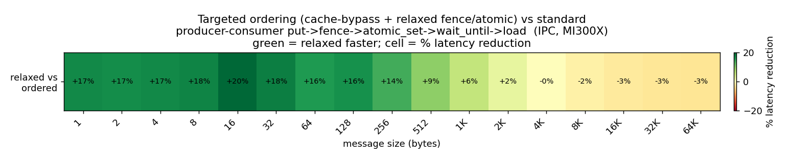

# Producer-consumer targeted-ordering functional test & perf evaluation

`producerconsumer` (`ProducerConsumerTester`, TestType 171) exercises the
canonical producer-consumer signaling pattern

```
producer:  put  ->  fence  ->  atomic_set(flag)
consumer:              wait_until(flag)  ->  load(payload)
```

as a timed ping-pong round-trip, in two modes selected at runtime by the
`ROCSHMEM_PC_RELAXED` environment variable:

| Mode | put | fence | atomic_set | consumer observe |
|------|-----|-------|-----------|------------------|
| **ordered** (`=0`, baseline) | standard | release fence (**L2 flush**) | seq_cst atomic | `wait_until` + acquire (**L2 invalidate**) + load |
| **relaxed** (`=1`, targeted) | cache-bypassing system-scope | `wait_on_vmem` (**waitcnt only**) | relaxed system-scope store | uncached poll + uncached load |

The relaxed mode avoids every L2 flush/invalidate in the critical path: payload
stores are system-scope (sc0/sc1) and visible without a flush, the completion
fence only drains VMEM, the flag store is relaxed-order, and the consumer reads
flag+payload uncached instead of taking an acquire fence. Targeted ordering is
requested through the public API via `CommOpt{RelaxedOrdering<true>}`.

## Running

```bash
# Build with functional tests, then from the build dir:
APP=tests/functional_tests/rocshmem_functional_tests
DRV=$ROCSHMEM/scripts/functional_tests/driver.sh
export ROCSHMEM_TEST_SLR=1                      # single-node (2 PEs via SLR)
ROCSHMEM_PC_RELAXED=0 $DRV $APP heatmaprelaxed logs_ordered
ROCSHMEM_PC_RELAXED=1 $DRV $APP heatmaprelaxed logs_relaxed
python3 $ROCSHMEM/scripts/functional_tests/perf_compare.py \
  --baseline logs_ordered --variants "relaxed:logs_relaxed" --outdir plots
```

This follows the same feature-flag flow as the SDMA on/off example in
`README-perf_compare.md`. The test is also registered in the `heatmap` /
`heatmaprelaxed` suites (driver.sh) and as a `HEATMAP;RELAXED` CTest group.

## Correctness

Both modes pass the payload verification (`verifyResults` checks the delivered
buffer): `VERIFY_ordered=PASS`, `VERIFY_relaxed=PASS`. The relaxed
cache-bypass / relaxed-ordering path delivers correct data, not just lower
latency.

## Results (MI300X, intra-node / IPC backend, 2 PEs, w1z1, 10 timed msgs)

One-way latency, standard vs targeted ordering, swept over payload size:

| size (B) | ordered us | relaxed us | speedup | latency reduction |
|---------:|-----------:|-----------:|--------:|------------------:|
| 1    | 3.44  | 2.85  | 1.21x | **+17.2%** |
| 2    | 3.50  | 2.91  | 1.20x | +16.9% |
| 4    | 3.61  | 2.99  | 1.21x | +17.2% |
| 8    | 3.71  | 3.06  | 1.21x | +17.5% |
| 16   | 3.98  | 3.19  | 1.25x | **+19.8%** |
| 32   | 4.37  | 3.58  | 1.22x | +18.1% |
| 64   | 5.39  | 4.54  | 1.19x | +15.8% |
| 128  | 4.61  | 3.85  | 1.20x | +16.5% |
| 256  | 5.30  | 4.57  | 1.16x | +13.8% |
| 512  | 6.86  | 6.21  | 1.11x | +9.5% |
| 1024 | 10.17 | 9.59  | 1.06x | +5.7% |
| 2048 | 16.33 | 15.93 | 1.03x | +2.4% |
| 4096 | 29.58 | 29.64 | 1.00x | -0.2% |
| 8192 | 56.32 | 57.31 | 0.98x | -1.8% |
| 16384| 109.91| 112.71| 0.98x | -2.5% |
| 32768| 216.38| 223.06| 0.97x | -3.1% |
| 65536| 427.78| 441.54| 0.97x | -3.2% |

(Raw data: `producer_consumer_relaxed_results.csv`.)



### Takeaways

- **Small-message signaling (<=256 B): ~17% mean latency reduction, peaking at
  ~20% (16 B)** -- the regime that matters for producer-consumer flags / short
  messages, and exactly where the relaxations pay off.
- The benefit is a **fixed ~0.71 us/op saving** (one-way) -- the L2 flush +
  invalidate the relaxed path avoids. It is constant in payload size, so it is a
  large fraction of the ~3 us small-message latency and negligible once the
  payload copy dominates.
- **Crossover at ~4 KB**: beyond it the single-thread payload copy dominates and
  the fixed saving is within run-to-run noise (+/-3% at 10 timed msgs).

### Scope

- Measured on the **IPC** backend (intra-node), which the single-node heatmap
  exercises. The same `CommOpt{RelaxedOrdering<true>}` API drives the GDA
  (inter-node) path; GDA's targeted benefit comes from the relaxed completion
  fence (the AMO doorbell relaxation on GDA is left for future work).
- `perf_compare.py` needs `seaborn` for its grid heatmap; the single-test
  comparison heatmap here was generated directly from the sweep logs.
